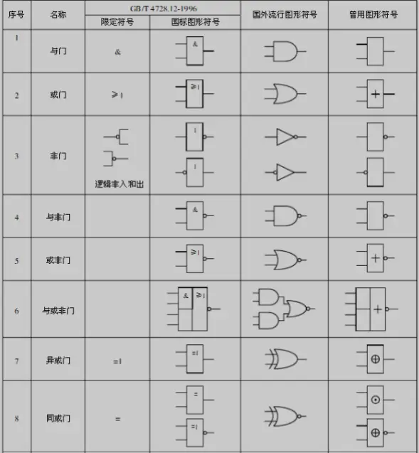
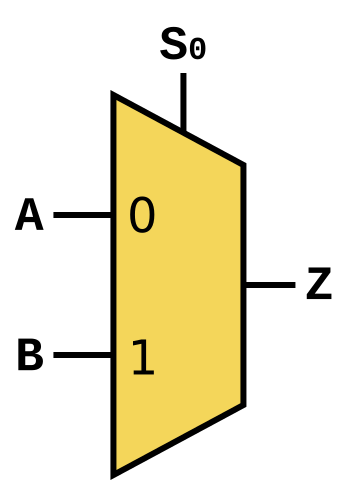

# 0x00. 导读
# 0x01. 简介

常用的基本逻辑门有两组符号，均在 ANSI / IEEE Std 91-1984 及其补充 ANSI/IEEE Std 91a-1991 中定义. [Logic_gate wiki](https://en.wikipedia.org/wiki/Logic_gate)

# 0x02.

[数据选择器](https://zh.wikipedia.org/wiki/%E6%95%B0%E6%8D%AE%E9%80%89%E6%8B%A9%E5%99%A8)  

圆圈带有两个等于号的符号通常表示的是一个比较器（comparator）。在缓存结构中，比较器的作用是将输入的标记（Tag）与存储的标记进行比较，判断它们是否相等。如果相等，说明缓存命中（hit），否则是未命中（miss）。