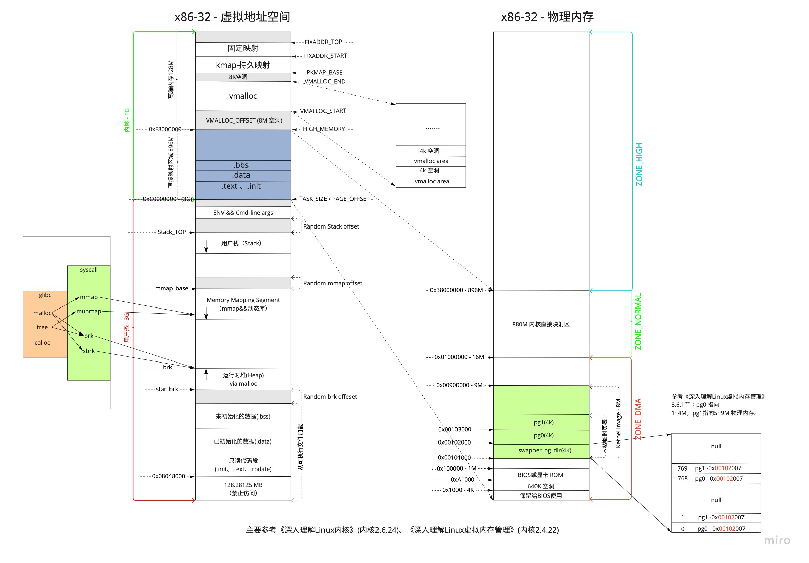
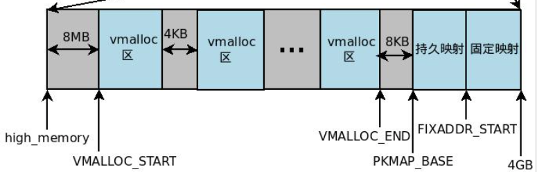

# 0x00 导读

# 0x01 简介

虚拟地址空间中，内存分为哪些部分，作用是如何？

虚拟地址空间分为 `用户地址空间(0~3G)` 和 `内核地址空间(3~4G)`。

`内核地址空间` 又分为 `高端内存(high-mem)` 和 `低端内存(low-mem)` .



# 0x02. 用户地址空间

## 2.1. 保留区

`32` 位下， `0 ~ 0x08048000` ，因为“历史原因”前面 `128.28125MB` 属于保留空间。任何对它的引用都是非法的。  

1. [On Linux, why does the text segment start at 0x08048000? What is stored below that address?](https://www.quora.com/On-Linux-why-does-the-text-segment-start-at-0x08048000-What-is-stored-below-that-address)  

2. [Where are "the kernel stack", "Frames for C run-time startup functions", and "Frame for main()" in the memory layout of a program?](https://unix.stackexchange.com/questions/466389/where-are-the-kernel-stack-frames-for-c-run-time-startup-functions-and-fr)

## 2.2. `TEXT`( 代码段 )

起始地址在 `IA32` 体系中中通常为 `0x08048000` ，在 `IA64` 体系中通常为 `0x0000000000400000` ，都是 `虚拟地址`。

**代码段**也称正文段或文本段，含了当前运行进程的二进制代码。

- 通常代码段是可共享的，因此频繁执行的程序只需要在内存中拥有一份拷贝即可。
- 代码段通常属于只读，以防止其他程序意外地修改其指令(对该段的写操作将导致段错误)。某些架构也允许代码段为可写，即允许修改程序。

代码段指令中包括操作码和操作对象(或对象地址引用)。
- 若操作对象是立即数(具体数值)，将直接包含在代码中；
- 若是局部数据，将在栈区分配空间，然后引用该数据地址；
- 若位于BSS段和数据段，同样引用该数据地址。

## 2.3. `DATA`( 数据段 )

**数据段**通常用于存放程序中已初始化的全局变量和静态局部变量。

## 2.4. `BSS`

**BSS(Block Started by Symbol)** 段中存放未初始化的全局变量和静态局部变量。

TEXT 、 DATA 、 BSS 三个段是紧挨者的，因为它们的大小是确定的，不会动态变化。

## 2.5. `HEAP`

存储动态分配的内存中的数据。

## 2.6. `MMAP`

mmap() 系统调用映射出来的。 mmap 映射的大小也是不确定的。

## 2.7. `STACK`

用于保存局部变量和实现函数/过程调用的上下文。

## 2.8. vm_area_struct

在 Linux 中，上面提到的每个 segment( 例如 TEXT、DATA、BSS 等 ) 用一个 `vm_area_struct` （简称 vma ）结构体表示。

`/proc/PID/maps` 中记录了进程所有的 vma 在虚拟地址空间中的分布情况。

[/proc/pid/maps 简要分析](../proc/maps.md)

```C
struct vm_area_struct 
{ 
    // vma 所指向区域的起始地址和结束地址
	unsigned long vm_start; 
	unsigned long vm_end;  
    // 前后另一个 vma 节点
	struct vm_area_struct *vm_next, *vm_prev; 
	rb_node_t vm_rb; 
    /* 
     * 描述的是vma的属性， flag 可以是 VM_READ 、 VM_WRITE 、 VM_EXEC 、 VM_SHARED ，分别指定 vma 的内容是否可以读、写、执行，或者由几个进程共享。
     * vma 由许多的虚拟 pages 组成，每个虚拟 page 需要经过 page table 的转换才能找到对应的物理页面。这个地方的属性会复制到这个 vma 所含 pages 的 PTE 中。
    */
    unsigned long vm_flags;
    /*
     * 可执行文件和动态链接库的 text 段和 data 段是基于 elf 文件的，
     * mmap 对文件的映射也是对应外部存储介质中这个被映射的文件的，
     * 这两种情况下， vm_file 指向这个被映射的文件，进而可获得该文件的 inode 信息，
     * 而 vm_pgoff 是这个段在该文件内的偏移。

     * 对于 text 段，一般偏移就是 0 。对于 heap 段， stack 段以及 mmap 的匿名映射，
     * 没有与之相对应的文件实体，此时 vm_file 就为 NULL ， vm_pgoff 的值没有意义。
    */
    struct file * vm_file;
    unsigned long vm_pgoff;
	struct mm_struct * vm_mm; 
	...
}
```


# 0x03. 内核地址空间

内核地址空间可以分为：直接映射区和高端内存

## 3.1. `直接映射区`（896M）

在这块内存区域，内核使用 `kmalloc()` 来分配内存， `kmalloc()` 返回的也是虚拟地址，但是分到的内存在物理地址上是连续的（因为是直接映射，在虚拟地址上自然也是连续的）（ kmalloc 底层靠的是 slab ）。

所谓的直接映射区，就是这一块空间是连续的，和物理内存是非常简单的映射关系，其实就是虚拟内存地址减去 `3G`，就得到物理内存的位置。也称为 `LowMem` 。

```C
__pa(vaddr) 返回与虚拟地址 vaddr 相关的物理地址；
__va(paddr) 则计算出对应于物理地址 paddr 的虚拟地址。

// PAGE_OFFSET => 3G  0x0c0000000
#define __va(x)      ((void *)((unsigned long)(x)+PAGE_OFFSET))
#define __pa(x)    __phys_addr((unsigned long)(x))
#define __phys_addr(x)    __phys_addr_nodebug(x)
#define __phys_addr_nodebug(x)  ((x) - PAGE_OFFSET)
```

可通过 `cat /proc/iomem` 查看详细数据。    
[iomem 解析](../proc/iomem.md)


## 3.2 高端内存

x86-32 下特有的（ x64 下没有这个东西），因为内核虚拟空间只有 1G 无法管理全部的内存空间。

高端内存的最基本思想：借一段地址空间，建立临时地址映射，用完后释放，达到这段地址空间可以循环使用，访问所有物理内存。

内核可以采用三种不同的机制将 物理页帧 映射到高端内存：非连续内存分配、永久内核映射、临时内核映射。

动态映射:节省资源,降低开销;每次访问映射,影响性能。  
永久映射:提高访问性能;占用较多资源,可能造成浪费。  
临时映射:根据实际情况选择,既能提高性能,也避免资源浪费;管理相对复杂。

**后续介绍的函数，注意区分 内存分配 和 内存映射。**

### 3.2.1 `VMALLOC_OFFSET`

系统会在 low memory 和 VMALLOC 区域留 8M ，防止访问越界。

### 3.2.2 `VMALLOC`

1. 虚拟内存中连续、但物理内存中不连续的内存区，可以在 `vmalloc` 区域分配。

2. 使用 `vmalloc()` 分配内存， `vmalloc area` 中的地址映射不再是简单的 3GB 偏移，因此需要调用 `map_vm_area()` ，建立虚拟地址和物理页面的映射关系，并添加到内核页表中。

3. vmalloc() 相比于 malloc() 的延迟满足，它申请的物理内存立刻满足。其分配到的每个内存区域都用一个 vm_struct 结构体表示。分配的内存区域如下图所示：

    每个 vmalloc 区域都会附加上一个额外的 page ，目的么，也是为了越界内存访问检测，这种 page 被称作 guard page 。所以，每个 vmalloc 区域的 size ，除了本身需要的内存，还要多加上一个 page 的大小。

    又是 8MB 的空洞间隔，又是那么多的 guard page ，多浪费空间啊……其实没关系的啦，因为这里都是虚拟地址空间，并没有多占用实际的物理内存。

    有意思的是， vm_struct 结构体占用的内存是通过 kmalloc() 分配的，坐落在 LowMem.



同 `kmalloc()` 相比， `vmalloc()` 分配的内存只能保证在虚拟地址上连续，不能保证在物理地址上连续。在物理地址上连续有什么好处呢？

- 可以更好的根据空间局部性原理利用 cache ，增加数据访问的速度。
- 由于 kmalloc() 基于的是直接映射，其虚拟地址和物理地址之间是一个固定的偏移，因此可以利用既有的内核页表，而不需要为新的地址增加新的 page table entries ，因此其分配速度也比 vmalloc() 更快。
- 因为物理地址不连续，通过 vmalloc() 获得的每个 page 需要单独映射，而 TLB 资源很有限，因此这将比直接映射造成更严重的 TLB thrashing(颠簸) 问题。

## 3.3. `持久映射`

从 `PKMAP_BASE` 到 `FIXADDR_START` .

`vmalloc()` 主要用于分配物理内存，并建立和虚拟地址的映射，如果已经分配好了物理内存（比如 `alloc_page()` 后），只是想建立映射，则可以使用 `vmap()` 。 `vmap()` 算是 `vmalloc()` 的一个组成部分，但 `kmap()` 跟 `kmalloc()` 没有半毛钱关系。

`vmap()` 用于相对长时间的映射，可同时映射多个 `pages` ， `kmap()` 和 `kmap_atomic()` 则用于相对短时间的映射，只能映射单个 `page` 。

kmap()	一次只能映射1个page，可能会睡眠，只能在进程上下文中调用  
kmap_atomic()	一次只能映射1个page，不会睡眠，可在中断上下文中调用  
vmap()	一次可以映射多个pages，且这些pages物理上可以不连续，只能在进程上下文中调用

kmap：把给定page结构映射到内核地址空间；  
- 当page位于低端内存，函数返回该页的虚拟地址  
- 当page位于高端内存，建立一个永久映射，再返回地址

kunmap: 永久映射的数量有限，应通过 kunmap 及时解除映射  
kmap_atomic: 临时映射   
kunmap_atomic: 解除临时映射

## 3.4. `固定映射/临时映射`

`FIXADDR_START` 到 `FIXADDR_TOP` ( 0xFFFF F000 ) 的空间，称为 `固定映射区域` ，主要用于满足特殊需求。  

这里固定映射是指虚拟地址是固定的，而被映射的物理地址并不固定，也就是说，有些虚拟地址在编译（compile-time）的时候就固定下来了，而这些虚拟地址对应的物理地址不是固定的，是在kernel启动过程中被确定的。

动态分配虚拟地址以及建立地址映射是一个复杂的过程，在内核完全启动之后，内存管理可以提供各种丰富的 API 让内核的其他模块可以完成虚拟地址分配和建立地址映射的功能，但是，在内核的启动过程中，有些模块需要使用虚拟内存并 mapping 到指定的物理地址上，而且，这些模块也没有办法等待完整的内存管理模块初始化之后再进行地址映射。因此，linux kernel固定分配了一些 fixmap 的虚拟地址，这些地址有固定的用途，使用该地址的模块在初始化的时候，讲这些固定分配的地址 mapping 到指定的物理地址上去。

start_kernel的时候我们面临的处境：

（1）我们不能访问全部的内存，只能访问kernel image附近的memory。

（2）我们不能访问任何的硬件，所有的io memory还没有mapping

想要通过串口控制台输出错误信息？sorry，现在离console驱动的初始化还早着呢。想点个LED灯看看内核运行情况？sorry，ioremp函数需要kmalloc分配内存，但是伙伴系统还没有初始化呢。怎么办？一个最简洁的方法就是简化虚拟内存的分配和管理，而最简单的方法就是fix virtual address。

其地址区域的用途可以参加枚举 `fixed_addresses` .

临时内核映射比永久内核映射的实现要简单。它不会阻塞当前进程，可以用于中断处理程序和可延迟函数。

使用 `kmap_atomic` 函数。

------------

每个CPU数据  
alloc_percpu: 给系统的每个处理器分配一个指定类型对象的实例，以单字节对齐；  
free_percpu: 释放每个处理器的对象实例；  
get_cpu_var: 返回一个执行当前处理器数据的特殊实例，同时会禁止内核抢占  
put_cpu_var: 会重新激活内核抢占  

使用每个CPU数据好处：
- 减少了数据锁定，每个CPU访问自己CPU数据
- 大大减少缓存失效，失效往往发生在一个处理器操作某个数据，而其他处理器缓存了该数据，那么必须清理或刷新缓存。持续不断的缓存失效称为缓存抖动。