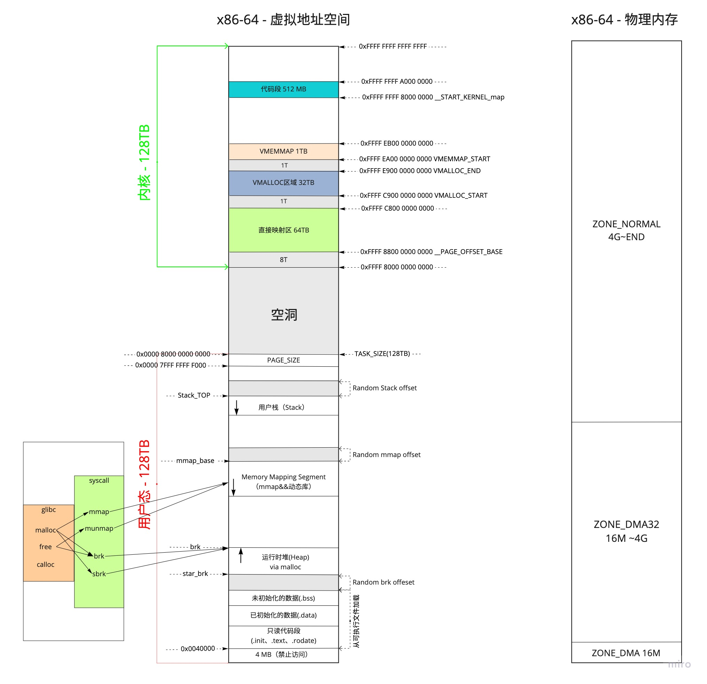
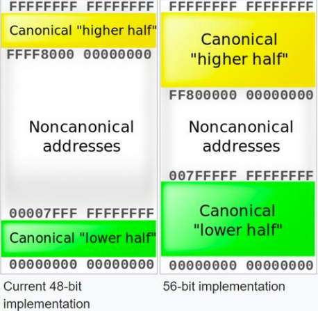

# 0x00. 导读

在 64 位系统中，进程地址空间的大小就不固定了，以 ARMv8-A 为例，它的 page 大小可以是 4KB , 16KB 或者 64KB ，可采用 3 级页表或 4 级页表，因此可以有多种组合的形式。

以采用 4KB 的页， 4 级页表，虚拟地址为 48 位的系统为例，其虚拟地址空间的范围为 2 的 48 次方 等于 256TB ，按照 1:1 的比例划分，内核空间和用户空间各占 128TB 。

256TB 已经很大很大了，但是面对 64 位系统所具备的 `16EB` 的地址范围，根本就用不完。为了以后扩展的需要（比如虚拟地址扩大到56位），用户虚拟空间和内核虚拟空间不再是挨着的，一个占据底部，一个占据顶部，所以这时 user space 和 kernel space 之间偌大的区域就空出来了。

但这段空闲区域也不是一点用都没有，它可以辅助进行地址有效性的检测。如果某个虚拟地址落在这段空闲区域，那就是既不在 user space ，也不在 kernel space ，肯定是非法访问了。使用 48 位虚拟地址，则 kernel space 的高 16 位都为 1 ，如果一个试图访问 kernel space 的虚拟地址的高 16 位不全为 1 ，则可以判断这个访问也是非法的。同理， user space 的高 16 位都为 0 。这种高位空闲地址被称为 `canonical addredd` 。

# 0x01. 64 位虚拟地址空间和物理地址空间

## 1.1 canonical address

在 64 位系统中，内核空间的映射变的简单了，因为这时内核的虚拟地址空间已经足够大了，即便它要访问所有的物理内存，直接映射就是，不再需要 ZONE_HIGHMEM 那种动态映射机制了。