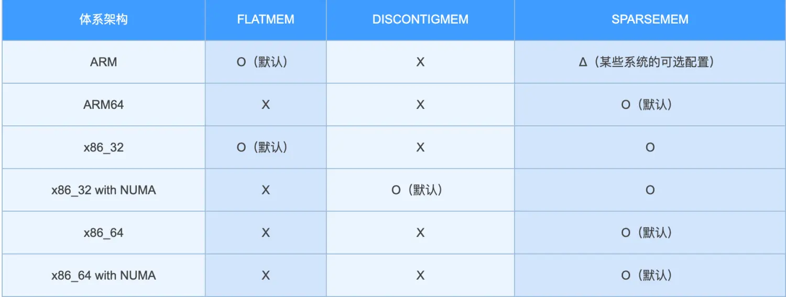
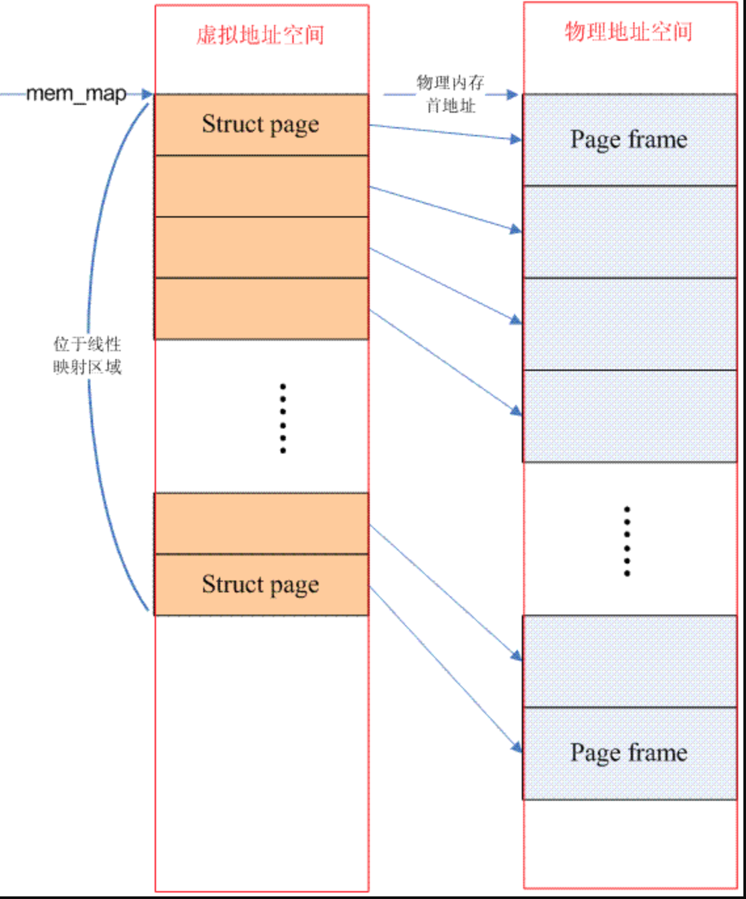
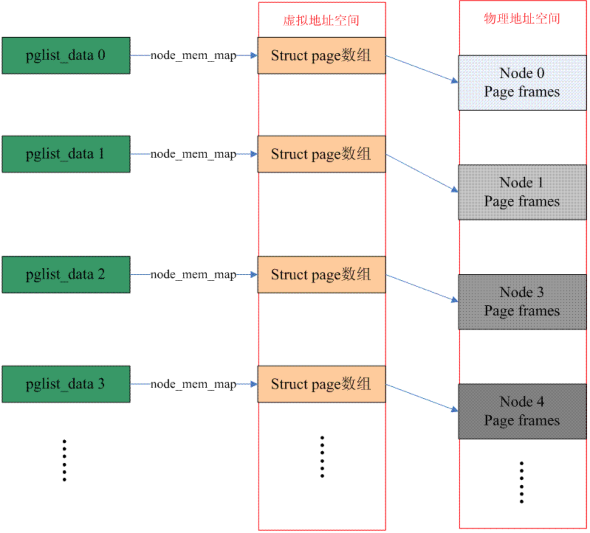
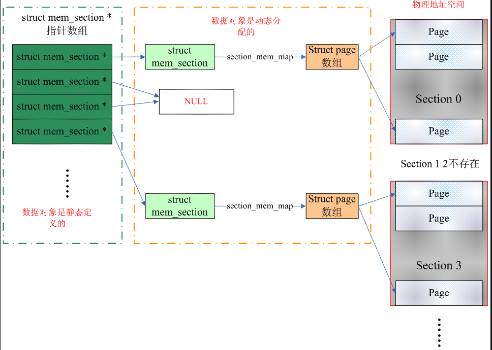

# 0x00. 导读

# 0x01. 简介

所谓 memory model ，是指 Linux 内核用怎么样的方式去管理物理内存，一个物理内存页（4k），内核会用一个 `page`（64Byte）去记录 `Physics Page Number` 相关信息，内存模型是讲如何存储这个 `meta` 信息（page），保证内核能快速根据 `PFN/PPN` 找到 `Page` ，也可以根据 `Page` 快速算出 `PFN` 。

> PFN, Page Frame Number = PPN, Physical Page Number, 是一样东西。

Linux 目前支持三种内存模型： `FLATMEM`、 `DISCONTIGMEM` 和 `SPARSEMEM` 。某些体系架构支持多种内存模型，但在内核编译构建时只能选择使用一种内存模型。

# 0x02. 内存模型

主流体系架构支持的内存模型:

## 2.1 FLATMEM

`FLATMEM` 内存模型是 Linux 最早使用的内存模型，那时计算机的内存通常不大。
Linux 会使用一个 `struct page mem_map[x]` 的数组根据 `PFN` 去依次存放所有的 `strcut page` ，且 `mem_map` 也位于内核空间的线性映射区，所以根据 `PFN(页帧号)` 即可轻松的找到目标页帧的 `strcut page` 。

- **用全局指针变量 mem_map 管理单个连续内存，其指向 struct page 类型数组的首地址。**

## 2.2 DISCONTIGMEM( 不连续内存模型 )

`DISCONTIGMEM` 原理上相当于 `FLATMEM` 的多个拼接，避开了 hole ，原来的单一的一个mem_maps 变成了若干个 mem_maps 了。

`DISCONTIGMEM` 是个稍纵即逝的内存模型，在 `SPARSEMEM` 出现后即被完全替代，且当前的 Linux kernel 默认都是使用 `SPARSEMEM` .

- **用全局数组 node_data 管理所有节点的内存，其元素是指向 pglist_data ， pglist_data 管理一个节点的内存。 pglist_data 的 node_mem_map 字段指向 struct page 类型数组的首地址，用于管理节点的所有物理页帧。**

## 2.3 SPARSEMEM

Memory model 也是一个演进过程，刚开始的时候，使用 flat memory 去抽象一个连续的内存地址空间（ mem_maps ），出现 NUMA 之后，整个不连续的内存空间被分成若干个 node ，每个 node 上是连续的内存地址空间，也就是说，原来的单一的一个 mem_maps 变成了若干个 mem_maps 了。一切看起来已经完美了，但是 memory hotplug 的出现让原来完美的设计变得不完美了，因为即便是一个 node 中的 mem_maps 也有可能是不连续了。

在 sparse memory 内存模型下，连续的地址空间按照 SECTION （例如1G）被分成了一段一段的，其中每一 section 都是 hotplug 的，因此 sparse memory 下，内存地址空间可以被切分的更细，支持更离散的 Discontiguous memory 。

- **用全局数组 mem_section 管理分散稀疏的内存，数组每个元素是指向 struct mem_section 实例的指针（注意：数组名称 mem_section 和结构体名称 struct mem_section 相同）。 struct mem_section 的 section_mem_map 字段指向 struct page 类型数组的首地址，用于管理 section 的所有物理页帧。**

# 0x03. 总结

内存模型表现的是CPU视角的内存分布情况，而 NUMA 体现的是 CPU 和内存的相对位置关系，两者本没有直接的对应关系。但在 DISCONTIGMEM 中，两者的耦合性是比较强的，而 SPARSEMEM 分离了这种耦合性。在 SPARSEMEM 中，不再是一个 node 对应一个 mem_map 数组，而是一个 section 对应一个 mem_map 数组。采用 SPARSEMEM 的系统可以是 NUMA 的，也可以是 UMA 的。

[memory-model](http://linux.laoqinren.net/kernel/memory-model/)   
[内存模型](https://chasinglulu.github.io/2019/05/29/%E5%86%85%E5%AD%98%E6%A8%A1%E5%9E%8B%E3%80%8Cmemory-model%E3%80%8D/)