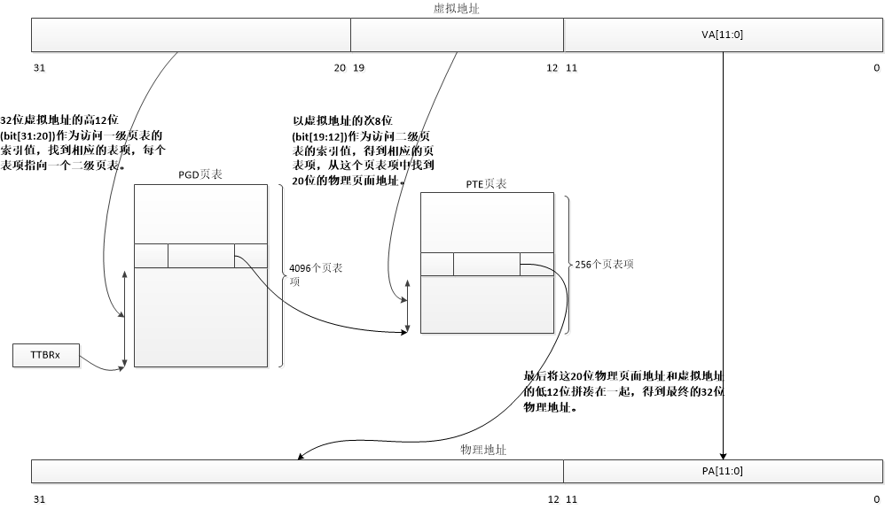

# 0x00. 导读

# 0x01. 简介

# 0x02 

32bit 的 Linux 采用三级映射: PGD-->PMD-->PTE， 64bit 的 Linux 采用四级映射: PGD-->PUD-->PMD-->PTE ，多了个 PUD 。

- PGD: Page Global Directory
- PUD: Page Upper Directory
- PMD: Page Middle Directory
- PTE: Page Table Entry。

32 位虚拟地址的高 `12` 位( `bit[31:20]` )作为访问一级页表的索引值，找到相应的表项，每个表项指向一个二级页表。

以虚拟地址的次 `8` 位( `bit[19:12]` )作为访问二级页表的索引值，得到相应的页表项，从这个页表项中找到 `20` 位的物理页面地址。

最后将这 `20` 位物理页面地址和虚拟地址的低 `12` 位拼凑在一起，得到最终的 `32` 位物理地址。

这个过程在 ARM32 架构中由 MMU 硬件完成，软件不需要接入。

