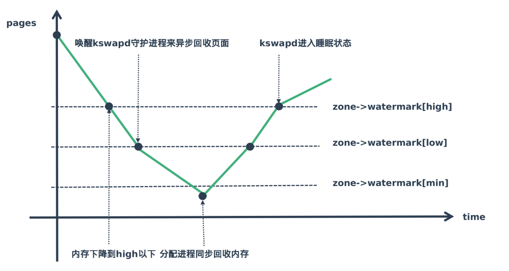

# 0x0. 导读

回收什么？何时回收？能免死吗？

# 0x01.简介

内存回收，针对三样东西：slab 、LRU 链表中的页、buffer_head

LRU 链表主要用于管理进程空间中使用的内存页，它主要管理三种类型的页：匿名页、文件页以及
shmem 使用的页。在内存回收过程中，对每个内存压力大的zone进行内存回收，**内存回收主要是针对 LRU 的匿名页和文件页进行的，就是将 LRU 链表中的一些页数据放到磁盘或者交换分区中。**

LRU 链表主要作用就是将页排序，将最应该回收的页放到最后面，最不应该回收的页放到最前面。

Linux内核中触发页面回收的机制大致有3个。

- 直接页面回收机制。在内核态里调用页面分配接口函数 alloe_pages() 分配物理页面时，由于系统内存短缺，不能满足分配请求，因此内核会直接自陷到页面回收机制，这称为直接页面回收
- 周期性回收内存机制。这是 kswapd 内核线程的工作职责。当内核路径调用 alloc_pages() 分配物理页面时，由于系统内存短缺，没法在低水位情况下分配出内存，因此会唤醒 kswapd 内核线程来异步回收内存
- slab 收割机（ slab shrinker ）机制。这是用来回收 slab 对象的。当内存短缺时，直接页面回收和周期性回收内存两种机制都会调用 slab 收割机机制来回收 slab 对象。 slab 机制分配的内存主要用于 slab 对象和 kmalloc 接口，也可用于内核空间的内存分配。

## 1.1 swap 空间的种类

```bash
# 查看 swap 信息
cat /proc/swaps

Filename                                Type            Size    Used    Priority
/dev/dm-0                               partition       2113532 704476  -2

# Filename：如果swap类型是分区，这里将是分区的路径，如果swap类型是文件，这里将是文件的路径

# Type：swap的类型，partition代表这是一个swap分区，file代表这是一个swap文件

# Size：swap的大小，单位是k，这里3944444表示的差不多是3900MB

# Used：已经被使用的大小，这里0表示还没有被使用到

# Priority：优先级，优先级高的swap将会被优先使用，同等优先级的swap将会被均匀的使用（round-robin算法），优先级可以通过“swapon -p”命令来设置
```

## 1.2 swap cache, 交换高速缓存

向 swap 来回传送页会引发很多竞争条件，具体的说，交换子系统必须仔细处理下面的情形：
- 多重换入：两个进程可能同时要换入同一个共享匿名页
- 同时换入换出：一个进程可能换入正由 PFRA 换出的页

交换高速缓存（swap cache）的引入就是为了解决这类同步问题的。

# 0x02. 回收页

## 2.1 File Cache 与 Anon Page

可以被回收的页可划分为两种：

- 文件页(file cache)   
    其特征是与外部存储设备上的某个文件相对应，有外部的后援设备(backend)。例如程序的代码区、数据区；  

    在内存回收时，被写过的文件页（脏文件页）将被写回以保存起来。写回之后的页将被释放。而没有被写过的页，比如进程代码段的页，他们是只读的，直接释放就可以了。

- 匿名页(anonymous cache)   
    其特征是，内容不来自于外部存储设备，例如为用户进程进程中的 malloc 系统调用分配的页即属于匿名页。 

    在内存回收时，匿名页将会被交换到交换区而保存起来。交换之后页将被释放。

## 2.2 文件页与匿名页的回收比例

`/proc/sys/vm/swappiness` 是控制系统对交换空间的使用程度，0 表示尽量不使用 swap 交换空间，100 表示积极的使用 swap 空间。

内存回收时，也会因为这个值影响匿名页与文件缓存的回收比例。  

这个值越大，swap 空间也就使用的越积极，回收的时候自然就会越倾向于回收匿名页。   
当这个值为 0 时，swap 空间则几乎没有使用，回收的时候自然只会去释放文件页来回收内存，设置为100的时候，则一半来自文件页，一半来自匿名页。

```bash
# 查看
cat /proc/sys/vm/swappiness
# 设置
sysctl vm.swappiness=10
```

# 0x03. 如何回收内存？

## 3.1 同步回收与异步回收

内存回收按照 **回收时机** 可以分为同步回收和异步回收：

- 同步回收是指在分配内存的时候发现无法分配到内存就进行回收
- 异步回收是指有专门的线程定期进行检测，如果发现内存不足就进行回收。

后续的介绍以 同步回收匿名页 、 同步回收文件页 、 异步回收匿名页 、 异步回收文件页 为指导思想。

# 0x04. 脏页的写回

**脏页都是指 文件页**，匿名页不会存在脏页。从 `/proc/meminfo` 的 `Dirty’` 一行可以看到当前系统的脏页有多少，用 `sync` 命令可以刷掉。

```bash
$ cat /proc/meminfo| grep Dirty
Dirty:                24 kB
$ sync                          
$ cat /proc/meminfo| grep Dirty
Dirty:                 0 kB
```

`sync` 是用来回写脏页的，脏页不能在内存中呆的太久，因为如果突然断电没有写到硬盘的话脏数据就丢了，另一方面如果攒了很多一起写回也会明显占用 CPU 时间。

脏页回写的时机由时间和空间两方面共同控制：

- 时间：
    - `dirty_expire_centisecs`  
        脏页的到期时间，或理解为老化时间，单位是 `1/100s` 。  
        内核中的 `flusher thread` 会检查驻留内存的时间超过 `dirty_expire_centisecs` 的脏页，超过的就回写。   
    - `dirty_writeback_centisecs`   
        内核的 `flusher thread` 周期性被唤醒的时间间隔，每次被唤醒都会去检查是否有脏页老化了。如果将这个值置为0，则 `flusher` 线程就完全不会被唤醒了。

- 空间：
    - `dirty_ratio`  
        同步刷脏页，会阻塞应用程序。这个参数控制文件系统的同步写缓冲区的大小，单位是百分比，表示当写缓冲区使用到系统内存多少的时候（即指定了当文件系统缓存脏页数量达到系统内存百分比时），开始向磁盘写出数据，在此过程中很多应用程序可能会因为系统在处理文件 I/O 而阻塞变慢。
    - `dirty_background_ratio`  
        异步刷脏页，不会阻塞应用程序。  
        一般 `dirty_ratio` 比 `dirty_background_radio` 要大，先达到 `dirty_background_ratio` 的条件然后触发 `flush` 进程进行异步的回写操作，但是这一过程应用进程仍然可以进行写操作，如果多个应用程序写入的量大于刷出的量那自然会达到 `dirty_ratio` 的标准，此时操作系统会进入同步刷出脏页的过程，阻塞应用进程。

# 0x05. Watermark

每个 CPU 加本地内存被称作 Node ，一个 node 又被划分为多个 zone ，每个 zone 有自己一套内存水位标记，来记录本 zone 的内存水平，同时每个 node 有一个 kswapd 内核线程来回收内存。

在内存不足时内核通过 wakeup_kswapd() 函数唤醒 kswapd 内核线程来回收页面，以便释放一些内存， kswapd 的回收方式又被称为 background reclaim。

1. 水位线在 high 以上表示内存剩余较多，目前内存使用压力不大， kswapd 处于休眠状态
2. 水位线在 high-low 的范围表示目前虽然还有剩余内存但是有点紧张， kswapd 开始工作进行内存回收
3. 水位线在 low-min 表示剩余可用内存不多了压力山大， min 是最小的水位标记，当剩余内存达到这个状态时，就说明内存面临很大压力。
4. 水位线低于 min 这部分内存，就会触发直接回收内存。
5. 随着内存不断回收，剩余内存又会回到 high ,这里 kswapd 工作完成进入休眠



内核中有三个水位：
- min  
    如果剩余内存减少到触及这个水位，可认为内存严重不足，当前进程就会被堵住，kernel 会直接在这个进程的进程上下文里面做内存回收（direct reclaim）。
- low  
    当剩余内存慢慢减少，触到这个水位时，就会触发 kswapd 线程的内存回收。
- high  
    进行内存回收时，内存慢慢增加，触到这个水位时，就停止回收。

```bash
# 查看 min low high
cat /proc/zoneinfo | grep Node -A8

# 各个数字的计算
cat /proc/sys/vm/min_free_kbytes
# min_free_kbytes = 4 * sqrt(lowmem_kbytes)
# low = min * 5 / 4
# high = min * 6 / 4
```

# 0x06. 拓展

内存规整、迁移(migrate)、合并(Kernel SamePage Merging)