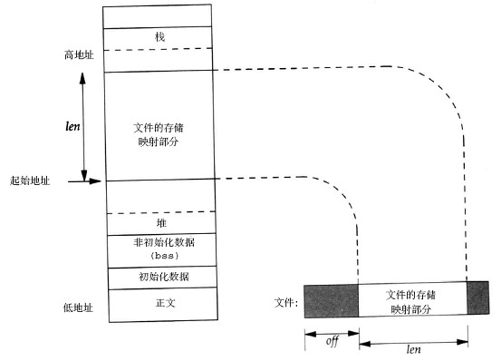

# 0x00、导读

> 使用 mmap 系统调用可以将用户空间的虚拟内存地址与文件进行映射，对映射后的虚拟内存地址进行读写操作就如同对文件进行读写操作一样。

随便一搜，到处都是类似上面的话，我不懂：
1. 虚拟内存地址与文件映射，是虚拟内存地址与磁盘映射吗？这也能映射？！
2. 如果上面说的映射是指把文件读入了内存，那我用 read 和 write 不行吗？

# 0x01、简介

mmap 系统调用并不完全是为了共享内存而设计的，它本身提供了不同于一般对普通文件的访问方式，进程可以像读写内存一样对普通文件操作。

# 0x02. 解释

## 2.1 原理

mmap 的实现原理：

1. 在使用 mmap 映射某个文件（或者文件的一部分）到进程的地址空间时，并没有加载文件的数据，而只是在进程的虚拟地址空间划分出一块区域，标记这块区域用于映射到文件的数据区域， mmap 的操作就完成了。

2. 当进程试图读或者写文件映射区域时，如果没有对应的物理页面，系统发生缺页异常并进入缺页异常处理程序，缺页异常处理程序根据该区域内存的类型使用不同的策略解决缺页。
对于使用 mmap 映射文件的虚拟内存区域，处理程序首先找到相关的文件的管理数据结构，确定所需页面对应的文件偏移，然后从文件中把对应数据加载到 page_cache 中。

    

3. 一般读写文件需要 open、read、write ，需要先将磁盘文件读取到内核，然后再拷贝到用户空间内存区，需要两次读写操作。而 mmap 只需要第一次就行。

## 2.2 api 说明

```c
#include <sys/mman.h>
/*
 * addr：如果不为NULL，内核会在此地址创建映射；否则，内核会选择一个合适的虚拟地址。
 * length：映射的长度。
 * prot：内存区域的读/写/执行属性，可选值如下：
 *     PROT_READ：可以被读取。
 *     PROT_WRITE：可以被写入。
 *     PROT_EXEC：可以被执行。
 *     PROT_NONE：不可访问。
 * flags：内存映射的属性，常用的可选值如下：
 *     MAP_FIXED：使用指定的起始虚拟内存地址进行映射。
 *     MAP_SHARED：与其它所有映射到这个文件的进程共享映射空间（可实现共享内存）。
 *     MAP_PRIVATE：建立一个写时复制（Copy on Write）的私有映射空间。
 *     MAP_LOCKED：锁定映射区的页面，从而防止页面被交换出内存。
 *     ...
 * fd：进行映射的文件句柄。
 * offset：在文件映射时，表示相对文件头的偏移量；返回的地址是偏移量对应的虚拟地址。
*/
void *mmap(void *addr, size_t length, int prot, int flags, int fd, off_t offset);
```

## 2.3 madvise

缺页中断分为两类:
- 一种是内存缺页中断  
    这种的代表是 malloc ，利用 malloc 分配的内存只有在程序访问到得时候，内存才会分配；
    
- 另一种就是硬盘缺页中断  
    这种中断的代表就是 mmap ，利用 mmap 映射后的只是逻辑地址，当我们的程序访问时，内核会将硬盘中的文件内容读进物理内存页中，**这里我们就会明白为什么mmap之后，访问内存中的数据延时会陡增。**

    上述情况出现的原因本质上是 mmap 映射文件之后，实际并没有加载到内存中，要解决这个文件，需要我们进行索引的预加载，这里就会引出本文讲到的另一函数 `madvise` ，这个函数会传入一个地址指针，已经是一个区间长度， madvise 会向内核提供一个针对于于地址区间的 I/O 的建议，内核可能会采纳这个建议，会做一些预读的操作。例如 MADV_SEQUENTIAL 这个就表明顺序预读。
# 0x03、分类

1. 共享文件映射

    修改对所有进程可见，也就是说，如果进程 A 修改了其中某个 page 上的数据，进程 B 之后读取这个 page 得到的就是修改后的内容。有共享就有竞态 (race condition) ， mmap 本身并没有提供互斥机制，需要调用者在使用的过程中自己加锁。

    通常用于内存映射IO、进程间通信、读写文件。

    `flags=MAP_SHARED`

2. 私有文件映射

    进程 A 的修改对进程 B 是不可见的，主要利用的是 Copy On Write (COW) 机制。

    当进程 A 试图修改某个 page 上的数据时，内核会将这个 page 的内容拷贝一份，之后 A 的写操作实际是在这个拷贝的 page 上进行的，这样进程 B 看到的这个 page 还是原来未经改动的。

    这种修改只会存在于内存中，不会同步到外部的磁盘文件上（事实上也没法同步，因为不同进程所做的修改是不同的）。
    
    私有文件映射最典型的应用就是进程对动态链接库（比如 libc.so ）的使用。

    `flags=MAP_PRIVATE`

3. 共享匿名映射

    一个典型应用是作为进程间通信机制的 POSIX 共享内存。在 Linux 中， POSIX 共享内存是通过挂载在 /dev/shm 下的 tmpfs 内存文件系统实现的，创建的每一个共享内存都对应 tmpfs 中的一个文件，因此 POSIX 共享内存也可视为共享文件映射。

    `FD=-1，flags=MAP_ANONYMOUS|MAP_SHARED`

4. 私有匿名映射

    可以用来实现 glibc 中的 malloc() 。
    > 传统的 malloc() 实现靠的是 brk ，通常 brk 用于分配小块内存， mmap 则用于分配大块内存，这个分界的阈值默认是 128KB （可通过 mallopt 函数调整）。

    利用写时复制技术，一般在分配大块内存时用代替 malloc() 。

    `fd=-1，flags=MAP_ANONYMOUS|MAP_PRIVATE`

# 0x04、同步 fsync/fdatasync/msync

一个文件在 page cache 中的内容包括 `文件数据` 也包括 `inode数据` 。

`fsync/fdatasync/msync` 三个系统调用都涉及把内存中的 dirty page 同步到的块设备上的文件中去。

- fsync 把两部分的 dirty 数据都会同步。除了使用 fsync 强行同步文件之外，系统也会定期自动同步，即把两种 dirty page 回写到磁盘中。

- fdatasync 只回写文件数据的 dirty page 到磁盘中，不回写文件 inode 相关的 dirty page 。

- 在使用 mmap 映射文件到内存地址，向映射地址写入数据时如果没有缺页，就不会进入内核层，也无法设置写入页的状态为 dirty ，但cpu会自动把 **页表** 的 dirty bit 置位，但是如果不设置 **页** 为 dirty ，其他的同步程序，如 fsync 以及内核的同步线程都无法同步这部分数据。  
msync 的主要作用就是检查一个内存区域的页表，把 dirty bit 置位的页表项对应的页的状态设置为 dirty ，如果 msync 指定了 M_SYNC 参数， msync 还会和 fsync 一样同步数据，如果指定为 M_ASYNC ，则用内核同步线程或其他调用同步数据。   
在 munmap 时，系统会对映射的区域执行类似 msync 的操作，（进程在退出时对映射区域也会自动调用 munmap ），写大量数据不调用 msync 会有丢失数据的风险。