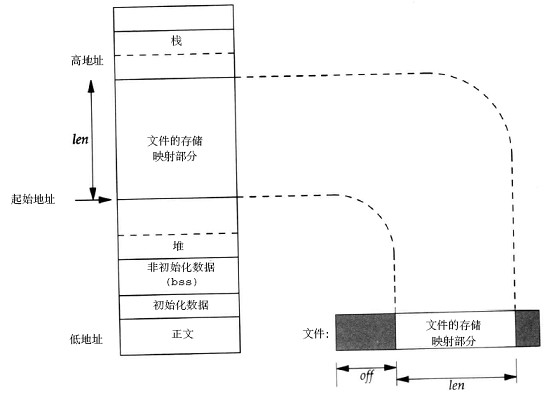

# 0x00、导读

介绍 mmap.

# 0x01、简介

mmap/munmap 函数是用户空间中常用的系统调用函数，无论是在用户程序中分配内存、读写大文件、链接动态库文件，还是多进程间共享内存，都可以看到 mmp/munmap() 函数的身影。

mmap 系统调用并不完全是为了共享内存而设计的，它本身提供了不同于一般对普通文件的访问方式，进程可以像读写内存一样对普通文件操作。

mmap 的作用就是将文件中的一段内容和一段内存逻辑地址关联，达到一个先占位但什么都不做的目的。就好像你要安排会议室的座位，你画了一个会议室图，将嘉宾的名字按照“礼仪风俗”排列标记在图上的座位上。这就是mmap的主要目的，这样后面如果再有人想坐某个座位时你可以告诉他“这个位子已经占了”。注意这时候你可能连会议室的椅子都还没摆呢。

内存映射后续的操作就好像是谁来给谁座一样，等到开会了，你看谁来了，来一个在相应位置摆好一把椅子，把水放好，请人坐下。对应计算机的操作就是你访问哪块映射好的文件内容（哪个客人来了）的时候，就通过一个缺页异常中断（招乎你）分配一段实际的物理内存（把椅子搬来）把这块内容加载到这块内存中（请人坐下）。如果你只是读不修改，那事后释放回收内存就行。如果你修改了这块内存，那么这块内存就会标记为“脏”，表示有改动的数据与文件的原内容不一样了。脏页会被定期扫描并写回到原文件所在的存储器上，或者等到最后访问结束释放内存页之前也会检查是否需要回写，需要回写的就先回写后再释放。

# 0x02. 解释

mmap系统调用的最终目的是将设备或文件映射到用户进程的虚拟地址空间，实现用户进程对文件的直接读写，这个任务可以分为以下三步:

- 在用户虚拟地址空间中寻找空闲的满足要求的一段连续的虚拟地址空间，并建立 vm_area_struct 结构体,将其传给具体的设备驱动程序
- 建立虚拟地址空间和 文件或设备 的物理地址之间的映射(设备驱动完成)，这是通过修改进程页表来实现（例如使用 remap_pfn_range 函数）。
- 当实际访问新映射的页面时的操作（由缺页中断完成）

## 2.1 原理

mmap 的实现原理：

1. 在使用 mmap 映射某个文件（或者文件的一部分）到进程的地址空间时，并没有加载文件的数据，而只是在进程的虚拟地址空间划分出一块区域，标记这块区域用于映射到文件的数据区域， mmap 的操作就完成了。

2. 当进程试图读或者写文件映射区域时，如果没有对应的物理页面，系统发生缺页异常并进入缺页异常处理程序，缺页异常处理程序根据该区域内存的类型使用不同的策略解决缺页。
对于使用 mmap 映射文件的虚拟内存区域，处理程序首先找到相关的文件的管理数据结构，确定所需页面对应的文件偏移，然后从文件中把对应数据加载到 page_cache 中。

    

3. 一般读写文件需要 open、read、write ，需要先将磁盘文件读取到内核，然后再拷贝到用户空间内存区，需要两次读写操作。而 mmap 只需要第一次就行。

## 2.2 api 说明

```c
#include <sys/mman.h>
/*
 * addr: 用户进程中要映射的用户空间的起始地址，通常为NULL（由内核来指定）
 * length: 要映射的内存区域的大小
 * prot: 设置内存区域的读/写/执行属性，可选值如下: 
 *     PROT_READ: 表示映射的页面是可以读取的
 *     PROT_WRITE: 表示映射的页面是可以写入的
 *     PROT_EXEC: 表示映射的页面是可以执行的
 *     PROT_NONE: 表示映射的页面是不可访问的
 * flags: 设置内存映射的属性，如共享映射、私有映射等，常用的可选值如下: 
 *     MAP_SHARED: 创建一个共享映射的区域。多个进程可以通过共享映射方式来映射一个文件，这样其他进程也可以看到映射内容的改变，修改后的内容会同步到磁盘文件中
 *     MAP_PRIVATE: 创建一个私有的写时复制的映射。多个进程可以通过私有映射的方式来映射一个文件，这样其他进程不会看到映射内容的改变，修改后的内容也不会同步到磁盘文件中
 *     MAP_ANONYMOUS：创建一个匿名映射，即没有关联到文件的映射
 *     MAP_FIXED：使用参数addr创建映射，如果在内核中无法映射指定的地址，那么mmap会返回失败，参数addr要求按页对齐。如果addr和length指定的进程地址空间和已有的VMA重叠，那么内核会调用do_munmapO函数把这段重叠区域销毁，然后重新映射新的内容
 *    MAP_POPULATE：对于文件映射来说，会提前预读文件内容到映射区域，该特性只支持私用映射
 *    MAP_LOCKED: 锁定映射区的页面，从而防止页面被交换出内存。
 *     ...
 * fd: 进行映射的文件句柄。通过参数 fd 可以看出 mmap 映射是否和文件相关联
 * offset: 在文件映射时，表示相对文件头的偏移量；
 * 
 * 返回值： mmap() 返回被映射区的指针，该指针就是需要映射的内核空间在用户空间的虚拟地址
*/
void *mmap(void *addr, size_t length, int prot, int flags, int fd, off_t offset);
```

## 2.3 madvise

缺页中断分为两类:
- 一种是内存缺页中断  
    这种的代表是 malloc ，利用 malloc 分配的内存只有在程序访问到得时候，内存才会分配；
    
- 另一种就是硬盘缺页中断  
    这种中断的代表就是 mmap ，利用 mmap 映射后的只是逻辑地址，当我们的程序访问时，内核会将硬盘中的文件内容读进物理内存页中，**这里我们就会明白为什么mmap之后，访问内存中的数据延时会陡增。**

    上述情况出现的原因本质上是 mmap 映射文件之后，实际并没有加载到内存中，要解决这个文件，需要我们进行索引的预加载，这里就会引出本文讲到的另一函数 `madvise` ，这个函数会传入一个地址指针，已经是一个区间长度， madvise 会向内核提供一个针对于于地址区间的 I/O 的建议，内核可能会采纳这个建议，会做一些预读的操作。例如 MADV_SEQUENTIAL 这个就表明顺序预读。
# 0x03、分类

1. 共享文件映射

    修改对所有进程可见，也就是说，如果进程 A 修改了其中某个 page 上的数据，进程 B 之后读取这个 page 得到的就是修改后的内容。有共享就有竞态 (race condition) ， mmap 本身并没有提供互斥机制，需要调用者在使用的过程中自己加锁。

    通常用于
    - 内存映射IO  
        映射磁盘文件到内存，实现搞笑 IO
    - 进程间通信  
        进程之间的进程地址空间相互隔离，一个进程不能访问另外一个进程的地址空间。如果多个进程同时映射到一个文件，就实现了多进程间的共享内存通信。如果一个进程对映射内容做了修改，那么另外的进程是可以看到的
    - 读写文件  
        把文件内容映射到进程地址空间，同时对映射的内容做了修改，内核的回写 (writeback) 机制最终会把修改的内容同步到磁盘中

    `flags=MAP_SHARED`

2. 私有文件映射

    进程 A 的修改对进程 B 是不可见的，主要利用的是 Copy On Write (COW) 机制。

    当进程 A 试图修改某个 page 上的数据时，内核会将这个 page 的内容拷贝一份，之后 A 的写操作实际是在这个拷贝的 page 上进行的，这样进程 B 看到的这个 page 还是原来未经改动的。

    这种修改只会存在于内存中，不会同步到外部的磁盘文件上（事实上也没法同步，因为不同进程所做的修改是不同的）。
    
    私有文件映射最典型的应用就是进程对动态链接库（比如 libc.so ）的使用。

    `flags=MAP_PRIVATE`

3. 共享匿名映射

    共享匿名映射让相关进程共享一块内存区域，一个典型应用是作为进程间通信机制的 POSIX 共享内存。

    `FD=-1，flags=MAP_ANONYMOUS|MAP_SHARED`

4. 私有匿名映射

    私有匿名映射常见的用途是在 glbc 分配大内存块时，如果需要分配的内存大 MMAP_THREASHOLD(128KB) ，glibc 会默认使用 mmap 代替 brk 来分配内存。

    `fd=-1，flags=MAP_ANONYMOUS|MAP_PRIVATE`

# 0x04、同步 fsync/fdatasync/msync

一个文件在 page cache 中的内容包括 `文件数据` 也包括 `inode数据` 。

`fsync/fdatasync/msync` 三个系统调用都涉及把内存中的 dirty page 同步到的块设备上的文件中去。

- fsync 把两部分的 dirty 数据都会同步。除了使用 fsync 强行同步文件之外，系统也会定期自动同步，即把两种 dirty page 回写到磁盘中。

- fdatasync 只回写文件数据的 dirty page 到磁盘中，不回写文件 inode 相关的 dirty page 。

- 在使用 mmap 映射文件到内存地址，向映射地址写入数据时如果没有缺页，就不会进入内核层，也无法设置写入页的状态为 dirty ，但cpu会自动把 **页表** 的 dirty bit 置位，但是如果不设置 **页** 为 dirty ，其他的同步程序，如 fsync 以及内核的同步线程都无法同步这部分数据。  
msync 的主要作用就是检查一个内存区域的页表，把 dirty bit 置位的页表项对应的页的状态设置为 dirty ，如果 msync 指定了 M_SYNC 参数， msync 还会和 fsync 一样同步数据，如果指定为 M_ASYNC ，则用内核同步线程或其他调用同步数据。   
在 munmap 时，系统会对映射的区域执行类似 msync 的操作，（进程在退出时对映射区域也会自动调用 munmap ），写大量数据不调用 msync 会有丢失数据的风险。

## 0x0

mmap 是系统调用，产生软中断进入内核后调用 sys_mmap，最终会调用到 mmap_mem

```c
// https://github.com/torvalds/linux/blob/39cd87c4eb2b893354f3b850f916353f2658ae6f/drivers/char/mem.c#L343
static int mmap_mem(struct file *file, struct vm_area_struct *vma)
{
	size_t size = vma->vm_end - vma->vm_start;
	phys_addr_t offset = (phys_addr_t)vma->vm_pgoff << PAGE_SHIFT;

	/* Does it even fit in phys_addr_t? */
	if (offset >> PAGE_SHIFT != vma->vm_pgoff)
		return -EINVAL;

	/* It's illegal to wrap around the end of the physical address space. */
	if (offset + (phys_addr_t)size - 1 < offset)
		return -EINVAL;

	if (!valid_mmap_phys_addr_range(vma->vm_pgoff, size))
		return -EINVAL;

	if (!private_mapping_ok(vma))
		return -ENOSYS;

	if (!range_is_allowed(vma->vm_pgoff, size))
		return -EPERM;

	if (!phys_mem_access_prot_allowed(file, vma->vm_pgoff, size,
						&vma->vm_page_prot))
		return -EINVAL;

	vma->vm_page_prot = phys_mem_access_prot(file, vma->vm_pgoff,
						 size,
						 vma->vm_page_prot);

	vma->vm_ops = &mmap_mem_ops;

	/* Remap-pfn-range will mark the range VM_IO */
	if (remap_pfn_range(vma,
			    vma->vm_start,
			    vma->vm_pgoff,
			    size,
			    vma->vm_page_prot)) {
		return -EAGAIN;
	}
	return 0;
}
```