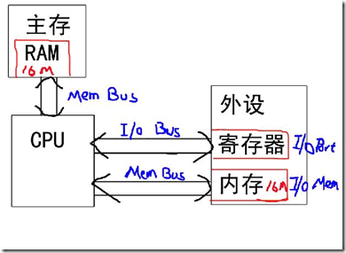
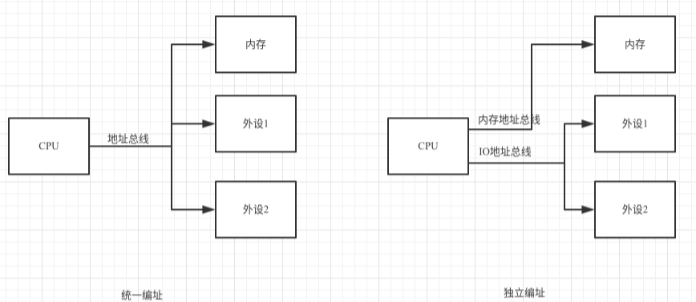

# 0x00. 导读

# 0x01. 简介

# 0x02. IO空间

理清 IO 端口、IO 内存、IO 空间、内存空间、IO映射、内存映射。

## 2.1 IO 空间

**端口（port）** 是接口电路中能被 CPU 直接访问的寄存器的地址。几乎每一种外设与 CPU 交互都是通过读写设备上的寄存器来进行的。CPU通过这些地址即端口向接口电路中的寄存器发送命令，读取状态和传送数据。  
外设寄存器也称为 **I/O端口**，通常包括：控制寄存器、状态寄存器和数据寄存器三大类，而且一个外设的寄存器通常被连续地编址。

外设中的寄存器被称为 I/O端口，外设中的内存被称为 **I/O内存**。二者合起来统称为 **I/O空间**。

**内存空间**：内存地址寻址范围，32位操作系统内存空间为2的32次幂，即4G。

## 2.2 IO端口编址

CPU对外设IO端口物理地址的编址方式有两种（具体采用哪一种则取决于CPU的体系结构）：
- 统一编址

    RISC 指令系统的CPU（如，PowerPC、m68k、ARM等）通常只实现一个物理地址空间（RAM）。在这种情况下，外设I/O端口的物理地址就被映射到CPU的单一物理地址空间中，而成为内存的一部分。此时，CPU可以象访问一个内存单元那样访问外设I/O端口，而不需要设立专门的外设I/O指令。

    统一编址也称为 I/O内存 方式，外设寄存器位于 内存空间。

- 独立编址

    而另外一些体系结构的CPU（典型地如X86）则为外设专门实现了一个单独地地址空间，称为“I/O地址空间”或者“I/O端口空间”。这是一个与CPU地RAM物理地址空间不同的地址空间，所有外设的I/O端口均在这一空间中进行编址。CPU通过设立专门的I/O指令（如X86的IN和OUT指令）来访问这一空间中的地址单元（也即I/O端口）。与RAM物理地址空间相比，I/O地址空间通常都比较小，如x86 CPU的I/O空间就只有64KB（0－0xffff）。这是“I/O映射方式”的一个主要缺点。

    独立编址也称为 I/O端口 方式，外设寄存器位于 I/O空间。

## 2.3 Linux下访问IO端口

对于某一既定的系统，它要么是独立编址、要么是统一编址，具体采用哪一种则取决于CPU的体系结构。但对于 Linux 内核而言，它可能用于不同的CPU，所以它必须都要考虑这两种方式，于是它采用一种新的方法：  
将基于统一编址或者独立编址的 I/O 端口通称为 **I/O区域（I/O region）**，不论你采用哪种方式，都要先申请 IO 区域：`request_resource()`，结束时释放它：`release_resource()`。

IO region 是一种 IO 资源，用 `struct resource` 结构类型来描述。

访问 IO端口 有2种途径：
- I/O映射方式（I/O－mapped）  
    不映射到内存空间，直接使用 intb()/outb() 之类的函数来读写IO端口。  
    涉及的函数大概是 `request_region`, `ioport_map`, `inb(),outb`, `release_region`

- 内存映射方式（Memory－mapped）  
    先把 IO端口 映射到 IO内存（“内存空间”），再使用访问IO内存的函数来访问 IO端口。  
    涉及的函数大概是 `request_mem_region`, `ioremap`, `readb(),writeb()`, `iounmap`, `release_mem_region`