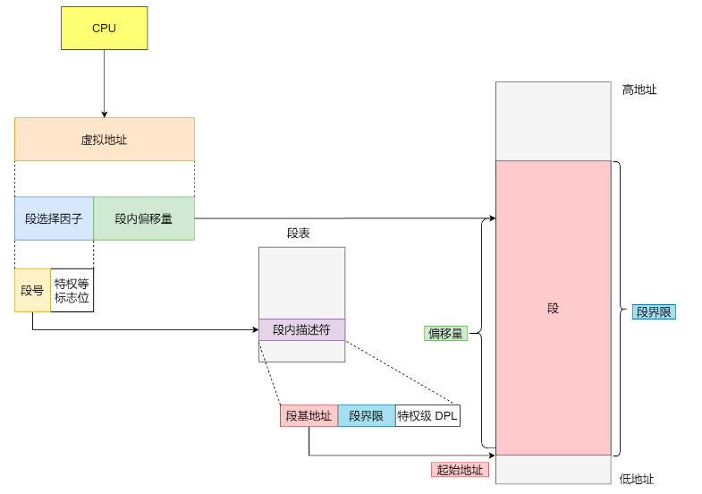

# 0x01. 机制解释

## 1. 虚拟地址的组成

    分段机制下的虚拟地址由两部分组成：
    - 段选择因子 
    - 段内偏移量 

## 2. 分段的好处
    分段的好处就是能产生连续的内存空间。

段选择因子和段内偏移量：

- 段选择子保存在段寄存器里面。   

    段选择子由段号、特权标志位等数据组成，段号最重要，用作段表的索引。   
    段表里面保存的是这个段的基地址、段的界限和特权等级等。

- 虚拟地址中的段内偏移量应该位于 0 和段界限之间，如果段内偏移量是合法的，就将段基地址加上段内偏移量得到物理内存地址。

从上面可以得知：虚拟地址是通过 **段表** 与物理地址进行映射的。

## 3. 缺点

两个缺点：
- 内存碎片 。   
    假如一共 100M 内存: 
    - 游戏 30M 
    - 浏览器 40M 
    - QQ 20M 
    
    现在浏览器关了，剩余 100M - 30M - 20M = 50M ，这个时候想看电影，程序需要 50M ，但是，万一刚刚剩余的 50M 不是连续的，那就没法看电影了。

    咋办？  -- 内存交换。QQ 暂时换到硬盘上去，腾出 20M 来，再不够游戏再挪挪屁股。

    这个内存交换空间，在 Linux 系统里，也就是我们常看到的 Swap 空间，这块空间是从硬盘划分出来的，用于内存与硬盘的空间交换。这就引入了第二个问题。
- 内存交换的效率低。   
    对于多进程的系统来说，用分段的方式，内存碎片是很容易产生的，产生了内存碎片，那不得不重新 Swap 内存区域，这个过程会产生性能瓶颈。

    因为硬盘的访问速度要比内存慢太多了，每一次内存交换，我们都需要把一大段连续的内存数据写到硬盘上。

    所以，如果内存交换的时候，交换的是一个占内存空间很大的程序，这样整个机器都会显得卡顿。

所以，还是得 内存分页 。