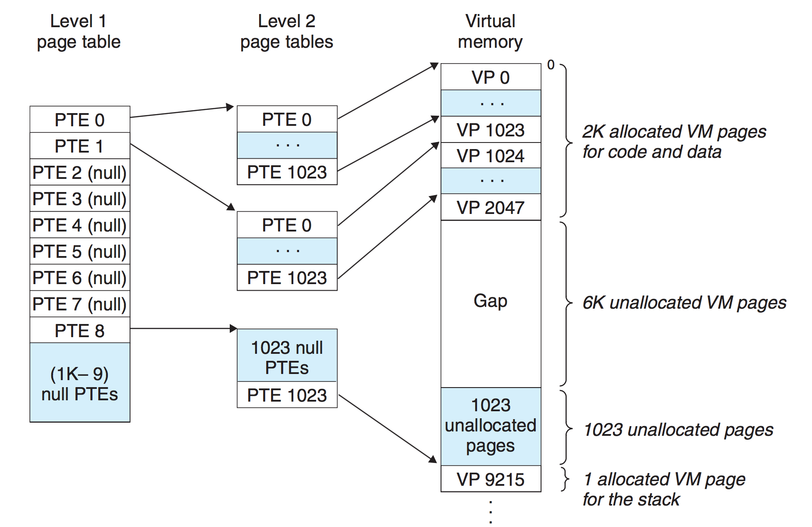
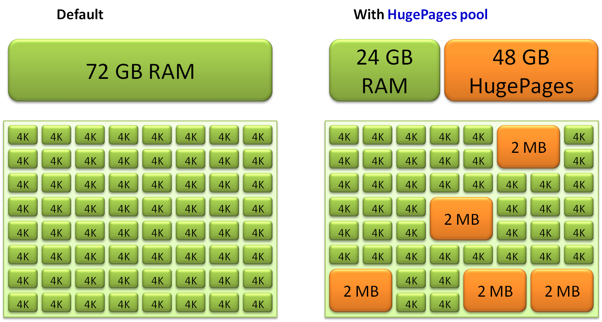

# 0x0 导读

内存分页是从 Intel 80386 开始的（前面分别是 8086、80286）。

1. 内存分页是什么？
2. 优化

# 0x01 简介

分页是把内存切成一段段固定尺寸的大小，也就是页 ( Page ) ，用大小相同的页替换大小不同的段。在 Linux 下，每一页的大小为 4KB。

这样一切分，内存碎片自然就出现的少了。另外，当需要进行内存交换的时候，需要交换写入或者从磁盘装载的数据也更少了。

并且因为每个进程都有自己的页表，所以每个进程的虚拟内存空间就是相互独立的。进程也没有办法访问其他进程的页表，解决了多进程之间地址冲突的问题。  

页表里的页表项中除了地址之外，还有一些标记属性的比特，比如控制一个页的读写权限，标记该页是否存在等。在内存访问方面，操作系统提供了更好的安全性。

物理内存是有限的，在物理内存整体吃紧的时候，可以让多个进程通过分时复用（你早上 8 点用，我早上 9 点用，分开时间）的方法共享一个物理页面（某个进程需要保存的内容可以暂时 swap 到外部的 disk/flash ）。

## 1.1 线性地址/虚拟地址

分页内存模式下的地址称为线性地址。

- 虚拟页号 VPN (virtual page number)
- 虚拟页偏移 VPO (virtual page offset)
- 物理页号 PPN (physical page number)
- 物理页偏移 PPO (physical page offset)

在分页机制下，虚拟地址分为两部分: VPN 和 VPO。

`VPN` 作为 `PageTable` 的索引，`PageTable` 中的每一项包含物理页每页所在物理内存的基地址，这个基地址与 `VPO` 的组合就形成了物理内存地址，见下图。（如果对应的 `PTE`(`page table entry`) 中的 `PPN` 不存在，也就是 `valid` 位是 0 ，这将触发一个 `page fault` 。）

其中 n 是地址的位数，例如 32 位机器是 32 ，64 位机器是 64 。  
p 等于页的字节大小的幂数，例如页是 4kb ，即 1024 * 4 字节，也就是 2 的 12 次方字节大小，则 p = 12.

换个思路，知道了 p ，剩余就可以算出 m 或者 n 了。

# 0x02、优化

## 2.1 页表优化

前面说到用 `VPN` 来做页表索引，也就是说页表的大小 = 虚拟地址位数 / 页的大小。比如 32 位机器，页大小一般为 4K ，则页表项有 2^32 / 2^12 = 2^20 条目。64 位机器就更多了。

所以可以引入多级页表：  
一级页表中的每个 `PTE` (`page table entry`)映射虚拟地址空间的一个 4MB 的片，每一片由1024 个连续的页面组成。一级 `PTE` 指向二级页表的基址。这样 32 位地址空间使用 1024 个一级 `PTE` 就可以表示。需要的二级页表总条目还是 2^32 / 2^12 = 2^20 个。**这里的关键在于如果一级 `PTE i` 中的页面都未被分配，一级 `PTE` 就为空。**

多级页表减少内存占用的关键在于：

1. 如果一级页表中的一个 `PTE` 为空，那么相应的二级页表就根本不会存在。这是一种巨大的潜在节约。
2. 只有一级页表才需要常驻内存。虚拟内存系统可以在需要时创建、页面调入或者调出二级页表，从而减轻内存的压力。

## 2.2 查询优化

页表是在内存中，这样每次地址翻译可能都需要先访问一次内存中的页表，效率非常低下。如果能缓存一些数据，就能减少这次内存访问了，对应的解决方案是引入页表的高速缓存：`TLB(Translation Lookaside Buffer)`。

每次先去查找 `TLB` ，如果 TLB miss ，再去 `PageTable` 。

`TLB` 是 `MMU`(`Memory Management Unit`) 的一部分。

`MMU` 是处理器/核 (processer) 中的一个硬件单元，通常每个核有一个 `MMU` 。 `MMU` 由两部分组成：
- `TLB`( Translation Lookaside Buffer ) ，通常称为页表缓存、转址旁路缓存、快表。
- `Table Walk Unit`: 本身是一个硬件单元，作用是通过查 PageTable 来获得 VA 对应的 PA。

    使用 `table walk unit` 硬件单元来查找 `page table` 的方式被称为 `hardware TLB miss handling` ，通常被 `CISC` 架构的处理器（比如 `IA-3` 2）所采用。它要在 `page table` 中查找不到，出现 `page fault` 的时候才会交由软件（操作系统）处理。

    与之相对的通常被 `RISC` 架构的处理器（比如Alpha）采用的 `software TLB miss handling` ， TLB miss 后 CPU 就不再参与了，由操作系统通过软件的方式来查找 `page table` 。
    使用硬件的方式更快，而使用软件的方式灵活性更强。 `IA-64` 提供了一种混合模式，可以兼顾两者的优点。

`PageTable` 是每个进程独有的，是软件实现的，是存储在内存中的。

有了 `TLB` 之后的虚拟地址转换流程会复杂一些，因为当 `TLB miss` 的时候需要更新 `TLB` ：

1. CPU 给出一个 virtual address

2. 首先查找 TLB ，存在则称为 TLB hit ，直接得到对应的地址。

3. TLB miss, 需要 MMU 的 table walk unit 来查找 page table.    
    如果在 page table 存在，检查 p(present) 位：
    - 为 1 
        - 更新 TLB ，因为我之所以到这一步就是因为 TLB 里面没有
        - 权限检测，如果没有正确权限，则触发 SIGSEGV(Segmantation Fault)
    - 为 0 ，触发 page fault，之所以为 0 ，可能因为
        - 这个虚拟地址被分配后还从来没有被 access 过（比如 malloc 之后还没有操作分配到的空间，则不会真正分配物理内存）。触发 page fault 后分配物理内存，也就是 demand paging ，有了确定的 demand 了之后才分，然后将 p 位置 1。
        - 对应的这个物理页面的内容被换出到外部的 disk/flash 了，这个时候 page table entry 里存的是换出页面在外部 swap area 里暂存的位置，可以将其换回物理内存，再次建立映射，然后将 p 位置 1。

4. 如果不存在，产生 page fault ，操作系统从硬盘将其加载到内存。

## 2.3 large/huge page

将 `Page` 大小从 4k 变为 2M 甚至 1G 。`Page` 变大了，所需要的索引就少了，`TLB` 缓存命中率将大大提高，访问速度也就快了。

但是，没有银弹，也会带来一些缺点：
- 由于各种内存操作基本都要求按照 `Page` 对齐，当 `Page` 变大的时候，浪费也就增多了。
- 系统运行一段时间后，会很难再也大块的连续物理内存，这时分配 `large page` 将会变的很困难，所以通常需要在系统初始化的时候就划分出一段物理内存给 `large page` 用，这样就减少了一些灵活性。
- 动态 `large page`(`THP`) 在换出到外部的 `flash/disk` 和从 `flash/disk` 换入物理内存的过程会比正常大小的 `Page` 带来更大的开销。

### 2.3.1 transparent huge page
在程序需要 `huge page` 的时候，可通过 内存规整(`memory compaction`) 操作移动页面，以形成一个 `huge page` ，因为该过程不会被应用感知到，所以被称为 `transparent` 。

[memory compaction 介绍](https://tinylab.org/lwn-368869/)

## 2.4 paging structure caches