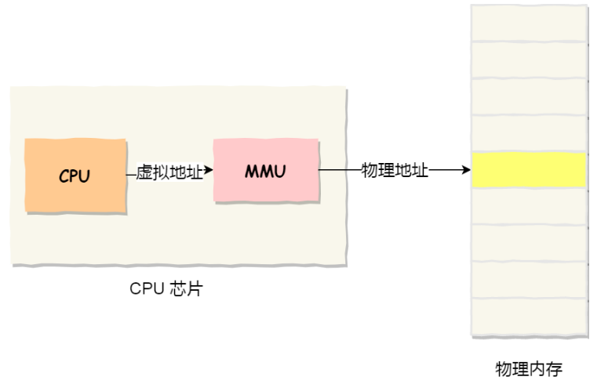
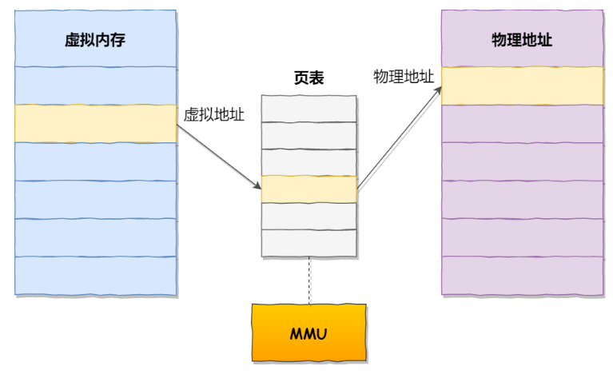
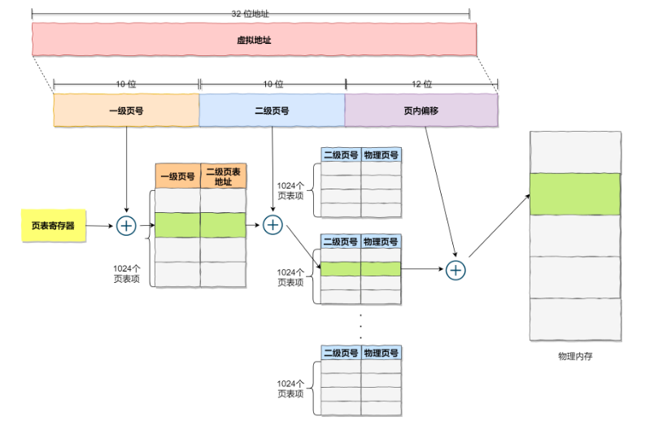
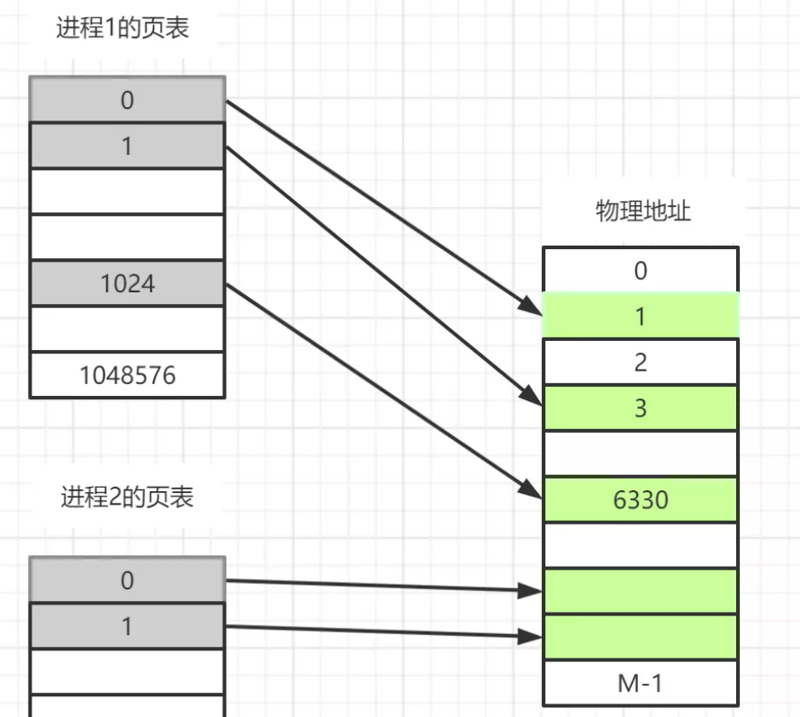
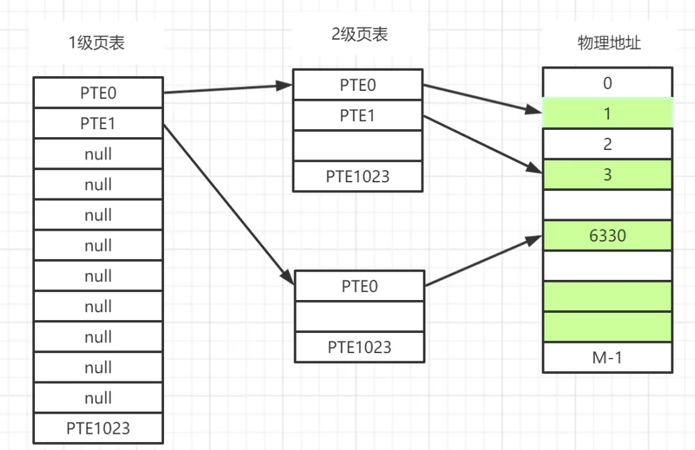

# 0x01 简介

    分页是把整个虚拟和物理内存空间切成一段段固定尺寸的大小。这样一个连续并且尺寸固定的内存空间，我们叫页（Page）。在 Linux 下，每一页的大小为 4KB。

    这样一切分，内存碎片自然就出现的少了。另外，当需要进行内存交换的时候，需要交换写入或者从磁盘装载的数据也更少了。

虚拟地址通过 MMU(Memory Management Unit) 和 页表(page table) 来转换为物理地址。

MMU是处理器/核 (processer) 中的一个硬件单元，通常每个核有一个MMU。MMU由两部分组成：
- TLB(Translation Lookaside Buffer)
- table walk unit。

page table 是每个进程独有的，是软件实现的，是存储在 main memory (比如DDR) 中的。



# 0x02 查找

1. CPU 给出一个 virtual address
2. 首先查找 TLB ，存在则称为 TLB hit ，直接获取对应的物理地址。
3. TLB miss, 需要 MMU 的 table walk unit 来查找 page table.    
    如果存在，检查 p(present) 位：
    - 为 1 
        - 更新 TLB ，因为我之所以到这一步就是因为 TLB 里面没有
        - 权限检测，如果没有正确权限，则触发 SIGSEGV(Segmantation Fault)
    - 为 0 ，触发 page fault，之所以为 0 ，可能因为
        - 这个虚拟地址被分配后还从来没有被 access 过（比如 malloc 之后还没有操作分配到的空间，则不会真正分配物理内存）。触发 page fault 后分配物理内存，也就是 demand paging ，有了确定的 demand 了之后才分，然后将 p 位置 1。
        - 对应的这个物理页面的内容被换出到外部的 disk/flash 了，这个时候 page table entry 里存的是换出页面在外部 swap area 里暂存的位置，可以将其换回物理内存，再次建立映射，然后将 p 位置 1。


虚拟地址与物理地址之间通过页表来映射，如下图：


页表是存储在内存里的，内存管理单元 （MMU）就做将虚拟内存地址转换成物理地址的工作。

当进程访问的虚拟地址在页表中查不到时，系统会产生一个缺页异常，进入系统内核空间分配物理内存、更新进程页表，最后再返回用户空间，恢复进程的运行。

缺点：因为内存分页机制分配内存的最小单位是一页，即使程序不足一页大小，我们最少只能分配一个页，所以页内会出现内存浪费，所以针对内存分页机制会有内部内存碎片（相对于前面的外部内存碎片，这里的内存碎片是在里面，给我分配了那么多，但是我用不着）的现象。

在分页机制下，虚拟地址分为两部分，页号和页内偏移。页号作为页表的索引，页表包含物理页每页所在物理内存的基地址，这个基地址与页内偏移的组合就形成了物理内存地址，见下图。


对于一个内存地址转换，其实就是这样三个步骤：

- 把虚拟内存地址，切分成页号和偏移量；
- 根据页号，从页表里面，查询对应的物理页号；
- 直接拿物理页号，加上前面的偏移量，就得到了物理内存地址。

----

### 2.3 更进一步

前面的内存分页有空间上的致命缺陷。

因为操作系统是可以同时运行非常多的进程的，那这不就意味着页表会非常的庞大。

在 32 位的环境下，虚拟地址空间共有 4GB，假设一个页的大小是 4KB（2^12），那么就需要大约 100 万 （2^20） 个页，每个「页表项」需要 4 个字节大小来存储，那么整个 4GB 空间的映射就需要有 4MB 的内存来存储页表。

这 4MB 大小的页表，看起来也不是很大。但是要知道每个进程都是有自己的虚拟地址空间的，也就说都有自己的页表。

那么，100 个进程的话，就需要 400MB 的内存来存储页表，这是非常大的内存了，更别说 64 位的环境了。

所以引入 多级页表 。

我们把 100 多万个「页表项」的单级页表再分页，将页表（一级页表）分为 1024 个页表（二级页表），每个表（二级页表）中包含 1024 个「页表项」，形成二级分页。



```
你可能会问，分了二级表，映射 4GB 地址空间就需要 4KB（一级页表）+ 4MB（二级页表）的内存，这样占用空间不是更大了吗？

如果某个一级页表的页表项没有被用到，也就不需要创建这个页表项对应的二级页表了，即可以在需要时才创建二级页表。做个简单的计算，假设只有 20% 的一级页表项被用到了，那么页表占用的内存空间就只有 4KB（一级页表） + 20% * 4MB（二级页表）= 0.804MB，这对比单级页表的 4MB 是不是一个巨大的节约？

解释的很好，那最开始的单页表不也可以这样吗，需要的时候再创建，何必还要多级页表？

问的很好，证明在瞎鸡儿想，完全不是一回事。听我说，抛开页表里面的内容（到目前位置，我也不知道是谁，以及咋填内容进去的），想象一下：

- 在单页表机制中，A 进程创建了，你是不是要给它腾出 4M 内存来放页表，先别管里面内容有没有，准不准，反正进程创建了，你得给它 4M 内存，咋用是它的事，你不能先给 1k ，然后发现不够了再加，不是这么回事，你仔细想想。
- 在多级页表下，A 进程创建了，我只需要给 4k 内存就行，剩下的，用到了再说。

```
还是没理解节省在哪的话，可以看下面的图：
- 单页表。0、1、1024 填了有效数据，其余的不填也占地方。
- 多级页表。1、2 填了有效数据，其余的不填也一样占地方，但是占的少。而没填的，对应的二级我就是可以不创建。



------