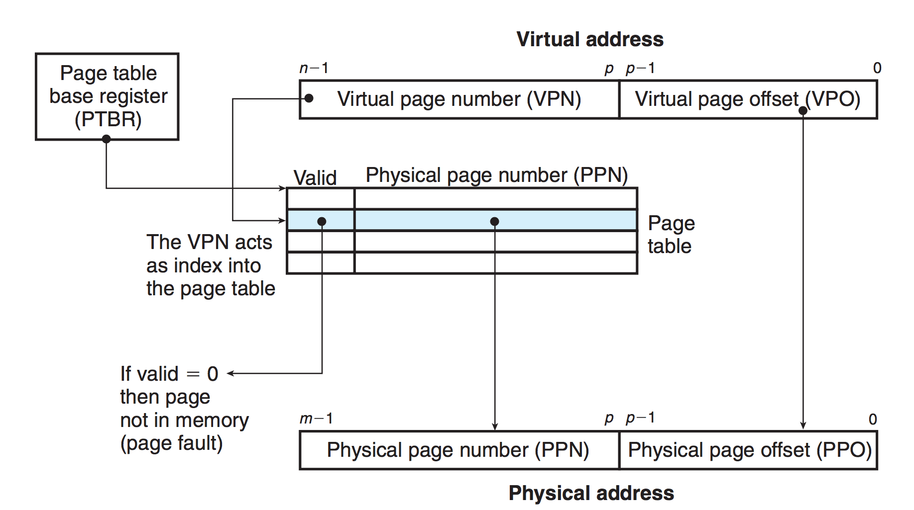

# 0x00. 导读

# 0x01. 简介

内存分页是从 Intel 80386 开始的（前面分别是 8086、80286）。

分页是把内存切成一段段固定尺寸的大小，也就是页 ( Page ) ，用大小相同的页替换大小不同的段。在 Linux 下，每一页的大小为 **4KB**。

这样一切分，内存碎片自然就出现的少了。另外，当需要进行内存交换的时候，需要交换写入或者从磁盘装载的数据也更少了。

并且因为每个进程都有自己的页表，所以每个进程的虚拟内存空间就是相互独立的。进程也没有办法访问其他进程的页表，解决了多进程之间地址冲突的问题。  

页表里的页表项中除了地址之外，还有一些标记属性的比特，比如控制一个页的读写权限，标记该页是否存在等。在内存访问方面，操作系统提供了更好的安全性。

物理内存是有限的，在物理内存整体吃紧的时候，可以让多个进程通过分时复用（你早上 8 点用，我早上 9 点用，分开时间）的方法共享一个物理页面（某个进程需要保存的内容可以暂时 swap 到外部的 disk/flash ）。

## 1.1 线性地址/虚拟地址

分页内存模式下的地址称为 **线性地址**。

**线性地址：** 也称为虚拟地址。在 32 位 CPU 中，它是 32 位的无符号整型，最大可以达到 4G 。在 x86_64 CPU 中目前最大可使用 48 位地址线，即最大可寻址 1TB 。 

- 虚拟页号 VPN (virtual page number)
- 虚拟页偏移 VPO (virtual page offset)
- 物理页号 PPN (physical page number)
- 物理页偏移 PPO (physical page offset)

在分页机制下，虚拟地址分为两部分: VPN 和 VPO。

`VPN` 作为 `PageTable` 的索引，`PageTable` 中的每一项包含物理页每页所在物理内存的基地址，这个基地址与 `VPO` 的组合就形成了物理内存地址，见下图。（如果对应的 `PTE`(`page table entry`) 中的 `PPN` 不存在，也就是 `valid` 位是 0 ，这将触发一个 `page fault` 。）

其中 n 是地址的位数，例如 32 位机器是 32 ，64 位机器是 64 。  
p 等于页的字节大小的幂数，例如页是 4kb ，即 1024 * 4 字节，也就是 2 的 12 次方字节大小，则 p = 12.

