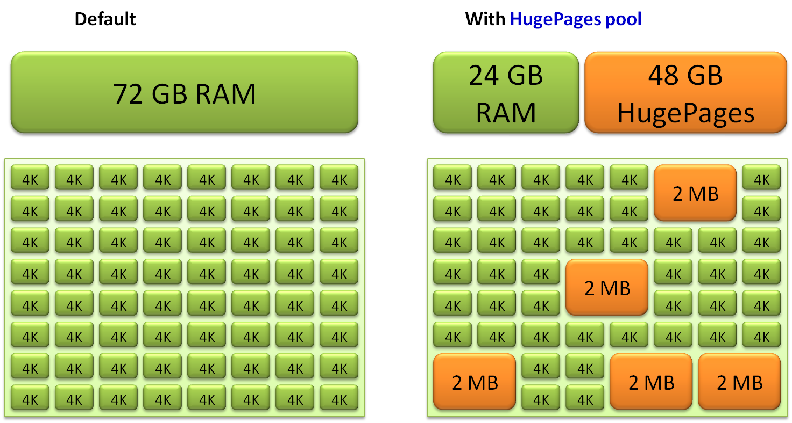

# 0x00. 导读

# 0x01. 简介

# 0x02. 优化

## 2.1 页表优化

前面说到用 `VPN` 来做页表索引，也就是说页表的大小 = 虚拟地址位数 / 页的大小。比如 32 位机器，页大小一般为 4K ，则页表项有 2^32 / 2^12 = 2^20 条目。64 位机器就更多了。

所以可以引入多级页表：  
一级页表中的每个 `PTE` (`page table entry`)映射虚拟地址空间的一个 4MB 的片，每一片由1024 个连续的页面组成。一级 `PTE` 指向二级页表的基址。这样 32 位地址空间使用 1024 个一级 `PTE` 就可以表示。需要的二级页表总条目还是 2^32 / 2^12 = 2^20 个。**这里的关键在于如果一级 `PTE i` 中的页面都未被分配，一级 `PTE` 就为空。**

多级页表减少内存占用的关键在于：

1. 如果一级页表中的一个 `PTE` 为空，那么相应的二级页表就根本不会存在。这是一种巨大的潜在节约。
2. 只有一级页表才需要常驻内存。虚拟内存系统可以在需要时创建、页面调入或者调出二级页表，从而减轻内存的压力。

## 2.2 查询优化

页表是在内存中，这样每次地址翻译可能都需要先访问一次内存中的页表，效率非常低下。如果能缓存一些数据，就能减少这次内存访问了，对应的解决方案是引入页表的高速缓存：`TLB(Translation Lookaside Buffer)`。

每次先去查找 `TLB` ，如果 TLB miss ，再去 `PageTable` 。

`TLB` 是 `MMU`(`Memory Management Unit`) 的一部分。

`MMU` 是处理器/核 (processer) 中的一个硬件单元，通常每个核有一个 `MMU` 。 `MMU` 由两部分组成：
- `TLB`( Translation Lookaside Buffer ) ，通常称为页表缓存、转址旁路缓存、快表。
- `Table Walk Unit`: 本身是一个硬件单元，作用是通过查 PageTable 来获得 VA 对应的 PA。

    使用 `table walk unit` 硬件单元来查找 `page table` 的方式被称为 `hardware TLB miss handling` ，通常被 `CISC` 架构的处理器（比如 `IA-32`）所采用。它要在 `page table` 中查找不到，出现 `page fault` 的时候才会交由软件（操作系统）处理。

    与之相对的通常被 `RISC` 架构的处理器（比如Alpha）采用的 `software TLB miss handling` ， TLB miss 后 CPU 就不再参与了，由操作系统通过软件的方式来查找 `page table` 。
    使用硬件的方式更快，而使用软件的方式灵活性更强。 `IA-64` 提供了一种混合模式，可以兼顾两者的优点。

`PageTable` 是每个进程独有的，是软件实现的，是存储在内存中的。

有了 `TLB` 之后的虚拟地址转换流程会复杂一些，因为当 `TLB miss` 的时候需要更新 `TLB` ：

1. CPU 给出一个 virtual address

2. 首先查找 TLB ，存在则称为 TLB hit ，直接得到对应的地址。

3. TLB miss, 需要 MMU 的 table walk unit 来查找 page table.    
    如果在 page table 存在，检查 p(present) 位：
    - 为 1 
        - 更新 TLB ，因为我之所以到这一步就是因为 TLB 里面没有
        - 权限检测，如果没有正确权限，则触发 SIGSEGV(Segmantation Fault)
    - 为 0 ，触发 page fault，之所以为 0 ，可能因为
        - 这个虚拟地址被分配后还从来没有被 access 过（比如 malloc 之后还没有操作分配到的空间，则不会真正分配物理内存）。触发 page fault 后分配物理内存，也就是 demand paging ，有了确定的 demand 了之后才分，然后将 p 位置 1。
        - 对应的这个物理页面的内容被换出到外部的 disk/flash 了，这个时候 page table entry 里存的是换出页面在外部 swap area 里暂存的位置，可以将其换回物理内存，再次建立映射，然后将 p 位置 1。

4. 如果不存在，产生 page fault ，操作系统从硬盘将其加载到内存。

假如目标内存页在物理内存中没有对应的页帧或者存在但无对应权限，CPU 就无法获取数据，这种情况下CPU就会报告一个缺页错误。

由于CPU没有数据就无法进行计算，CPU罢工了用户进程也就出现了缺页中断，进程会从用户态切换到内核态，并将缺页中断交给内核的 Page Fault Handler 处理。

- Hard Page Fault  
也被称为 Major Page Fault ，翻译为硬缺页错误/主要缺页错误，这时物理内存中没有对应的页帧，需要CPU打开磁盘设备读取到物理内存中，再让MMU建立VA和PA的映射。
- Soft Page Fault  
也被称为Minor Page Fault，翻译为软缺页错误/次要缺页错误，这时物理内存中是存在对应页帧的，只不过可能是其他进程调入的，发出缺页异常的进程不知道而已，此时MMU只需要建立映射即可，无需从磁盘读取写入内存，一般出现在多进程共享内存区域。
- Invalid Page Fault  
翻译为无效缺页错误，比如进程访问的内存地址越界访问，又比如对空指针解引用内核就会报segment fault错误中断进程直接挂掉。

不同类型的Page Fault出现的原因也不一样，常见的几种原因包括：

非法操作访问越界
这种情况产生的影响也是最大的，也是Coredump的重要来源，比如空指针解引用或者权限问题等都会出现缺页错误。
使用malloc新申请内存
malloc机制是延时分配内存，当使用malloc申请内存时并未真实分配物理内存，等到真正开始使用malloc申请的物理内存时发现没有才会启动申请，期间就会出现Page Fault。
访问数据被swap换出
物理内存是有限资源，当运行很多进程时并不是每个进程都活跃，对此OS会启动内存页面置换将长时间未使用的物理内存页帧放到swap分区来腾空资源给其他进程，当存在于swap分区的页面被访问时就会触发Page Fault从而再置换回物理内存。

## 2.3 large/huge page

将 `Page` 大小从 4k 变为 2M 甚至 1G 。`Page` 变大了，所需要的索引就少了，`TLB` 缓存命中率将大大提高，访问速度也就快了。

但是，没有银弹，也会带来一些缺点：
- 由于各种内存操作基本都要求按照 `Page` 对齐，当 `Page` 变大的时候，浪费也就增多了。
- 系统运行一段时间后，会很难再也大块的连续物理内存，这时分配 `large page` 将会变的很困难，所以通常需要在系统初始化的时候就划分出一段物理内存给 `large page` 用，这样就减少了一些灵活性。
- 动态 `large page`(`THP`) 在换出到外部的 `flash/disk` 和从 `flash/disk` 换入物理内存的过程会比正常大小的 `Page` 带来更大的开销。

### 2.3.1 transparent huge page
在程序需要 `huge page` 的时候，可通过 内存规整(`memory compaction`) 操作移动页面，以形成一个 `huge page` ，因为该过程不会被应用感知到，所以被称为 `transparent` 。

[memory compaction 介绍](https://tinylab.org/lwn-368869/)

## 2.4 paging structure caches