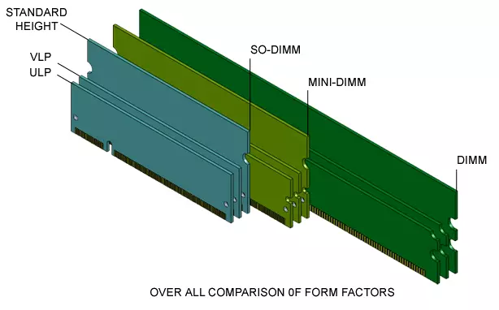
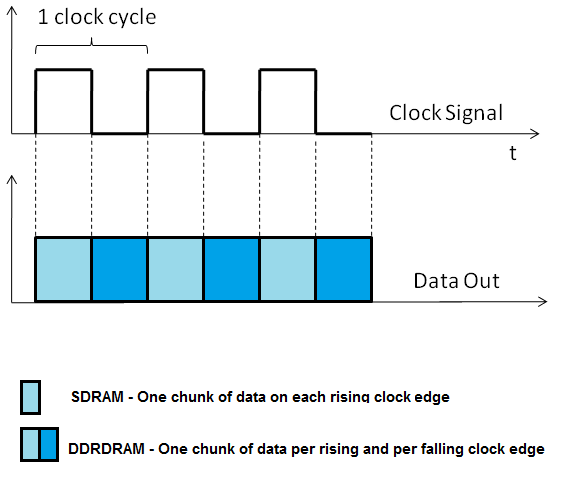
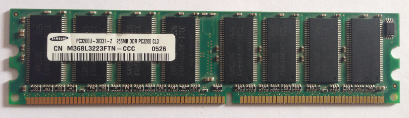
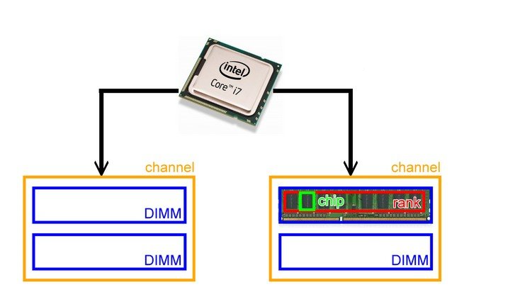
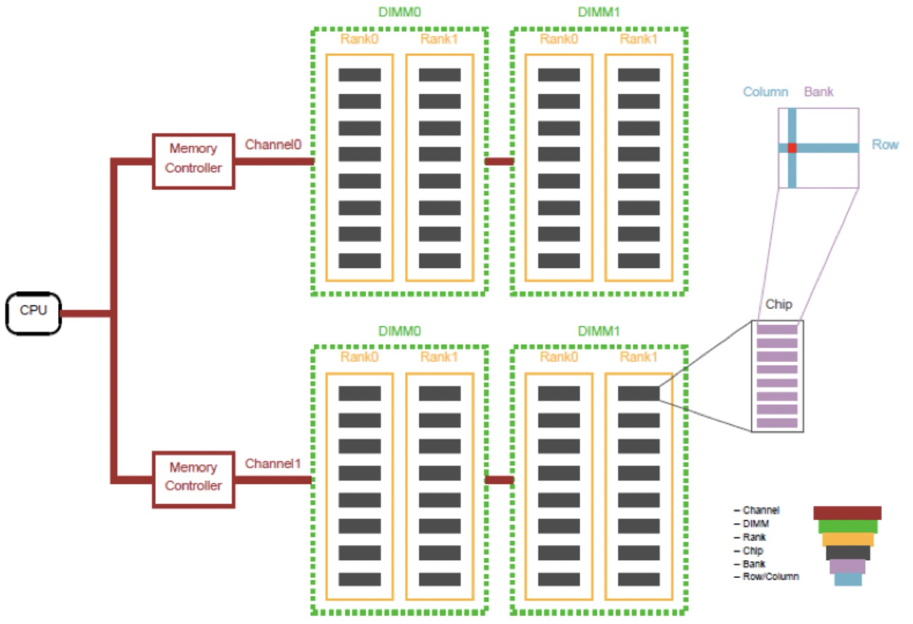
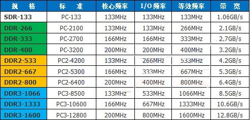
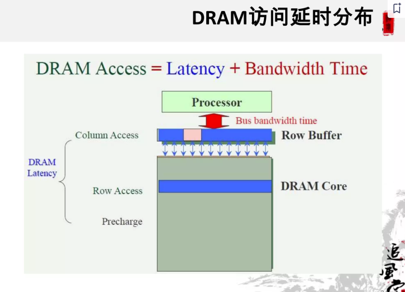
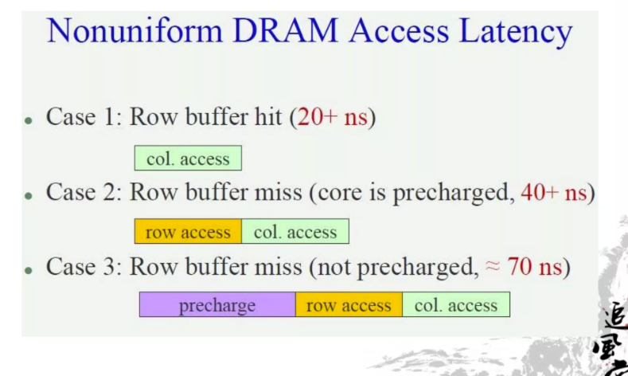
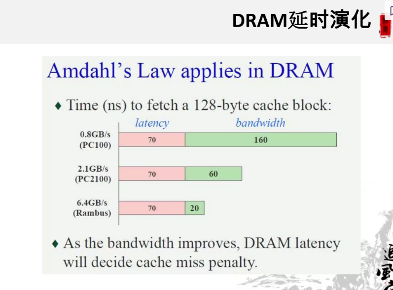

# 0x00. 导读

# 0x01. 简介

[plantegg: Linux内存](https://plantegg.github.io/2020/11/15/Linux%E5%86%85%E5%AD%98--%E7%AE%A1%E7%90%86%E5%92%8C%E7%A2%8E%E7%89%87/)

[DDR 探密一：从电容鼓到 DDR，内存技术进化史](https://zhuanlan.zhihu.com/p/663690992)

# 0x02. 


# 0x03. 扫盲

## 3.1 DIMM

在80286时代，内存颗粒 (Chip) 是直接插在主板上的，叫做 DIP(Dual In-line Package)。到了80386时代，换成1片焊有内存颗粒的电路板，叫做 SIMM (Single-Inline Memory Module) 。由阵脚形态变化成电路板带来了很多好处:模块化，安装便利等等，由此DIY市场才有可能产生。当时 SIMM 的位宽是32bit，即一个周期读取4个字节，到了奔腾时，位宽变为64bit，即8个字节，于是SIMM就顺势变为 `DIMM (Double-Inline Memory Module), 双列直插式内存模块` 。这种形态一直延续至今，也是内存条的基本形态。我们可以把 DIMM 作为一个内存条实体。

现在DIMM分为很多种：

注：ECC ：纠错码。一种 DRAM，包含附加码用于检测和纠正内存错误。

- RDIMM: 全称 (Registered DIMM) ，寄存型模组，主要用在服务器上，为了增加内存的容量和稳定性分有ECC和无ECC两种，但市场上几乎都是ECC的。带寄存器的内存，又称为缓冲内存。一种 DRAM，内存和内存控制器之间有一个寄存器。寄存器会将数据保留一个时钟周期，从而提高可靠性。

- UDIMM：全称 (Unbuffered DIMM) ，无缓冲型模组，这是我们平时所用到的标准台式电脑DIMM，分有ECC和无ECC两种，一般是无ECC的。不带缓冲的内存，是 PC、笔记本电脑和 Mac 使用的标准内存。

- SO-DIMM：全称 (Small Outline DIMM) ，小外型DIMM，笔记本电脑中所使用的DIMM，分ECC和无ECC两种。

- Mini-DIMM：DDR2时代新出现的模组类型，它是Registered DIMM的缩小版本，用于刀片式服务器等对体积要求苛刻的高端领域。

一般内存长度 133.35mm，SO-DIMM为了适应笔记本内狭小的空间，缩短为67.6mm而且一般为侧式插入。高度也有些变种，一般的内存条高度为30mm，VLP (Very Low Profile) 降低为18.3mm，而ULP (Ultra Low Profile) 更是矮化到17.8mm，主要是为了放入1U的刀片服务器中。

大小关系如下图：



## 3.2 DDR 到 DDR4

大部分台式机 DIMM 厂商都会标注 `DDRx-yyy`，x代表第几代，yyy代表数据传输率，例如 DDR4-3200. 而大部分的 SO-DIMM 和 RDIMM 等则标注 `PCx-zzzz`，x还代表第几代，zzzz则代表最大带宽，zzzz=yyy * 8, 而 yyy 又是时钟的两倍，例如 PC3-10600 代表 DDR3，1333MHz 的SO-DIMM。

```
RAM = Random Access Memory
DRAM = dynamic RAM
SRAM = Static RAM
SDRAM = Synchronous DRAM
SDR SDRAM = Single Data Rate SDRAM
DDR SDRAM = Double Data Rate SDRAM
```

RAM 是仅在通电状态下才会保留其内容的存储器。  
动态 RAM (或 DRAM) 单元不仅需要通电来保存其内容，而且即使这样，如果不定期刷新，它也会逐渐丢失其内容。  
静态 RAM (或 SRAM) 只要通电就会简单地保留其内容。

在广泛的 RAM 类别中，SRAM 仍然比 DRAM 更快，但每比特的成本也更高。这是因为 SRAM 单元需要四到六个晶体管，而 DRAM 单元只需要一个。然而，DRAM 内存确实需要一个自动执行定期刷新的控制器。

DRAM 有多种类型，最新的是 DDR5。最初的 DRAM 被 FPRAM (Fast Page RAM) 所取代，然后是 EDO RAM (Extended Data Output RAM) ，最后被 Synchronous DRAM (即 SDRAM) 所取代。

DDR SDRAM 全称为 Double Data Rate SDRAM，中文名为“双倍数据流SDRAM”。DDR SDRAM 在原有的 SDRAM 的基础上改进而来，SDRAM 是 SDR SDRAM 。顾名思义，和原本的 SDRAM 相比，DDR SDRAM一个时钟周期要传输两次数据 (transferring data on both the rising and falling clock edges) ：



SDRAM 是所有现代 DRAM 存储器的基础。 SDRAM 之前的 DRAM 存储器是异步的，这意味着在读取请求之后，所请求的数据会在任何时候出现。在SDRAM中，数据与存储器访问时钟同步。


## 3.3 RANK 和 BANK

内存从物理结构上面分为：Channel > DIMM (对应物理上售卖的内存条)  > Rank > Chip > Bank > Row/Column。



我们可以把DIMM作为一个内存条实体，我们知道一个内存条会有两个面，高端的内存条，两个面都有内存颗粒。所以我们把每个面叫做一个Rank，也就是说一个内存条会存在Rank0和Rank1。

拿rank0举例，上面有8个黑色颗粒，我们把每个黑色颗粒叫做chip。再向微观走，就是一个chip里面会有8个bank。每个bank就是数据存储的实体，这些bank就相当于一个二维矩阵，只要声明了column和row就可以从每个bank中取出8bit的数据。



在这个例子中，一个i7 CPU支持两个Channel（双通道），每个Channel上可以插俩个DIMM,而每个DIMM由两个rank构成，8个chip组成一个rank。由于现在多数内存颗粒的位宽是8bit,而CPU带宽是64bit，所以经常是8个颗粒可以组成一个rank。所以小张的内存条2R X 8的意思是由2个rank组成，每个rank 8个内存颗粒(为啥我们以后讲)。假设整个内存是4GB，我们可以算出单个内存颗粒是256MB, `4 * 1024M / 2 / 8 = 256M`。

具体可以看如下图，一个通道Channel可以是一个DIMM也可以是两个DIMM，甚至3个DIMM，图中是2个DIMM。



## 3.4 频率

内存有三种不同的频率指标，它们分别是核心频率、时钟频率和有效数据传输频率:

- **核心频率** 即为内存 Cell 阵列 (Memory Cell Array) 的工作频率，它是内存的真实运行频率；它是内存电路的震荡频率，是内存一切工作的基石。内存的**时钟周期**与内存核心频率互为倒数。DDR5 的内存颗粒内部频率（就是刚刚说的 核心频率）为 IO频率的十六分之一，一般为 133MHz（4800MT/s）到 200MHz（6400MT/s），超频条颗粒可以跑到 300MHz；DDR3/DDR4 则为8分之一。

- **时钟频率**，又叫 IO频率，它是有效频率的一半。

- **等效频率**，或者叫**有效频率**，是内存条上贴的标签上的频率，也是常说的所谓**内存频率**，是指数据传送的频率。有效频率就是 核心频率*倍增系数 得来的，在理想情况下能代表我们内存数据传输频率。在 DDR（双倍数据率）内存技术中，传输通道中，每个时钟周期可以传输两次数据。这就导致了实际的数据传输率（MT/s, 表示每秒钟可以进行的数据传输次数）是时钟频率（MHz, 是频率的单位，表示每秒钟的周期数）的两倍。例如，一个物理通道频率在 1600MHz 的 DDR 内存，其实际数据传输率为 3200 MT/s。基于 DDR 内存的这种特性，通常会用等效频率，即传输频率 x 2 来标称内存条的传输频率。

    倍增系数，DDR通过数据预取技术放大速率，每代ddr倍率是固定的，ddr=2, ddr2=4, ddr3=8, ddr4=8, ddr5=16

    等效频率和内存预取(prefetch)有关。理解预读取，可以打个比方，一个人跑步快慢既取决于他的步频即单位时间内跑多少步，也取决于他的步长即每一步有多长。步频类似于内存的核心频率，步长则类似于内存预取的位数。DDR内存每次取2bit，DDR2内存每次取4bit，DDR3内存每次取8bit，DDR4有点特殊，它每次也是取8bit，但是内存制造商们提出了bank group 的方法来提升工作效率，使得等效频率可以达到核心频率的16倍（在DDR5中采用16-bit prefetch，从而使实际数据传输速率为IO时钟频率的16倍。）。

内存通道：若是把内存传输比作行车的道路，那么道路的宽度自然很重要，当前民用级别的设备大都支持双通道，DDR很好理解，单个通道64Bit，双通道乘以2即可。  
而DDR5有所谓的单条即可支持双通道的技术，但是这个双通道并没有比DDR4的位宽更大，因为单个通道仅是32Bit，如果你插入2条DDR5组成双通道，将会是4\*32Bit=128，这实际上是和DDR4(64\*2)的总位宽是一样的。

还有几个频率和内存有关：
- 内存控制器 IMC 频率： 一般为 3.2G 到 4.3G。
- 内存控制器总线频率：固定为 1900～2300MHz



## 3.5 延迟

DDR 的延迟可通过一系列数字体现，如 14-14-14-34, 16-18-18-36 等。这些数字表明内存进行某一操作所需的时钟脉冲数，数字越小，存储越快。

这些数字代表的操作如下：CL- tRCD – tRP – tRAS – CMD。

要理解这几个参数，需要知道内存被内部组织为一个矩阵，数据保存在行和列的交叉点。另外，还需要了解一个基本的读内存的流程如下：

首先是命令和地址信息输入，经过地址解码器分解成 bank（段）和 Word（字）选择，Word 选择就是行选择，之后是对存储单元进行再存储（Restore）和预充电（Precharge）。然后是 Column（列）选择，到此为止存储单元（cell）已经被定位。存储单元的数据被输出到内部数据总线（Internal Data Bus），最后通过输出电路输出数据。

- CAS Latency (CL/tCAS), 最广泛使用的参数

    列地址选通脉冲（CAS）延迟，是从处理器发出数据内存请求到内存开始返回数据间的时间。

- RAS to CAS Delay (tRCD)

    行地址选通脉冲（RAS）到 CAS 的延迟，是激活行（RAS）和激活列（CAS）间的时间。

- Row Precharge Time (tRP)

    RAS 预充电时间，是禁用数据行接入和开始另一行数据接入间的时间。

- Row Active Time (tRAS):

    激活预充电延时，是在启动下一次存储器接入前存储器必须等待的时间。

- Command Rate (CR/CMD/CPC/tCPD):

    命令速率是存储芯片激活和向存储器发送第一个命令间的时间。有时，该值不会公布。它通常是 T1（1 个时钟速度）或 T2（2 个时钟速度）。








[图片来源](https://www.slideshare.net/slideshow/ss-13022232/13022232#1)    

## 3.6 理论带宽

带宽是指一瞬间，最大能输送多少数据，明白了道理后，记得注意单位，然后就能算了：
- 频率是时间单位，一秒钟有多少次，剩下就是要知道一次能送多少数据。
- 数据量，涉及到 
    - 内存预取(prefetch)，也就是 倍增系数。一个盒子可以装几个饼
    - 通道位宽。一个外卖箱可以装几个盒子。
    - 通道数，不管是单个 DIMM 里面的通道数，还是CPU的通道数，有就都乘起来。我的小电驴一次可以装几个外卖箱。

```
// yu feng 推荐
带宽=内存核心频率×内存总线位数×倍增系数
带宽=标称频率×位宽, 推荐这个，算上 bit 转 Byte 的除以 8 以及位宽基本都是 64 ，所以直接拿 标频/1000*8=xx G/s 了

有时候还要除以 8 ，因为通道位宽单位是 Bit ，转换成 Byte 需要除以 8, 看你是要啥单位了
标称频率 除了在外包装上看到，还可以 `sudo dmidecode | grep -A16 "Memory Device" | grep 'Speed' 查看`
```

- 位宽

    从SDRAM-DDR时代，数据总线位宽时钟没有改变，都为 64bit，但是采用双通道技术，可以获得 64X2=128bit 的位宽。

    ddr5 单个内存条里面就是双通道的，但是单通道位宽是 32bit

- 倍增系数

    DDR采用时钟脉冲上升、下降沿各传一次数据，1个时钟信号可以传输2倍于SDRAM的数据，所以又称为双倍速率SDRAM。它的倍增系数就是2。

    DDR2仍然采用时钟脉冲上升、下降支各传一次数据的技术（不是传2次），但是一次预读4bit数据，是DDR一次预读2bit的2倍，因此，它的倍增系数是2X2=4。

    DDR3作为DDR2的升级版，最重要的改变是一次预读8bit，是DDR2的2倍，DDR的4倍，所以，它的倍增系数是2X2X2=8。

    DDR4作为DDR3的升级版，最重要的改变是一次预读16bit，是DDR3的2倍，DDR的8倍，所以，它的倍增系数是2X2X2X2=16。

    ddr5 是 16

例子：
```
下面计算一下一条标称 DDR4 3200MHz 的内存条在默认频率下的带宽：
3200 是指有效数据传输频率，除以 16 才是核心频率。一条内存只用采用单通道模式，位宽为64bit。所以
内存带宽=(3200/16)×64×16=204,800 Mbit/s。
       =204800/8=25600 MByte/s / 1000 = 25.6GB/s (这里除以 1000, 行业是这样的，别纠结 1024)。

由此可知，如果内存工作在标称频率的时候，可以直接用 标称频率×位宽，简化公式。


下面是常见的 DDR4 内存条理论带宽，可以自己算一下，验证一下。

常见DDR4内存理论带宽
DDR4 2133: 17 GB/s, 2133 * 64 / 8 / 1000 = 2.133 * 8 = 17.064
DDR4 2400: 19.2 GB/s
DDR4 2666: 21.3 GB/s
DDR4 3200: 25.6 GB/s

DDR5 4800: 38.4 GB/s, 4800 * 64 / 8 / 1000 = 4.8 * 8 = 38.4
DDR5 5200: 41.6 GB/s
DDR5 5400: 43.2 GB/s
DDR5 5600: 44.8 GB/s
DDR5 6000: 48.0 GB/s
DDR5 6400: 51.2 GB/s
```

实际带宽总是无法达到理论带宽，参考基础知识篇，内存在时钟周期内不是一直在吞吐用户数据。在CPU传入了行地址后，内存打开一行需要tRCD+tRP个时钟周期的延迟。输入列地址后，又需要等待CL个时钟周期。而内存作为易失性存储元器件，又需要定时对所有的行进行充电，来保证数据不丢失。