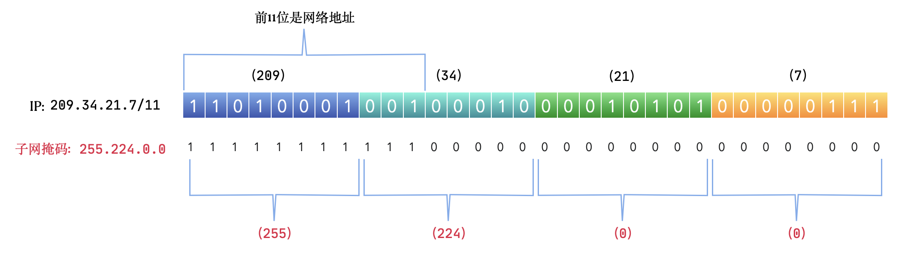
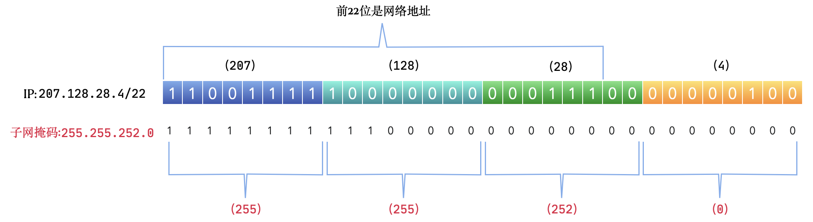

# 0x00. 导读

# 0x01. 简介

# 0x02. 

CIDR 仍然是用点分十进制的方式表示，IP v4 中仍然是 32 位，每8位一组，共4组。只是需要在后面加一个数字后缀，表示这个地址的网络地址是多少位。

传统的分类方法是以 8 位为最小单元，网络地址只能是8位、16位、24位，而在 CIDR 中用子网掩码区分网络地址和主机地址，连续为 1 的位数就是网络地址位数，用二进制可以清楚的看出来。

例如子网掩码是 11111111.00000000.00000000.00000000，前面 8 位连续都是 1 ，表示 8 位的网络地址，子网掩码就是 255.0.0.0。

再比如子网掩码是 11111111.11100000.00000000.00000000，前面 11 位连续都是 1 ，表示 11 位的网络地址，子网掩码就是 255.224.0.0。这与传统的 IP 地址分类法就不一样了。

看下面两个 CIDR IP 地址，一个 11位网络地址的 IP ，一个 22 位网络地址的 IP。

例如 209.34.21.7/11，表示前 11 位代表网络地址，后面的 21 位都是主机地址。

207.128.28.4/22，表示前 22 位是网络地址，后面 10 位是主机地址。

