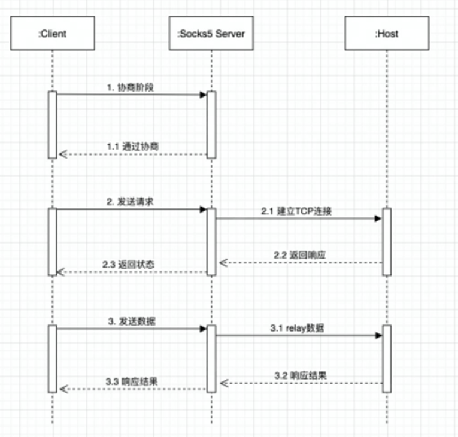

# 0x00. 导读

# 0x01. 简介

SOCKS 全称是 `SOCKet Secure` ，是一种网络传输协议，主要用于客户端与外网服务器之间通讯的中间传递。在 OSI 模型中， SOCKS 是会话层的协议，位于表示层与传输层之间，最新协议是 SOCKS5 。

SOCKS5 协议广泛用于代理服务器、xx上网、匿名访问、负载均衡等场景。它提供了一种通用的、灵活的代理解决方案，可以在各种网络环境和应用中使用。

# 0x02. 

原理图:

