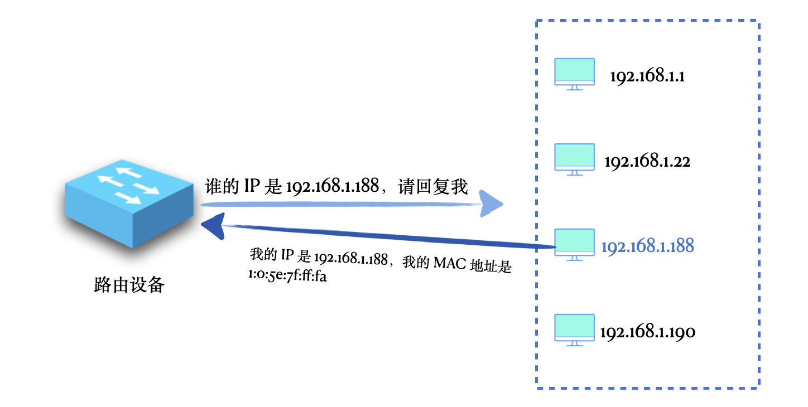
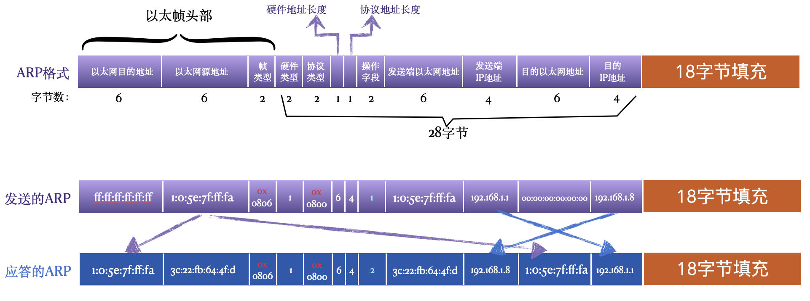

# 0x00. 导读

[ARP协议](https://www.cnblogs.com/fengzheng/p/17235193.html)

# 0x01. 简介

ARP 的作用是根据 IP 地址获取对应的 MAC 地址。在 OSI 模型中，通常认为 ARP 和 RARP 属于数据链路层协议，因为它们不使用 IP 协议。而在 TCP/IP 协议栈中，将 ARP 归于网络层，和 IP 协议在同一层。

ARP 就是工作在一个局域网中的，

当一台路由器或者一个具有路由转发功能的主机想要通过一个 IP 地址得到对应的 MAC 地址时，就可以使用 ARP 协议了，这个设备向它所在的目标子网中发送一个广播的 ARP 请求，请求中带着这个 IP 地址，意思是说，在这个网络中的各位，谁的 IP 是这个，请回复我一下，并告诉我你的 MAC 地址。收到这个请求的主机对这个 ARP 包进行解析，如果发现携带的 IP 正好是自己的，就返回一个 ARP 回复，回复中带上自己的 MAC 地址。

# 0x02. 协议详解

## 2.1 以太网数据帧格式

以太网目的地址：目的端 MAC 地址，6字节。

以太网源地址：发送端的 MAC 地址，6字节。

帧类型：标记数据部分的类型，如果是 IP 数据报，值为 0x0800，如果是 ARP 数据报，值为 0x0806，2 字节。

数据：以太帧搭载的数据。只要是在以太网上发送数据，最终都会被链路层封装成以太网数据帧，所以数据部分可以是 IP 数据报、ARP 协议包、ICMP 数据包等，以太网数据帧数据部分最小长度是 46 字节，最大长度由 MTU 决定，是 1500 字节。

CRC：数据检验码，用来在接收端检验接收的数据是不是无差错的，4字节。

## 2.2 ARP 协议格式

ARP 协议的格式，以及一对完整的 ARP 请求数据帧和应答数据帧。

硬件类型：2字节，用来表示硬件地址的类型，为 1 表示以太网地址。

协议类型：2字节，用来表示要映射的协议地址类型。ARP 不仅可以表示要将 IP 转换为 MAC ，还允许其他的转换关系，例如将另外一种非 IP 地址转换为 MAC 地址。当它的值为0x0800表示 IP 地址，与包含IP数据报的以太网数据帧中的类型字段的值相同。

硬件地址长度：1字节，用来表示硬件地址的长度，单位是字节。在以太网中就是 MAC 地址的长度，值为6，也就表示 MAC 地址长度为 6 字节。

协议地址长度：1字节，用来表示协议地址的长度，单位是字节。在以太网中，如果协议类型是 IP，也就是要将 IP 转换为 MAC 时，它的值是 4 ，也就是4字节，表示 IP 地址的长度是 4 字节。

操作字段：2字节，用来表示当前操作的类型。值为1，表示 ARP 请求；值为2，表示 ARP 应答；值为3，表示 RARP 请求；值为4，表示 RARP 应答。此字段是用来区分请求和应答的必需字段。

发送端以太网地址：6字节，用来表示发送端的以太网 MAC 地址。

发送端 IP 地址：4字节，用来表示发送端的 IP 地址。

目的以太网地址：6字节，用来表示目的端的 MAC 地址。

目的 IP 地址：4字节，用来表示目的端的 IP 地址。

整个 ARP 协议部分共 28字节，但是在以太网中，一个以太网数据帧数据最小长度为 46，所以，后面要有18字节的数据填充。