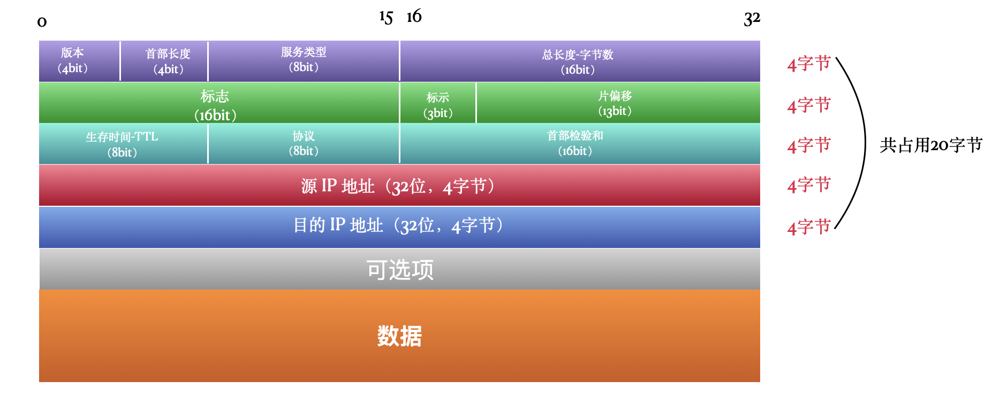
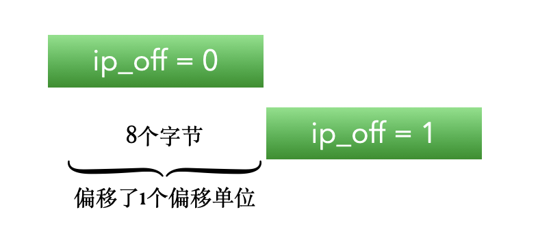

# 0x00. 导读

# 0x01. 简介

# 0x02. 协议详解

1. 版本

    版本字段占用 4 bit，用来标示当前使用的 IP 协议版本，只有 IPv4（0100） 和 IPv6（0110） 两个版本区分。

2. 首部长度

    首部长度表示占 32bit 的数目，也就是有多少个 4 字节（32bit/8=4字节），比如首部长度是 5 ，就表示有 5 个 4 字节，也就是 20 个字节。

    而用来表示首部长度的字段是 4bit ，这样一来它可表示的最大长度就是二进制的 1111 ，也就是 2^4-1=15 ，也就是最大可以是 15 个 4 字节，也就是 15*4=60 个字节，也就是说首部的最大长度是 60 个字节，而通过图可以看出来固定的部分占20字节，**那可选项部分的最大长度就是 40 字节**。

3. 服务类型

    服务类型，英文全称 Type of Service。用来标示是一个什么类型的应用正在使用 IP 协议。但是现在很少有应用支持 TOS，所以了解一下就可以了。这属于理想很丰满，现实很骨感的一个体现。标准是标准，但是实现上会有一定差异。

    

    前面 3 个bit 用来标示优先级，但现在已经被忽略了。接着 4 个 bit 用来标示子类型，每一个 bit 分别代表 最小延迟、最大吞吐量、最高可靠性、最小费用 。例如 Telnet 应用要求最小延迟，所以这 4 个 bit 分别是 1000 。

    最后一个 bit 是保留位，必须是 0。

4. 总长度字段

    IP 报文除了首部还要携带数据，总长度字段指整个 IP 报文的长度，单位是字节。总长度字段占 2 个字节， 16bit ，这样算下来，总共可以表示 2^15-1 ，也就是 65535 个字节。虽然可以表示这么多字节，但是绝多数情况下都不会一次性传输这么大的数据量，会有很多因素影响每个数据报的最大值。

    数据报的最大长度主要和上层应用限制和 MTU 限制有关系。

    例如 DNS 服务就限制数据报最大长度为 512 字节。

    另外我们常用的以太网 MTU (最大传输单元)就是 1500 字节，所以在以太网上的报文不能超过 1500 字节。

    可以用 `netstat -in` 查看本机网络接口的 MTU 。

    **总长度-首部长度=数据长度**。有一种情况，以太网要求报文的最小长度是 46 字节，但是 IP 数据报的总长度可能不足46字节，例如只传输很少的数据，这种情况下，以太网链路层就要将不足46字节的部分补全。这样一来，当接收方 IP 层接到这个报文后，就可以通过总长度字段和首部长度得出真正的数据长度，从而将后面多余的数据部分去掉。

5. 分片标示

    

    如果报文超过 IP 层允许的最大报文长度，就会进行 IP 分片，将原本的大报文分片成一个个小的报文，每一个小的报文都可能会从不同的路径发送到目标主机，而每一个分片报文发送到目的主机的顺序也不一定是按照原有顺序到达的。所以，在目的主机端获取到所有的报文分片后，要按照原始的顺序将一个个小的分片还原成原始的报文。

    在还原的过程中就需要知道各个分片的顺序，标志、标示和片偏移字段就是为了完成这个还原的过程。

    - 标志字段  
        当数据报被分片后，来自一个大报文的每个分片都会被赋予相同的值，用来表示这些分片来自同一个报文，在报文还原的时候用。

    - 标示字段  
        占3个bit，第一位始终是 0 ，第二位是 DF 位，如果是 1 表示不分片，第三位是 MF ，如果是 1 ，表示这个分片不是最后一个，后面还有更多的分片。

    - 片偏移字段  
        表示这个分片的偏移量，单位是 8 个字节，也就是 8*8=64 个 bit 。例如第一个分片的偏移量是0，第二个分片的偏移量是 1 ，则第二个分片相对第一个分片的偏移量是 1 ，也就是 8 个字节。如下图所示:

        

        如果第二个偏移量的值是 3 ，则相对于第一个分片的偏移量是 3*8=24 字节。

6. TTL

    IP 数据报的生存时间，单位不是时间单位，而是跳数。在网络上，每经过一个路由器，叫做一跳，例如我们经常听到的下一跳路由，就是指一个数据包要经过的下一个路由器。

    一般 TTL 是 32 或 64 ，由初始主机设置，表示这个 IP 报文最多可经过 32 个路由或 64 个路由，每经过一个路由器，TTL 的值就减一，当这个值为 0 时，路由器就直接将这个报文丢弃。并发送 ICMP 报文给源主机，由源主机商的服务决定是重发还是怎么样。

    之所以要设置一个值，是防止浪费太多网络资源，如果一个报文经过了好多路由器还没有到达目的地，很有可能就是网络有问题了，比如进入了一个循环网络，或者目的端未联网。

7. 协议

    协议字段，长度为 8 个 bit ，标识了上层所使用的协议，下面是几个比较常用的协议号:  
    1：ICMP，2：IGMP，6： TCP，17： UDP

8. 首部检验和

    首部检验和用来检验一份报文的正确性，当报文到达目的端后，用首部检验和规定的校验方法计算，并用计算出的结果和此报文本身携带的首部检验和字段做比较，如果结果一致，则说明报文没有问题，如果结果不一致，则直接丢弃报文。

    在传输过程中 TTL 的值会一点点减小，所以在TTL减小的同时，也会动态调整首部检验和的内容，因为如果首部检验和如果不根据TTL进行调整的话，在报文达到目的端后，根据首部各字段的值进行计算，由于TTL已经减小，最终算出的检验和必定会与最开始的检验和不一致，即使是没有问题的报文也会被丢弃。

9. 可选项

    可选项可有可无，它有如下几种功能：

    - 安全和处理限制（用于军事领域）

    - 记录路径（让每个路由器都记下它的 IP地址）

    - 时间戳（让每个路由器都记下它的 IP地址和时间）

    - 宽松的源站选路（为数据报指定一系列必须经过的 IP地址）

    - 严格的源站选路（与宽松的源站选路类似， 但是要求只能经过指定的这些地址， 不能经过其他的地址）。

    这些选项很少被使用，并非所有的主机和路由器都支持这些选项。 选项字段一直都是以 32 bit 作为界限，在必要的时候插入值为 0 的填充字节。这样就保证 IP 首部始终是 32 bit 的整数倍。但是最大长度不能超过 40 字节。

10. 数据

    数据就是真正要传输的内容了，当然包括上一层的头信息，例如 TCP 头、UDP 头。