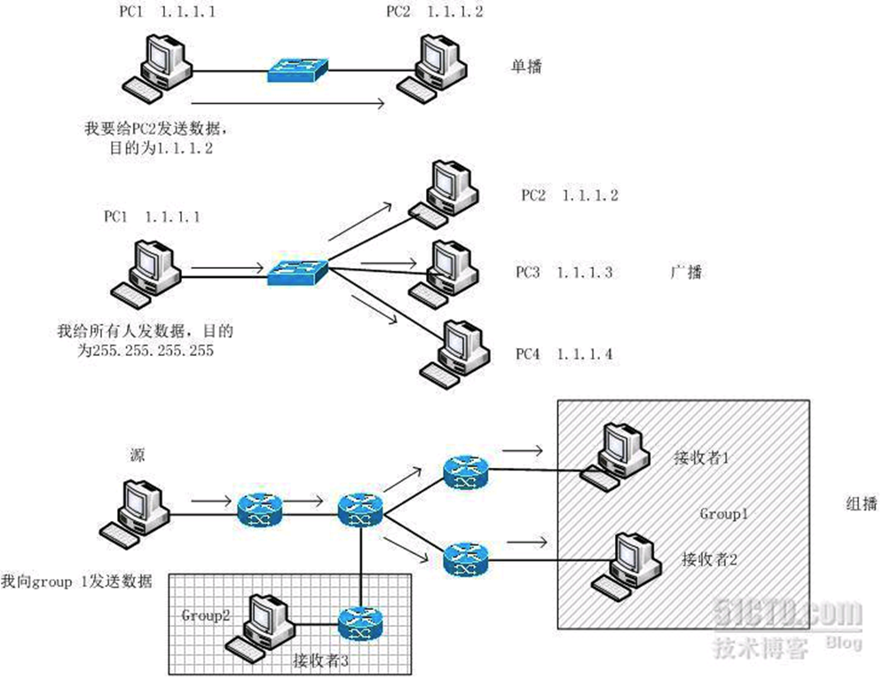
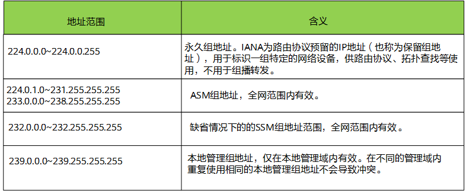

# 0x00. 导读

# 0x01. 简介

组播并不像单播，有一个明确的目的主机和IP地址，也不像广播，局域网内的所有主机都是目的主机，广播IP地址也明确（主机标识全部置为1）。组播不同，它并不知道要把信息发给谁，因为谁都可能随时加入组播组，谁都可能随时离开，不可能用某一个主机的IP地址作为组播地址。

组播也是一种 IP 包，也有源 IP 地址，目的 IP 地址，源 IP 地址为组播源的服务器 IP 地址，目的地址为一个特殊的 IP 地址，它位于 224.0.0.0 - 239.255.255.255 中

# 0x02. 单播、组播、广播

- 单播(unicast): 是指封包在计算机网络的传输中，目的地址为单一目标的一种传输方式。它是现今网络应用最为广泛，通常所使用的网络协议或服务大多采用单播传输，例如一切基于TCP的协议。 
- 组播(multicast): 也叫多播， 多点广播或群播。 指把信息同时传递给一组目的地址。它使用策略是最高效的，因为消息在每条网络链路上只需传递一次，而且只有在链路分叉的时候，消息才会被复制。 
- 广播(broadcast):是指封包在计算机网络中传输时，目的地址为网络中所有设备的一种传输方式。实际上，这里所说的“所有设备”也是限定在一个范围之中，称为“广播域”。 

# 0x03. 组播

组播一般都是指 IP 组播，组播是基于 UDP 的。

在 Linux 运行 `ifconfig` , 如果网卡信息中包含 `UP BROADCAST RUNNING MULTICAST` ，则支持广播和组播。

## 3.1 组播地址

IANA 将 D 类地址空间分配给 IPv4 组播使用。IPv4 地址一共 32 位，D 类地址最高 4 位为 1110 ，地址范围从 `224.0.0.0` 到 `239.255.255.255` ，具体分类及含义见下图。

## 3.2 组播MAC地址的范围

以太网传输IPv4单播报文的时候，目的MAC地址使用的是接收者的MAC地址。但是在传输组播数据时，其目的地不再是一个具体的接收者，而是一个成员不确定的组，所以要使用IPv4组播MAC地址，即IPv4组播地址映射到链路层中的地址。

IANA规定，IPv4组播MAC地址的高24位为 `0x01005e` ，第25位为0，低 23 位为IPv4组播地址的低23位。例如组播组地址 224.0.1.1 对应的组播MAC地址为 01-00-5e-00-01-01 。

IPv4组播地址的前4位是固定的1110，对应组播MAC地址的高25位，后28位中只有23位被映射到MAC地址，因此丢失了5位的地址信息，直接结果是有32个IPv4组播地址映射到同一MAC地址上。例如IP地址为224.0.1.1、224.128.1.1、225.0.1.1、239.128.1.1等组播组的组播MAC地址都为01-00-5e-00-01-01。

# 0x04. 组播协议

在IP组播传输模型中，发送者不关心接收者所处的位置，只要将数据发送到约定的目的地址，剩下的工作就交给网络去完成。网络中的组播设备必须收集接收者的信息，并按照正确的路径实现组播报文的转发和复制。在组播的发展过程中，形成了一套完整的协议来完成此任务。

- 组播组管理协议 IGMP（Internet Group Management Protocol）
IGMP是负责IPv4组播成员管理的协议，运行在组播网络中的最后一段，即三层网络设备与用户主机相连的网段内。IGMP协议在主机端实现组播组成员加入与离开，在上游的三层设备中实现组成员关系的维护与管理，同时支持与上层组播路由协议的信息交互。

    IGMP目前有三个版本，目前用的最多的是IGMPv2。IGMPv1主要基于查询和响应机制来完成对组播组成员的管理；IGMPv2增加了查询器选举机制和离开组机制；IGMPv3在兼容和继承IGMPv1和IGMPv2的基础上，进一步增强了主机的控制能力，并增强了查询和报告报文的功能。

- 协议无关组播 PIM（Protocol Independent Multicast）
PIM作为一种IPv4网络中的组播路由协议，主要用于将网络中的组播数据流发送到有组播数据请求的组成员所连接的组播设备上，从而实现组播数据的路由查找与转发。

    PIM协议包括PIM-SM（Protocol Independent Multicast Sparse Mode）协议无关组播-稀疏模式和PIM-DM（Protocol Independent Multicast Dense Mode）协议无关组播－密集模式。PIM-SM适合规模较大、组成员相对比较分散的网络；PIM-DM适合规模较小、组播组成员相对比较集中的网络。

- 组播源发现协议 MSDP（Multicast Source Discovery Protocol）
MSDP是为了解决多个PIM-SM域之间的互连的一种域间组播协议，用来发现其他PIM-SM域内的组播源信息，将远端域内的活动信源信息传递给本地域内的接收者，从而实现组播报文的跨域转发。

- 组播边界网关协议MBGP（MultiProtocol Border Gateway Protocol）
MBGP实现了跨AS域的组播转发。适用于组播源与组播接收者在不同AS域的场景。

- IGMP Snooping  
IGMP Snooping功能可以使设备工作在二层时，通过侦听上游的三层设备和用户主机之间发送的IGMP报文来建立组播数据报文的二层转发表，管理和控制组播数据报文的转发，进而有效抑制组播数据在二层网络中扩散。

- BIER  
BIER是基于比特索引的显式复制技术，通过将组播报文目的节点的集合以比特串的方式封装在报文头部进行发送，从而使网络中间节点无需为每一个组播流(Per-flow)建立组播树及保存组播流状态，仅需根据报文头部的目的节点的集合进行复制转发。