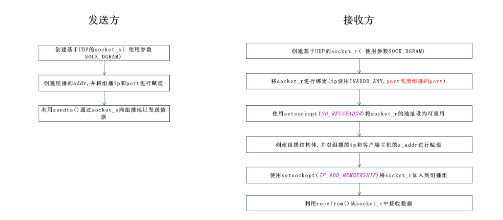

# 0x00. 导读

# 0x01. 简介

# 0x02. 



发送者

```c++
#include <stdio.h>
#include <stdlib.h>
#include <string.h>
#include <unistd.h>
#include <arpa/inet.h>
#include <sys/socket.h>

#define TTL 64    //数据包生存时间，即最多可以传递经过第64个路由时销毁
#define BUF_SIZE 30
void error_handling(char *message);

int main(int argc, const char * argv[]) {
    int send_sock;
    struct sockaddr_in mul_adr;
    int time_live = TTL;
    FILE *fp;
    char buf[BUF_SIZE];
    if (argc != 3) {
        printf("Usage : %s <GroupIp> <Port> \n", argv[0]);
        exit(1);
    }

    //基于UDP的多播
    send_sock = socket(AF_INET, SOCK_DGRAM, IPPROTO_UDP);
    memset(&mul_adr, 0, sizeof(mul_adr));
    mul_adr.sin_family = AF_INET;
    mul_adr.sin_addr.s_addr = inet_addr(argv[1]);
    mul_adr.sin_port = htons(atoi(argv[2]));

    //设置生存时间(除了这里其它基本和UDP编写一样)
    setsockopt(send_sock, IPPROTO_IP, IP_MULTICAST_TTL, (void *)&time_live, sizeof(time_live));

    if((fp = fopen("/Users/app05/Desktop/test.txt", "r")) == NULL)
        error_handling("fopen() error");

    while (!feof(fp)) //如果文件结束，则返回非0值，否则返回0
    {
        fgets(buf, BUF_SIZE, fp);
        sendto(send_sock, buf, strlen(buf), 0, (struct sockaddr *)&mul_adr, sizeof(mul_adr));
        sleep(1); //只是为了加个传输数据时间间隔，没有特殊意义
    }

    fclose(fp);
    close(send_sock);
    return 0;
}

void error_handling(char *message)
{
    fputs(message, stderr);
    fputc('\n', stderr);
    exit(1);
}
```

接收者

```c++
#include <stdio.h>
#include <stdlib.h>
#include <string.h>
#include <unistd.h>
#include <arpa/inet.h>
#include <sys/socket.h>

#define BUF_SIZE 30
void error_handling(char *message);

int main(int argc, const char * argv[]) {
    int recv_sock;
    int str_len;
    char buf[BUF_SIZE];
    struct sockaddr_in adr;
    struct ip_mreq join_adr; //多播组结构体

    if(argc != 3)
    {
        printf("Usage : %s <GroupIp> <Port> \n", argv[0]);
        exit(1);
    }

    recv_sock = socket(AF_INET, SOCK_DGRAM, IPPROTO_UDP);


    // non-block
    int flags = fcntl(recv_sock, F_GETFL, 0);
    if(flags == -1) {
        perror("fcntl get");
        ret = 2;
        break;
    }
    if(fcntl(recv_sock, F_SETFL, flags | O_NONBLOCK) == -1) {
        perror("fcntl set");
        ret = 3;
        break;
    }

    // REUSEADDR
    int on = 1;
    if(setsockopt(recv_sock, SOL_SOCKET, SO_REUSEADDR, &on, sizeof(on)) == -1){
        perror("setsockopt REUSEADDR");
        ret = 4;
        break;
    }

    memset(&adr, 0, sizeof(adr));
    adr.sin_family = AF_INET;
    adr.sin_addr.s_addr = htonl(INADDR_ANY);
    adr.sin_port = htons(atoi(argv[2]));

    if(bind(recv_sock, (struct sockaddr *)&adr, sizeof(adr)) == -1)
        error_handling("bind() error");

    //加入多播组
    join_adr.imr_multiaddr.s_addr = inet_addr(argv[1]);
    join_adr.imr_interface.s_addr = htonl(INADDR_ANY);
    setsockopt(recv_sock, IPPROTO_IP, IP_ADD_MEMBERSHIP, (void *)&join_adr, sizeof(join_adr));

    while (1) {
        str_len = recvfrom(recv_sock, buf, BUF_SIZE - 1, 0, NULL, 0);//只需要多播组IP地址，不关心自己主机地址
        if(str_len < 0)
            break;
        buf[str_len] = 0;
        fputs(buf, stdout);
    }

    close(recv_sock);
    return 0;
}


void error_handling(char *message)
{
    fputs(message, stderr);
    fputc('\n', stderr);
    exit(1);
}
```