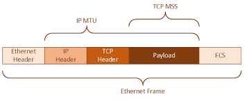

# 0x00. 导读

# 0x01. 简介

该层的作用包括：物理地址寻址、数据的成帧、流量控制、数据的检错、重发等。

数据链路层为网络层提供可靠的数据传输；  
主要的协议：以太网协议；  
数据: 帧(frame)  
重要设备名称：网桥和交换机。  

最大传输单元 MTU(Maximum Transmission Unit)

# 0x02. 

MSS(Maximum Segment Size) = MTU - IP_Header - TCP_Header  
IP 首部(不含option)的长度是 20 字节，TCP 首部(不含option)的长度也是 20 字节，两个加起来正好 40 字节