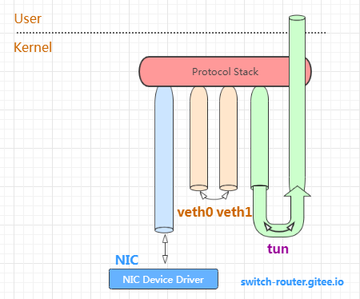

# 0x00. 导读

[net_device](https://jiyang.site/posts/2020-01-05-%E7%90%86%E8%A7%A3linux%E5%86%85%E9%83%A8%E7%BD%91%E7%BB%9C%E5%AE%9E%E7%8E%B0%E4%B9%8B%E5%85%B3%E9%94%AE%E6%95%B0%E6%8D%AE%E7%BB%93%E6%9E%84%E4%B9%8B-net_device/)
# 0x01. 简介

内核使用 net_device 表示网卡。

网卡可以分为物理网卡和虚拟网卡。物理网卡是指真正能把报文发出本机的网卡，包括真实物理机的网卡以及VM虚拟机的网卡，而像 tun/tap，vxlan、veth pair 这样的则属于虚拟网卡的范畴。

每个网卡都有两端，一端是协议栈(IP、TCP、UDP)，另一端则有所区别，对物理网卡来说，这一端是网卡生产厂商提供的设备驱动程序，而对虚拟网卡来说差别就大了，正是由于虚拟网卡的存在，内核才能支持各种隧道封装、容器通信等功能。

# 0x02. 