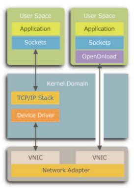
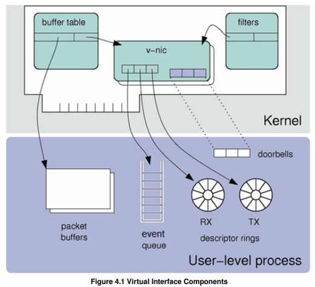

# 0x00. 导读

[ef_vi_User_Guide](https://www.xilinx.com/content/dam/xilinx/publications/solarflare/onload/openonload/packages/SF-114063-CD-10_ef_vi_User_Guide.pdf), 官方文档

[Github 仓库](https://github.com/majek/openonload.git), 官方代码保护示例的仓库。

[早期youtube视频](https://www.youtube.com/watch?v=1Y8hoznuuuM&ab_channel=GoogleTechTalks)  
[早期的设计思想](http://www.moderntech.com.hk/sites/default/files/whitepaper/V10_Solarflare_OpenOnload_IntroPaper.pdf)

# 0x01. 简介

Solarflare's ef_vi API is a flexible interface for passing Ethernet frames between applications and the network. It is the internal API used by Onload for sending and receiving packets.



# 0x02. 概念

## 2.1. virtual interface

Each ef_vi instance provides a virtual interface to the network adapter.



A virtual interface includes the following components:
- an Event queue
- a Transmit descriptor ring
- a Receive descriptor ring.

A virtual interface also has a few hardware resources:
- a doorbell register to inform the card that new RX buffers are available for it to use
- a doorbell register to inform the card that new TX buffers are ready for it to send
- some timers
- a share of an interrupt.

### 2.1.1 event queue 事件队列

An event queue is a channel for passing information from the network adapter to the application.  
It is used to notify the application of events such as the arrival of packets.

事件队列是一个通道，用来从 network adapter 传递 `信息` 到 application 。  
例如通知 application 有 packet 到达。

### 2.1.2 Transmit descriptor ring

The transmit descriptor ring is used to pass packets from the application to the adapter. 
Each entry in the ring is a descriptor which references a buffer containing packet data. Each packet is described by one or more descriptors.

The transmission of packets proceeds in the background, and the adapter notifies the application when they have finished via the event queue.

Transmit descriptor ring 是用来从 application 传递 `packet` 到 adapter.   
上面的每个 entry 都是一个 descriptor, 其代表了一个包含 packet data 的 buffer. 每个 packet 对应一个或者多个 descriptor. 

packet 的传递是异步处理的，当完成的时候，会通过 event queue 通知 application 。

### 2.1.3  Receive descriptor ring

The receive descriptor ring is used to pass packets from the adapter to the application. The application must pre-allocate buffers and post them to the receive descriptor ring. 
Each entry in the ring is a descriptor which references a 'free' buffer that the adapter can place a packet into.  
When the adapter delivers a packet to an ef_vi instance, it copies the packet data into the next available receive buffer and notifies the application via the event queue. Large packets can be scattered over multiple receive buffers.

receive descriptor ring 是用来从 adapter 传递 `packet` 到 application. application 必须提前分配好 buffer 并传给 receive descriptor ring. 
上面的每个 entry 都是一个 descriptor, 其代表了一个 空闲 的 buffer, adapter 可以随时将 packet 放入。

当 adapter 传递一个 packet 给 ef_vi 实例的时候，会将 packet data 拷贝到空闲的 buffer ，并且通过 event queue 通知 application. 大的 packet 会被分解放入多个 buffer 。

# 2.2. Protection Domain

A protection domain identifies a separate address space for the DMA addresses passed to the adapter. It is used to protect multiple ef_vi applications from one another, or to allow them to share resources:
- Each Virtual Interface is associated with one protection domain.
- Multiple VIs can be associated with the same protection domain.
- Each Memory Region is registered with one or more protection domains.
- A memory region can only be used by a virtual interface that is in the same protection domain.
- Memory regions that are registered with multiple protection domains can be used as a shared resource, for example for zero-copy forwarding. 

protection domain 用来标识一个独立的地址空间，用来将 DMA 地址传递给 adapter. 它可以保护 ef_vi application 互不干扰，并且可以共享资源：
- 每个 virtual Interface 都与一个 protection domain 关联
- 多个 virtual Interface 可以共享同一个 protection domain
- 每个 Memory Region 都会对应一个或者多个 protection domain
- 一个 Memory Region 只能被处于同一 protection domain 中的虚拟接口使用
- 对应多个 protection domain 的 Memory region 可以被用来当做共享资源，例如用来 zero-copy forwarding.

```
可以将 Protection Domain 看作是一个房间, Memory Region 是房间里的柜子。
例如,有两个房间 A 和 B :
- 房间A 有 柜子1 和 柜子2
- 柜子1 放衣服, 柜子2 放书
- 房间B 有 柜子3 和 柜子4
- 柜子3 放玩具, 柜子4 放文件
那么:
- 每个房间是一个 Protection Domain ,对其他房间进行隔离。
- 每个柜子是一个 Memory Region ,定义了该房间内可以存放什么物品。
- 房间A 不能访问 房间B 的柜子。
- 但在 房间A 内,可以按柜子的规定使用不同的柜子。
这样如果 房间A 被入侵, 房间B 仍然是安全的。而且即使是在 房间A 内,也不能将衣服放到书柜里。

通过这个简单的比喻, Protection Domain 提供隔离, Memory Region 在域内进行访问控制。两者结合实现了对内存的安全管控。
```

# 2.3. Memory Region

Any memory region used for transmit or receive buffers must be registered using the ef_memreg interface. This ensures the memory region meets the requirements of ef_vi:
- The memory is pinned, so that it can't be swapped out to disk.
- The memory is mapped for DMA, so that the network adapter can access it. The adapter translates the DMA addresses provided by the application to I/O addresses used on the PCIe bus.
- The memory region is page-aligned, for performance.
- The size of the memory region is a multiple of the packet buffer size, so no memory is wasted

任何用来发送或者接收 buffer 的 memory region 都必须使用 ef_memreg 接口注册，这样才能使得 memory region 满足 ef_vi 的要求：
- memory 钉住，使得无法被 swap 出去
- memory mapped for DMA, 这样 network adapter 就能访问。  
    adapter 将 application 给的 DMA 地址转换为 PCI bus 使用的 I/O 地址。
- 页对齐
- 大小是 packet buffer size 的整数倍，这样就不会浪费内存

# 2.4. Packet Buffer

A packet buffer is a memory allocations on the host which the card will read from when sending packets, or write to when receiving packets. They are usually 2KB in size.

packet buffer 是一块内存，当发送数据出去的时候，网卡就会从 packet buffer 读数据。（猜测可能是程序需要发送数据了，一路从上传下来，最后会把数据放入 packet buffer ，网卡从这里拿到数据，发送出去）

当网卡收到数据，就会把数据写入 packet buffer 。（方便其它同僚读取拿去使用）。

packet buffer 通常是 2kb 大小。

Each packet buffer is referred to by a descriptor, which contains:
- a pointer
- an offset
- a length.

# 2.5.  Filters
Filters select which packets are delivered to a virtual interface. Packets that are not selected are ignored and allowed to pass on to the kernel.  
Each filter specifies the characteristics of packets for selection. These characteristics are typically packet header fields, including Ethernet MAC address, VLAN tags, IP addresses and port numbers.  

过滤器决定了哪些 packet 会传递给 virtual interface, 剩余的 packet 会被忽略或者传递给内核。  
每个过滤器指定了一些特性，用来筛选 packet. 例如 Ethernet MAC address, VLAN tags, IP addresses, port number. 

A selected packet can be:
- Stolen: the packet is delivered to the virtual interface, but not to the kernel stack.
- Replicated: a copy is delivered to the virtual interface, and might also be delivered to other consumers. Used for multicast packets.
- Sniffed: the packet is delivered to the virtual interface, and to the kernel stack.

被选中的 packet 可以用来：
- 偷走：这些 packet 只会传递给 virtual interface, 不会传递给 kernel stack
- 复制：这些 packet 传递给 virtual interface, 也可以拷贝传递给其它 consumer. 主要用来广播数据。
- 嗅探：这些 packet 既传递给 virtual interface, 也传递给 kernel stack

An ef_vi application can set multiple types of filters on the same virtual interface. Setting an invalid filter or combination of filters causes an error.

# 0x03. 步骤

更详细的可以参考 [6 Using ef_vi](https://www.xilinx.com/content/dam/xilinx/publications/solarflare/onload/openonload/packages/SF-114063-CD-10_ef_vi_User_Guide.pdf)

## 3.1. Setup
1. include the various headers we need (etherfabric/pd.h, vi.h, memreg.h)
2. open the driver
3. allocate a protection domain, `ef_pd_alloc()` or `ef_pd_alloc_by_name()` or `ef_pd_alloc_with_vport()`.
4. allocate a virtual interface from the protection domain.
    ```c
    int ef_pd_alloc(ef_pd *pd,
            ef_driver_handle pd_dh,
            int ifindex,
            enum ef_pd_flags flags);

    int ef_pd_alloc_by_name(ef_pd *pd,
            ef_driver_handle pd_dh,
            const char* cluster_or_intf_name,
            enum ef_pd_flags flags);

    int ef_vi_alloc_from_pd(ef_vi *vi, ef_driver_handle vi_dh,
            ef_pd *pd, ef_driver_handle pd_dh,
            int eventq_cap, int rxq_cap, int txq_cap,
            ef_vi *opt_evq, ef_driver_handle opt_evq_dh,
            enum ef_vi_flags flags);

    ```
    ```c
    ef_driver_handle driver_handle;
    ef_vi vi;
    ef_pd pd;

    ef_driver_open(&driver_handle);
    ef_pd_alloc(&pd, driver_handle, ifindex, EF_PD_DEFAULT );
    ef_vi_alloc_from_pd(&vi, driver_handle, &pd, driver_handle,-1, -1, -1, NULL, -1, 0);
    ```

## 3. 2. Creating Packet buffers
The next step is to allocate a memory region and register it for packet buffers.
```c
const int BUF_SIZE = 2048; /* Hardware always wants 2k buffers */
int bytes = N_BUFS * BUF_SIZE;
void* p;
posix_memalign(&p, 4096, bytes) /* allocate aligned memory */
ef_memreg_alloc(&memreg, driver_handle, &pd, driver_handle,p, bytes); /* Make it available to ef_vi */
```

## 3. 3.  Adding Filters
Next, a filter is specified and added, so that the virtual interface receives traffic. Assuming there is a sockaddr to work from:
```c
struct sockaddr_in sa_local; /* TODO: Fill this out somehow */
ef_filter_spec filter_spec;
ef_filter_spec_init(&filter_spec, EF_FILTER_FLAG_NONE);
TRY(ef_filter_spec_set_ip4_local(&filter_spec, IPPROTO_UDP
        , sa_local.sin_addr.s_addr, sa_local.sin_port));
TRY(ef_vi_filter_add(&vi, driver_handle, &filter_spec, NULL));
```

## 3. 4. Receiving packets
At this point, packets will start arriving at the interface, be diverted to the application, and immediately be dropped.
So the next step is to push some packet buffers to the RX descriptor ring, to receive the incoming packets.
For efficiency, the code pushes packet buffers eight at a time.
```c
unsigned rx_posted = 0; /* We need to keep track of which buffers are
already on the ring */
void rx_post( int n ) {
    for( int i = 0; i < n; ++i ) {
        struct pkt_buf* pb = pkt_bufs[rx_posted % N_RX_BUFS];
        ef_vi_receive_init(&vi, pb->dma_buf_addr, pb->id);
        ++rx_posted;
    }
    ef_vi_receive_push(&vi);
}
```
So now, there are packet buffers on the descriptor ring. But once they are filled, the application will start dropping again.

## 3. 5. Handling Events
The next step is to handle these incoming packets, by polling the event queue.
```c
void rx_wait(void) {
    /* Again, for efficiency, poll multiple events at once. */
    ef_event evs[NUM_POLL_EVENTS];
    int n_ev, i;
    while( 1 ) {
        n_ev = ef_eventq_poll(&vi, evs, NUM_POLL_EVENTS);
        if( n_ev > 0 ) {
            for( i = 0; i < n_ev; ++i ) {
                switch( EF_EVENT_TYPE(evs[i]) ) 
                {
                case EF_EVENT_TYPE_RX:
                    handle_rx_packet(EF_EVENT_RX_RQ_ID(evs[i]),
                    EF_EVENT_RX_BYTES(evs[i]) );
                    break;
                case EF_EVENT_TYPE_RX_DISCARD:
                    /* Interesting to print out the cause of the discard */
                    fprintf(stderr, "ERROR: RX_DISCARD type=%d",
                        EF_EVENT_RX_DISCARD_TYPE(evs[i]));
                    /* but let’s handle it like a normal packet anyway */
                    handle_rx_packet(EF_EVENT_RX_RQ_ID(evs[i]),
                    EF_EVENT_RX_BYTES(evs[i]) );
                    break;
                }
            }
        }
    }
}
```
This code is calling a handle_rx_packet() function, passing it the packet id and the length of data. The body of this function is not shown, but it should do the following:
- note that this packet buffer has been consumed, and so is ready to be re-posted:
    - the rx_post() function must also be updated to use this information, so a buffer is not re-posted until it is marked as consumed
- ensure that the received packet is processed according to the purpose of the application:
    - if the application can always process incoming packets as fast as they are received, then it can do its work inline, and immediately repost the buffer on the ring
    - otherwise, the application should probably post an item on a work queue for another thread to act upon, and arrange for the refill to come from a larger pool of buffers


## 3. 6. Transmitting packets

The next step is to implement the transmit side. The hard part is filling out the payload, and getting all the fields of IP and UDP correct. (ef_vi is usually used to transmit UDP, as it's a much simpler protocol to implement than TCP.)

There's some sample code to fill out the headers in the functions ci_∗_hdr_init(), which can be found in `src/lib/citools/ippacket.c`.

After that, to transmit one of the pb structures , a single function call is needed:  
`ef_vi_transmit(&vi, pb->dma_buf_addr, frame_length, 0);` 

But the application must also keep track of when that buffer is used, and when it is free. This means adding some complexity to the poll loop.

# 4. 诊断

[3.28 Linux ethtool Statistics](https://servak.com.ua/image/manual/Ethernet/Solarflare_SFN5122F_10GbE_Adapter_User_Guide_Servak.pdf) 显示 `ethtool -S ethX` 输出字段解释。

## 4.1 丢包

### 4.1.1

`ethtool -S eth0 | grep port_rx_nodesc_drop_cnt` 有些是 `port_rx_nodesc_drops`

This output identifies that packets are being dropped at the Solarflare network adapter level.

### 4.1.2

The `onload_stackdump lots | grep oflow_drop` command allows to check for dropped packets at the socket level.

### 4.1.3 

The `onload_stackdump lots | grep memory_pressure` command allows to check for packet dropped when Onload fails to allocate a packet buffer on the receive path:

## 4.2 抓包

Packets delivered to an application via the accelerated path are not visible to the OS kernel. As a result, diagnostic tools such as tcpdump and wireshark do not capture accelerated packets. The supplied `onload_tcpdump` application does support capture of UDP and TCP packets from Onload stacks.

`onload_tcpdump -n -i <interface>`

## 4.3 onload_stackdump

[onload_stackdump](https://docs.xilinx.com/r/en-US/ug1586-onload-user/onload_stackdump)

[Onload Stack](https://docs.xilinx.com/r/en-US/ug1586-onload-user/Onload-Stacks)
1. 必须有程序在运行，必须通过 root 用户运行命令.
2. `onload_stackdump` 显示 stack 等信息
3. `onload_stackdump processes` 显示 PID
4. `onload_stackdump threads`
5. `onload_stackdump stats`
6. snapshot: `onload_stackdump netif`  
    dynamic: `watch -d -n1 onload_stackdump netif`
7. `onload_stackdump packets`
8. `onload_stackdump lots`
9. `onload_stackdump tcp_stats`
10. `onload_stackdump udp_stats`