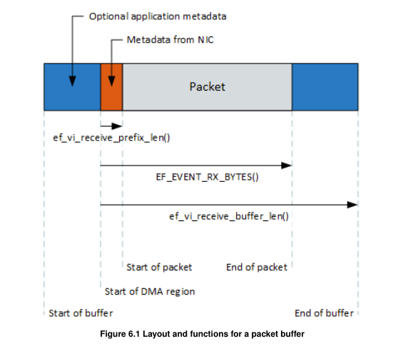

# 0x00. 导读

# 0x01. 简介

## receive descriptors

[6.7 Receiving packets](https://docs.amd.com/v/u/en-US/SF-114063-CD-ef_vi_User_Guide)
> **Receive descriptors** should be posted in multiples of 8. When an application pushes 10 descriptors, ef_vi will push 8 and ef_vi will ignore descriptor batch sizes < 8. Users should beware that if the ring is empty and the application pushes < 8 descriptors before blocking on the event queue, the application will remain blocked as there are no descriptors available to receive packets so nothing gets posted to the event queue.
> Posting descriptors should ideally be done in batches, by a thread that is not on the critical path. A small batch size means that the ring is kept more full, but a large batch size is more efficient. A size of 8, 16 or 32 is probably the best compromise.

ChatGPT 关于 接收描述符 的解释：
```
在高性能网络编程中，接收描述符（receive descriptors）用于管理内存缓冲区，接收网络数据包。这些描述符指向内存区域，硬件将数据包复制到这些区域。每当数据包到达网络接口卡 (NIC) 时，NIC 会使用一个接收描述符来存储数据包的内容。

处理接收的数据包之后设置新的接收描述符的原因:
1. 循环使用缓冲区：每个接收描述符在接收数据包后，需要重新分配或重置，以便接收下一个数据包。这确保了缓冲区的循环使用。

2. 保持接收队列满载：为了确保接收操作的高效进行，接收队列（ring buffer）需要保持尽可能满载。这样可以避免数据包到达时没有空闲的接收描述符可用，从而导致丢包。

3. 硬件要求：网络硬件通常需要新的描述符来继续接收数据包。如果不及时设置新的接收描述符，硬件可能会停止接收新的数据包，导致网络性能下降。

总结:
1. 接收描述符管理：每个接收描述符只能用于一次数据接收，处理完数据后需要重新设置。
2. 确保队列满载：保持接收队列中始终有足够的空闲描述符，以避免丢包。
3. 高效数据接收：通过及时设置新的接收描述符，可以确保网络硬件持续高效地接收数据包。
```

# 0x02. 

## ef_vi_alloc_from_pd

```c
// This allocates an RX and TX descriptor ring, an event queue, timers and interrupt etc. 
int ef_vi_alloc_from_pd(ef_vi *vi, ef_driver_handle vi_dh,
        ef_pd *pd, ef_driver_handle pd_dh,
        int eventq_cap, int rxq_cap, int txq_cap,
        ef_vi *opt_evq, ef_driver_handle opt_evq_dh,
        enum ef_vi_flags flags);
```


## posix_memalign

POSIX 标明了通过 malloc(), calloc(), 和 realloc() 返回的地址对于任何的 C 类型来说都是对齐的。在 Linux 中，这些函数返回的地址在 32 位系统是以 8 字节为边界对齐，在 64 位系统是以 16 字节为边界对齐的。有时候，对于更大的边界，例如页面，程序员需要动态的对齐。于是 posix_memalign 来了。

```c
#include <stdlib.h>
/*
 * 通俗解释，调用函数将返回你一块大小为 size 字节的内存，
 * 内存首地址是 alignment 的倍数
*/
int posix_memalign (void **memptr,
                    size_t alignment,
                    size_t size);
// 成功返回 0

char *buf;
int ret;
/* allocate 1 KB along a 256-byte boundary */
ret = posix_memalign (&buf, 256, 1024);
if (ret) {
    fprintf (stderr, "posix_memalign: %s\n",
             strerror (ret));
    return -1;
}
/* use 'buf'... */
free (buf);
```

## ef_memreg_dma_addr

```c
// Return the DMA address for the given offset within a registered memory region
ef_vi_inline ef_addr ef_memreg_dma_addr (ef_memreg ∗ mr, size_t offset );

// mr: The ef_memreg object to query.
// offset: The offset within the ef_memreg object
// return: The DMA address for the given offset within a registered memory region.

// Note that DMA addresses are only contiguous within each 4K block of a memory region.
// 注意，DMA 地址只在单个的 4k 内存区域内连续
```

## ef_memreg_alloc

```c
// Register a memory region for use with ef_vi.
int ef_memreg_alloc (
            ef_memreg ∗ mr,
            ef_driver_handle mr_dh,
            struct ef_pd ∗ pd,
            ef_driver_handle pd_dh,
            void ∗ p_mem,
            size_t len_bytes )

// mr: The ef_memreg object to initialize.
// mr_dh: Driver handle for the ef_memreg.
// pd: Protection domain in which to register memory.
// pd_dh: Driver handle for the protection domain.
// p_mem: Start of memory region to be registered. This must be page-aligned, and so be on a 4K boundary.
// len_bytes: Length of memory region to be registered. This must be a multiple of the packet buffer size (currently 2048 bytes).

```

## ef_vi_receive_capacity

```c
// return the total capacity of the RX descriptor ring
// , as slots for descriptor entries.
int ef_vi_receive_capacity (const ef_vi ∗ vi )
```

## ef_vi_receive_space

```c
// Returns the amount of free space in the RX descriptor ring. 
// This is the number of slots that are available for
// pushing a new descriptor (and an associated unfilled packet buffer).
int ef_vi_receive_space (const ef_vi ∗ vi )
```

## ef_vi_receive_init

```c
// Initialize an RX descriptor on the RX descriptor ring
// 成功返回 0
#define ef_vi_receive_init(vi, addr, dma_id) (vi)->ops.receive_init((vi), (addr), (dma_id))

// addr: DMA address of the packet buffer to associate with the descriptor, as obtained from ef_memreg_dma_addr()
// dma_id: DMA id to associate with the descriptor. This is completely arbitrary, and can be used for subsequent tracking of buffers

// Initialize an RX descriptor on the RX descriptor ring
// , and prepare the associated packet buffer (identified by its DMA address) to receive packets. 
// This function only writes a few bytes into host memory, and is very fast.
```

## ef_vi_receive_push

在网络编程中，接收数据包通常涉及到操作系统内核和网络硬件之间的多次交互。每次数据包从网络接口卡 (NIC) 传输到应用程序，都需要经过多个步骤，这些步骤会带来一些延迟。

ef_vi_receive_push 函数的作用是减少这些步骤带来的延迟。它通过直接与网络硬件交互，尽可能快地把数据包从网络接口卡推送到应用程序中。

```c
// Submit newly initialized RX descriptors to the NIC. The NIC can then receive packets into the associated packet buffers.
#define ef_vi_receive_push(vi ) (vi)->ops.receive_push((vi))

// For Solarflare 7000-series NICs, this function submits RX descriptors only in multiples of 8. This is to conform with hardware requirements. If the number of newly initialized RX descriptors is not exactly divisible by 8, this function does not submit any remaining descriptors (up to 7 of them).
```

ChatGPT 例子：
```c
#include <ef_vi.h>

// 假设你已经初始化了 ef_vi 结构体和相关资源
ef_vi vi;
ef_vi_rxq rxq;

// 准备接收描述符
void prepare_receive_descriptors() {
    // 假设 buffer 是一个准备接收数据的缓冲区
    void* buffer;
    int buffer_id;

    // 这里设置接收描述符（简化示例）
    ef_vi_receive_init(&vi, &rxq, buffer, buffer_id);

    // 推送接收操作
    ef_vi_receive_push(&vi);
}

int main() {
    // 初始化代码，包括 ef_vi 的初始化等

    // 准备初始接收描述符并推送
    prepare_receive_descriptors();

    // 进入主循环，处理接收的数据包
    while (1) {
        // 检查并处理接收到的数据包
        ef_event ev;
        while (ef_eventq_poll(&vi, &ev, 1) > 0) {
            if (EF_EVENT_TYPE(ev) == EF_EVENT_TYPE_RX) {
                // 处理接收的数据包
                // ...

                // 设置新的接收描述符
                prepare_receive_descriptors();
            }
        }

        // 其他处理逻辑
        // ...
    }

    return 0;
}

```

## EF_EVENT_RX_BYTES

EF_EVENT_RX_BYTES gives the number of bytes received.



## ef_vi_receive_prefix_len

Returns the length of the prefix at the start of a received packet.  
The NIC may be configured to deliver meta-data in a prefix before the packet payload data. This call returns the size of the prefix.  
When a large packet is received that is scattered over multiple packet buffers, the prefix is only present in the first buffer.

## EF_EVENT_RX_RQ_ID

Get the dma_id used for a received packet, 也就是 ef_vi_receive_init 最后一个参数

```c
#define EF_EVENT_RX_RQ_ID(e) ((e).rx.rq_id)
```
