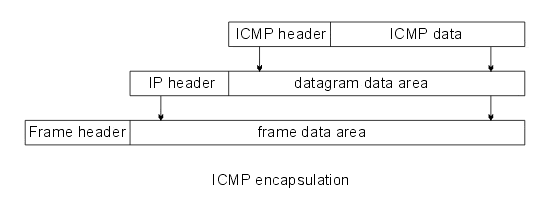
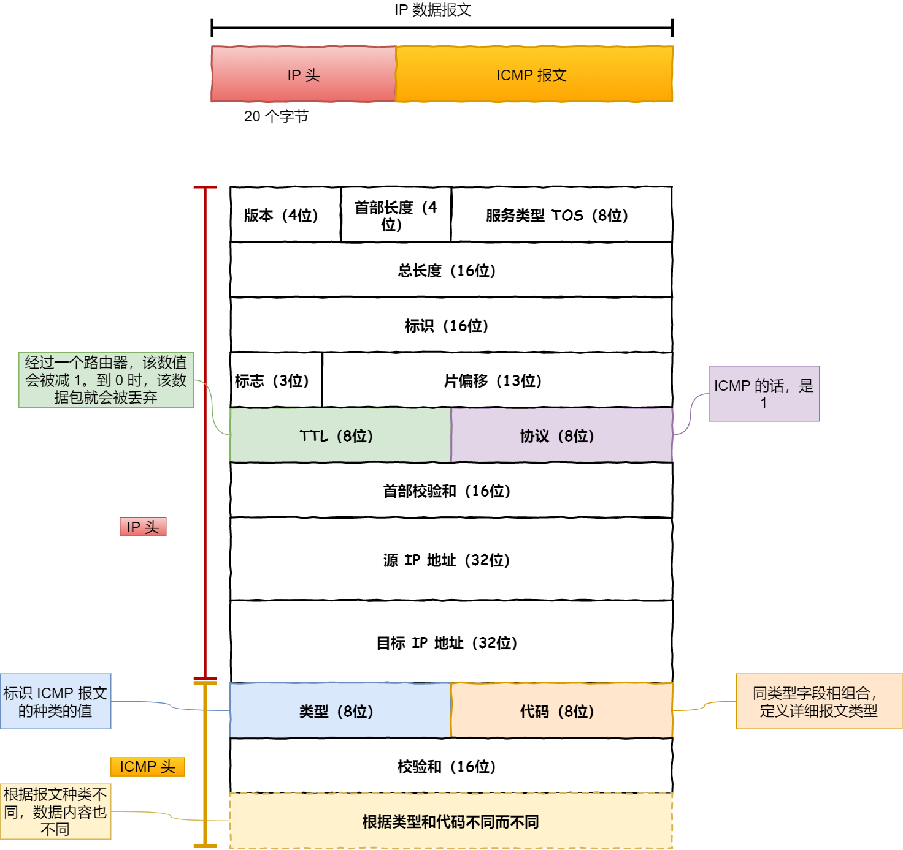
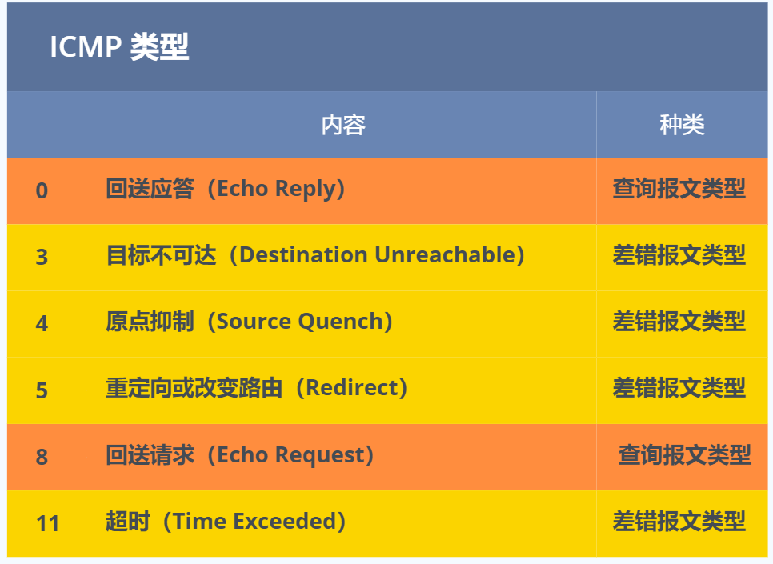
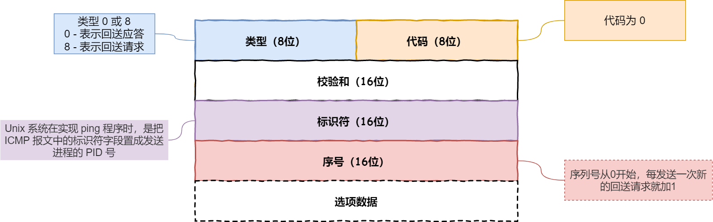
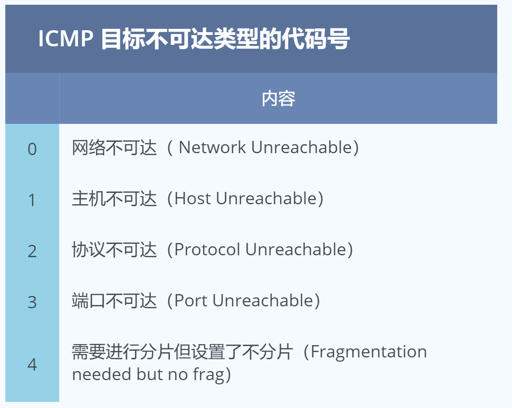
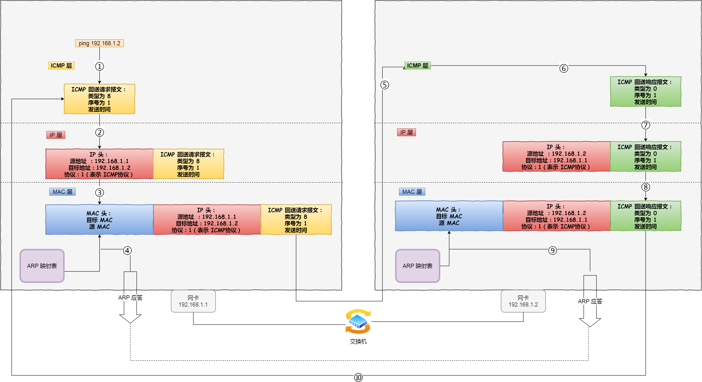

# 0x00. 导读

[小lin](https://xiaolincoding.com/network/4_ip/ping.html#ip%E5%8D%8F%E8%AE%AE%E7%9A%84%E5%8A%A9%E6%89%8B-icmp-%E5%8D%8F%E8%AE%AE)

[ICMP-Wireshark抓包分析](https://flxdu.cn/2022/06/07/ICMP-Wireshark%E6%8A%93%E5%8C%85%E5%88%86%E6%9E%90/)

[ICMP协议](https://www.cnblogs.com/fengzheng/p/17260432.html)

# 0x01. 简介

ICMP协议，它属于网络层协议（第三层）。作为一种面向无连接的协议，ICMP协议用于传输控制信息，包括报告错误、交换受限控制和状态信息等

ping就是基于ICMP网络协议，探测网络之间的连通性. 是icmp协议的典型应用

ICMP是（Internet Control Message Protocol）Internet控制报文协议。它是TCP/IP协议族的一个子协议，用于在IP主机、路由器之间传递控制消息。控制消息是指网络通不通、主机是否可达、路由是否可用等网络本身的消息。这些控制消息虽然并不传输用户数据，但是对于用户数据的传递起着重要的作用

ICMP 主要的功能包括：

- 确认 IP 包是否成功送达目标地址
- 报告发送过程中 IP 包被废弃的原因和改善网络设置等

在 IP 通信中如果某个 IP 包因为某种原因未能达到目标地址，那么这个具体的原因将由 ICMP 负责通知。

ICMP 报文是封装在 IP 包里面，它工作在网络层，是 IP 协议的助手。

# 0x02. ICMP 协议详解

ICMP 包头的类型字段，大致可以分为两大类：

- 一类是用于诊断的查询消息，也就是「查询报文类型」
- 另一类是通知出错原因的错误消息，也就是「差错报文类型」

## 2.1 查询报文类型

回送消息 —— 类型 0 和 8

回送消息用于进行通信的主机或路由器之间，判断所发送的数据包是否已经成功到达对端的一种消息，ping 命令就是利用这个消息实现的。只要正常返回了 ICMP 回送响应，则代表发送端主机到接收端主机是否可达。

可以向对端主机发送回送请求的消息（ICMP Echo Request Message，类型 8），也可以接收对端主机发回来的回送应答消息（ICMP Echo Reply Message，类型 0）。

## 2.2 差错报文类型

- 目标不可达消息 —— 类型 为 3
- 原点抑制消息 —— 类型 4
- 重定向消息 —— 类型 5
- 超时消息 —— 类型 11

### 2.2.1 目标不可达消息

IP 路由器无法将 IP 数据包发送给目标地址时，会给发送端主机返回一个目标不可达的 ICMP 消息，并在这个消息中显示不可达的具体原因，原因记录在 ICMP 包头的代码字段。

由此，根据 ICMP 不可达的具体消息，发送端主机也就可以了解此次发送不可达的具体原因。

举例 6 种常见的目标不可达类型的代码：

### 2.2.2 原点抑制消息

在使用低速广域线路的情况下，连接 WAN 的路由器可能会遇到网络拥堵的问题。

ICMP 原点抑制消息的目的就是为了缓和这种拥堵情况。

当路由器向低速线路发送数据时，其发送队列的缓存变为零而无法发送出去时，可以向 IP 包的源地址发送一个 ICMP 原点抑制消息。

收到这个消息的主机借此了解在整个线路的某一处发生了拥堵的情况，从而增大 IP 包的传输间隔，减少网络拥堵的情况。

然而，由于这种 ICMP 可能会引起不公平的网络通信，一般不被使用。

### 2.2.3 重定向消息

如果路由器发现发送端主机使用了「不是最优」的路径发送数据，那么它会返回一个 ICMP 重定向消息给这个主机。

在这个消息中包含了最合适的路由信息和源数据。这主要发生在路由器持有更好的路由信息的情况下。路由器会通过这样的 ICMP 消息告知发送端，让它下次发给另外一个路由器。

### 2.2.4 超时消息

IP 包中有一个字段叫做 TTL （Time To Live，生存周期），它的值随着每经过一次路由器就会减 1，直到减到 0 时该 IP 包会被丢弃。

此时，路由器将会发送一个 ICMP 超时消息给发送端主机，并通知该包已被丢弃。

设置 IP 包生存周期的主要目的，是为了在路由控制遇到问题发生循环状况时，避免 IP 包无休止地在网络上被转发。

# 0x03. 举例

## 3.1 ping —— 查询报文类型的使用

同个子网下的主机 A 和 主机 B，主机 A 执行ping 主机 B 后，我们来看看其间发送了什么？

## 3.2 traceroute —— 差错报文类型的使用

traceroute 的第一个作用就是故意设置特殊的 TTL，来追踪去往目的地时沿途经过的路由器。

traceroute 还有一个作用是故意设置不分片，从而确定路径的 MTU。