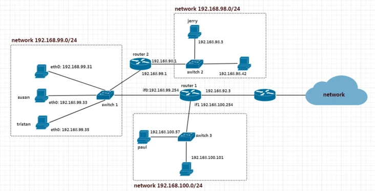

# 0x00. 导读

比如说进一栋大楼找一个人，你要先找大爷问问，有没有这个人。
大爷就是路由表，你问的人就是网络地址，如果有的话，大爷会说这个人在 402 室，402 就是那个网卡。

# 0x01. 简介

Linux route 命令用来显示并设置 Linux 内核中的网络路由表， route 命令设置的路由主要是`静态路由`。
要实现两个不同的子网之间的通信，需要一台连接两个网络的路由器，或者同时位于两个网络的网关来实现。

# 添加组播路由:  

1. 使用 ip 命令
`ip route add <multicast_address> dev <interface_name>`  
<multicast_address> 是您要加入的组播地址，<interface_name> 是您要在其上加入该组播的网络接口名称。

    例如，如果要将组播地址224.0.0.1添加到eth0接口，请使用以下命令：  
    `ip route add 224.0.0.1 dev eth0`  

2. 使用 route 命令  
`route add -net <multicast_address> netmask <netmask> dev <interface_name>`  
其中，<multicast_address> 是您要加入的组播地址，<netmask> 是网络掩码，<interface_name> 是您要在其上加入该组播的网络接口名称。

    例如，如果要将组播地址224.0.0.1添加到eth0接口，请使用以下命令：  
    `route add -net 224.0.0.1 netmask 255.255.255.255 dev eth0`

请注意，如果您使用较新的Linux发行版，则可能需要使用ip命令，因为route命令已被弃用。

# 网关

可以理解成流量代理人，流量代理人又意味着啥，意味着网关设置成 106.1 ，则客户端流量的下一跳地址必然是 106.1 。因为客户端的网络请求可以有无数个目标，客户端自己也不知道怎么抵达目的地，有了网关的概念，客户端就不需要想那么长远只要无脑把请求甩给下一跳网关即可。

比如本机 ip 是 192.168.106.118 同事可能是 106.117 但相同点在于大家网关都是 106.1 这就意味着我和同事电脑上的所有网络指令最终都由 106.1 这个设备处理，至于 106.1 怎么处理那是它的事客户端无权干事。



上图左边是一幅典型的网络拓扑。主机之间通过交换机组成一个小型局域网，再通过一个路由器连接到更大的网络。

图中的路由器对于局域网内的主机来说，即可称为 Gateway ，一般翻译为网关。他的地位如同一个国家的海关,出了网关，IP 报文就在另一个网络之中了。

当主机发现报文的目的IP地址不满足其他表项时，就表示这个报文需要送到局域网外部，所以它会将报文发送给网关。

# route 命令

```
# route  [add|del] [-net|-host] target [netmask Nm] [gw Gw] [[dev] If]
add : 添加一条路由规则
del : 删除一条路由规则
-net : 目的地址是一个网络
-host : 目的地址是一个主机
target : 目的网络或主机
netmask : 目的地址的网络掩码
gw : gateway 的简写，表示用于到达目标的网关，后面接 ip。
dev : 表示用于到达目标的网络接口，后面接 eth0 等。
```

例子：
```bash
# 对于 10.0.0.8 这个主机，通过网关 192.168.0.1 网关路由：
> route add -net 10.0.0.8 gateway 192.168.0.1 netmask 255.255.255.255 dev eth0
> route -n 
Destination     Gateway         Genmask         Flags Metric Ref    Use Iface
10.0.0.8        192.168.0.1     255.255.255.255 UGH   0      0        0 eth0

# 对于10.0.0.0/24这个网络，通过网关 192.168.0.1 网关路由：
> route add -net 10.0.0.0/24 gateway 192.168.0.1   dev eth0
> route -n
Destination     Gateway         Genmask         Flags Metric Ref    Use Iface
10.0.0.0        192.168.0.1     255.255.255.0   UG    0      0        0 eth0
//或者
> route add -net 10.0.0.0 gateway 192.168.0.1  dev eth0

# 默认路由的 Destination 是 default 或 0.0.0.0。
> route add default gw 192.168.1.1
> route -n
Destination     Gateway         Genmask         Flags Metric Ref    Use Iface
default         192.168.1.1     0.0.0.0         UG    100    0        0 eth0

# 不指定 gw 选项时，添加的路由记录不使用网关：
> route add -net 10.10.1.0 netmask 255.255.255.0 dev eth0
> route
Destination     Gateway         Genmask         Flags Metric Ref    Use Iface
10.10.1.0       0.0.0.0         255.255.255.0   U     0      0        0 eth0

```

```bash
[alfred@bbro-ZXDG1 ~]$ route
Kernel IP routing table
Destination     Gateway         Genmask         Flags Metric Ref    Use Iface
default         gateway         0.0.0.0         UG    100    0        0 p4p1
10.27.95.144    0.0.0.0         255.255.255.240 U     100    0        0 p4p1
10.27.102.32    10.27.102.190   255.255.255.240 UG    101    0        0 p4p2
10.27.102.184   0.0.0.0         255.255.255.248 U     101    0        0 p4p2
```
|  列名  | 含义  |
|  ----  | ----  |
|Destination  | 目标网段或者主机  |
|Gateway	| 网关地址，0.0.0.0 表示目标是本主机所属的网络，不需要路由|
|Genmask	| Destination 字段的网络掩码，Destination 是主机时需要设置为 255.255.255.255，是默认路由时会设置为 0.0.0.0 |
|Flags	| 标记。一些可能的标记如下：|
| 	    | U — 该路由是启动的|
| 	    | H — 目标是一部主机 (IP) 而非网域|
| 	    | G — 需要透过外部的主机 (gateway) 来转递封包|
| 	    | R — 恢复动态路由产生的表项|
| 	    | D — 由路由的后台程序动态地安装|
| 	    | M — 由路由的后台程序修改|
| 	    | ! — 拒绝路由|
|Metric	| 路由距离，到达指定网络所需的中转数（linux 内核中没有使用）|
|Ref	| 路由项引用次数（linux 内核中没有使用）|
|Use	| 此路由项被路由软件查找的次数|
|Iface	| 该路由表项对应的输出接口|

## 3 种路由类型
### 1. 主机路由
主机路由是路由选择表中指向单个 IP 地址或主机名的路由记录。
主机路由的 Flags 字段为 `H` 。  
例如，在下面的示例中，本地主机通过 IP 地址 192.168.1.1 的路由器到达 IP 地址为 10.0.0.10 的主机。
```
Destination    Gateway       Genmask    Flags     Metric    Ref    Use    Iface
-----------    -------       -------    -----     ------    ---    ---    -----
10.0.0.10   192.168.1.1  255.255.255.255   UH       0         0      0    eth0
```
### 2. 网络路由
网络路由是代表主机可以到达的网络。
网络路由的 Flags 字段为 `N` 。  
例如，在下面的示例中，本地主机将发送到网络 192.19.12(注意 Genmask) 的数据包转发到IP地址为 192.168.1.1 的路由器。
```
Destination    Gateway       Genmask Flags    Metric    Ref     Use    Iface
-----------    -------       -------         -----    -----   ---    ---    -----
192.19.12     192.168.1.1    255.255.255.0      UN      0       0     0    eth0
```

### 3. 默认路由
当主机不能在路由表中查找到目标主机的 IP 地址或网络路由时，数据包就被发送到默认路由（默认网关）上。
默认路由的 Flags 字段为 `G` 。  
例如，在下面的示例中，默认路由是 IP 地址为 192.168.1.1 的路由器。
```
Destination    Gateway       Genmask Flags     Metric    Ref    Use    Iface
-----------    -------     ------- -----      ------    ---    ---    -----
default       192.168.1.1     0.0.0.0    UG       0        0     0    eth0
```

# Linux 包转发
在 CentOS 中默认的内核配置已经包含了路由功能，但默认并没有在系统启动时启用此功能。开启 Linux 的路由功能可以通过调整内核的网络参数来实现
```
sysctl -w net.ipv4.ip_forward=1
or
echo "1" > /proc/sys/net/ipv4/ip_forward     # 临时开启
```
用户还可以使用如下的命令查看当前系统是否支持包转发。
```
sysctl  net.ipv4.ip_forward
```


# 配置网卡信息
```
$ vim /etc/sysconfig/network-scripts/ifcfg-ens33
TYPE=Ethernet                   #网卡类型为以太网
HWADDR=00:0C:29:FE:1A:09        #网卡MAC地址 
UUID=99-6217--a******           #UUID号，没事不要动它，否则你会后悔的
NAME=em1                        #网卡名称
DEVICE=eth0						#物理设备名
IPADDR=192.168.1.10 			#IP地址
NETMASK=255.255.255.0 			#掩码值
NETWORK=192.168.1.0				#网络地址(可不要)
BROADCAST=192.168.1.255			#广播地址（可不要）
GATEWAY=192.168.1.1				#网关地址
DEFROUTE=yes                    #default route
ONBOOT=yes 						#[yes|no]（启动时是否激活设备）
USERCTL=no						#[yes|no]（非root用户是否可以控制该设备）
BOOTPROTO=static				#[none|static|bootp|dhcp]（启动时不使用协议|静态分配|BOOTP协议|DHCP协议）
```