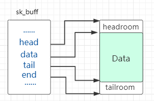
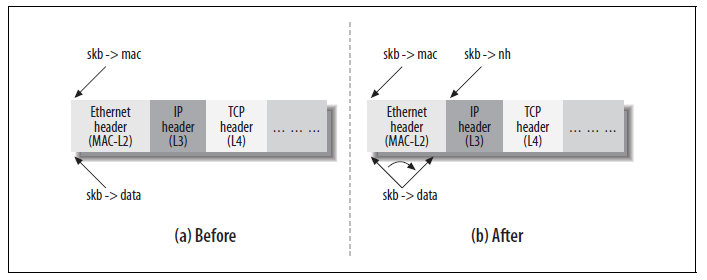

# 0x00. 导读

[sk_buff](https://jiyang.site/posts/2020-01-02-%E7%90%86%E8%A7%A3linux%E5%86%85%E9%83%A8%E7%BD%91%E7%BB%9C%E5%AE%9E%E7%8E%B0%E4%B9%8B%E5%85%B3%E9%94%AE%E6%95%B0%E6%8D%AE%E7%BB%93%E6%9E%84%E4%B9%8B-sk_buff/)
# 0x01. 简介

`<include/linux/skbuff.h>`

内核显然需要一个数据结构来表示报文，这个结构就是 sk_buff (socket buffer 的简称) ，自身并不存储报文内容，它通过多个指针指向真正的报文内存空间:

sk_buff 是一个贯穿整个协议栈层次的结构，在各层间传递时，内核只需要调整 sk_buff 中的指针位置就行：

# 0x02. 