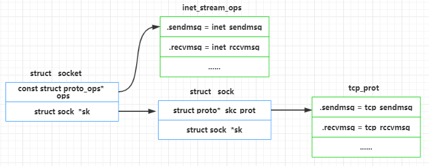

# 0x00. 导读

# 0x01. 简介

用户空间通过 socket()、bind()、listen()、accept() 等库函数进行网络编程。而这里提到的 socket 和 sock 是内核中的两个数据结构，其中 socket 向上面向用户，而 sock 向下面向协议栈。

# 0x02. 

注意到，这两个结构上都有一个叫 ops 的指针, 但它们的类型不同。socket 的 ops 是一个指向 struct proto_ops 的指针，sock 的 ops 是一个指向 struct proto 的指针, 它们在结构被创建时确定