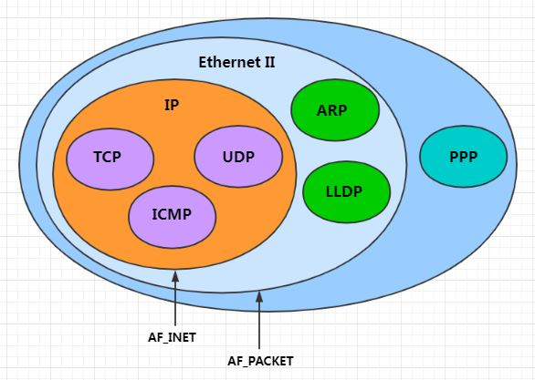
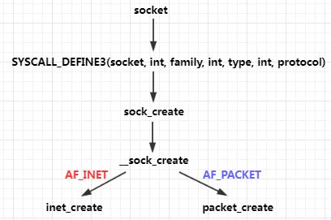

# 0x00. 导读

[inet socket 与 packet socket](https://switch-router.gitee.io/blog/af_packet/)

# 0x01. 简介

```c
#include <sys/socket.h>
sockfd = socket(int socket_family, int socket_type, int protocol);
```

# 0x02. 参数详解

第一个参数叫做 “套接字协议簇”。第二个参数是表示这个套接字的类型。

## 2.1 socket_family

第一个参数表示创建的 socket 所属的地址簇或者协议簇，取值以 AF 或者 PF 开头定义在 `(include\linux\socket.h)` ，实际使用中并没有区别(有两个不同的名字只是因为是历史上的设计原因)。最常用的取值有 AF_INET, AF_PACKET, AF_UNIX 等。 AF_UNIX 用于主机内部进程间通信。 AF_INET 与 AF_PACKET 的区别在于使用前者只能看到 IP 层以上的东西，而后者可以看到链路层的信息。



AF_INET 是与 IP 报文对应的，而 AF_PACKET 则是与 Ethernet II 报文对应的。 AF_INET 创建的套接字称为 `inet socket` ，而 AF_PACKET 创建的套接字称为 `packet socket` 。



## 2.2 socket_type

第一个参数family会影响第二个参数socket_type和第三个参数protocol取值范围

第二个参数socket_type表示套接字类型。它的取值不多，常见的就以下三种
```c
enum sock_type {
	SOCK_STREAM	= 1,     /* stream (connection) socket  */
	SOCK_DGRAM	= 2,     /* datagram (conn.less) socket */
	SOCK_RAW	= 3,     /* raw socket                  */
};
```

## 2.3 protocol

对于AF_INET地址簇，protocol的取值范围是如 IPPROTO_TCP IPPROTO_UDP IPPROTO_ICMP 这样的IP报文协议类型，或者IPPROTO_IP = 0 这个特殊值 对于AF_PACKET地址簇，protocol的取值范围是 ETH_P_IP ETH_P_ARP这样的以太帧协议类型。


## raw inet socket
对于 inet socket 来说，一个TCP报文可以这样分解：
```
packet = IP Header + TCP Header +  Payload
```
如果我们是使用SOCK_STREAM创建的TCP套接字，应用程序在通过send发送数据时，只需要提供Payload就行了，而IP Header和TCP Header则由内核组装完成。接收方向，应用程序通过recv也只能收到payload

而RAW套接字则为应用提供了更底层的控制能力
```s
int s = socket (AF_INET, SOCK_RAW, IPPROTO_TCP);
```
使用上面的接口可以创建一个更原始的TCP套接字，当我们使用这个套接字发送数据时，需要提供Payload和TCP Header，而IP Header依然由内核协议栈自动组装。

如果希望手动组装IP Header，有两个方法：

- 第一种是protocol使用IPPROTO_RAW
    ```c
    int s = socket (AF_INET, SOCK_RAW, IPPROTO_RAW);
    ```

- 第二种是置位IP_HDRINCL的套接字选项。
    ```c
    int s = socket (AF_INET, SOCK_RAW, IPPROTO_TCP);

    int one = 1;
    const int *val = &amp;one;
    if (setsockopt (s, IPPROTO_IP, IP_HDRINCL, val, sizeof (one)) &lt; 0)
    {
        printf (&quot;Error setting IP_HDRINCL. Error number : %d . Error message : %s \n&quot; , errno , strerror(errno));
        exit(0);
    }
    ```
以上两种方法都是告诉内核，IP Header也由应用程序自己提供。

## packet socket
inet socket的控制范围是IP报文，而packet socket的控制范围扩大到了以太层报文。

对于inet socket, 第二个参数socket_type只能选择SOCK_DGRAM、SOCK_RAW或者SOCK_PACKET, protocol则表示支持的网络层的协议类型。

### Protocol Handler

对以太帧来说，不同的网络层协议类型(比如IP ARP PPPoE)有不同的接收处理函数。在内核中，这就是Protocol Handler。

所有AF_INET套接字实际上是共用这样一个handler，对应的接收函数是ip_rcv，区分是哪一个套接字的报文是之后的工作。

每个AF_PACKET套接字拥有独立的handler

## raw packet socket
对于AF_PACKET来说，一个报文可以这样分解：
```
packet = Ethernet Header + Payload
```
而SOCK_DGRAM和SOCK_RAW的区别就在于，在接收方向，使用SOCK_DGRAM套接字的应用程序收到的报文已经去除了Ethernet Header，而SOCK_RAW套接字则会保留。


tcpdump是如何完成嗅探工作的呢？ 没错！它正是使用的packet socket：

- tcpdump作为Sniffer，它不能影响正常的报文收发，因此它需要单独的protocol handler，这样内核接收的报文会复制一份后，交给tcpdump
- tcpdump不止能抓取IP报文, 它还可以抓起链路层信息或者其他一些非IP报文。