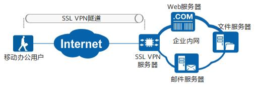
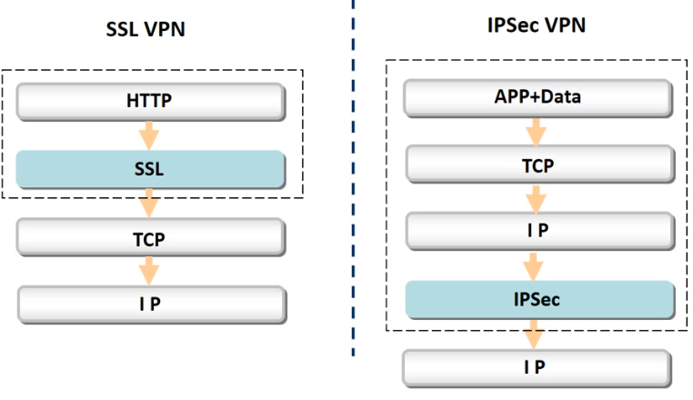
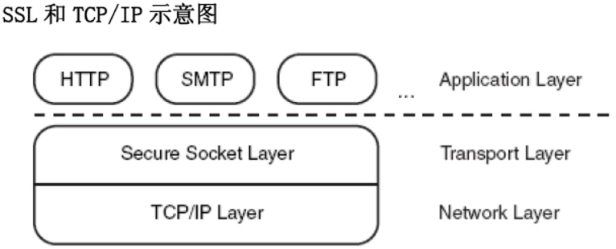
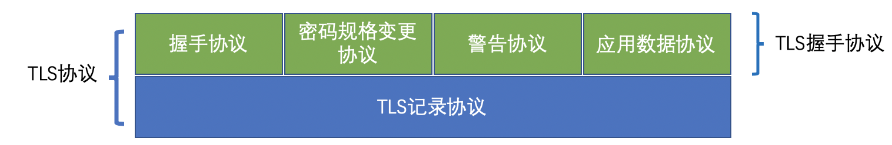

# 0x00. 导读

# 0x01. 简介

VPN(virtual private network) 是一种允许用户在公共互联网与企业或机构网络之间建立安全加密连接的服务。 

SSL VPN 是以 SSL 协议为安全基础的 VPN 远程接入技术，移动办公人员（在 SSL VPN 中被称为远程用户）使用 SSL VPN 可以安全、方便的接入企业内网，访问企业内网资源，提高工作效率。

VPN 产品主要分为两类：IPSec VPN 和 SSL VPN。   
SSL VPN 与 IPSec VPN对比：

SSL VPN 保护的是应用层的数据，可以针对某个应用做具体保护。而 IPSec VPN 针对的是整个网络层。无法做精细化控制。

# 0x02. SSL/TLS 详解

[SSL/TLS协议详解](https://www.biaodianfu.com/https-ssl-tls.html)

SSL 是一个不依赖于平台和运用程序的协议，位于 TCP/IP 协议与各种应用层协议之间，为数据通信提高安全支持。

## 2.1 SSL 历史

SSL（Secure Sockets Layer）中文称作“安全套接层”，TLS（Transport Layer Security），中文称作“传输层安全协议”。SSL是由网景公司（Netscape）设计的主要用于Web的安全传输协议，目的是为网络通信提供机密性、认证性及数据完整性保障。SSL最初的几个版本（SSL 1.0、SSL2.0、SSL 3.0）由网景公司设计和维护，从3.1版本开始，SSL协议由因特网工程任务小组（IETF）正式接管，并更名为TLS（Transport Layer Security），发展至今已有TLS 1.0、TLS 1.1、TLS 1.2、TLS 1.3这几个版本。

## 2.2 SSL 协议

SSL协议结构：

TLS主要分为两层：
- 底层的是TLS记录协议，它建立在可靠的传输（如TCP）之上，为高层协议提供数据封装、压缩、加密等基本功能。

- 上层的是TLS握手协议，它建立在SSL记录协议之上，用于在实际的数据传输开始之前，通讯双方进行身份认证、协商加密算法、交换加密密钥等。主要分为握手协议，密码规格变更协议和应用数据协议4个部分。
    - 握手协议负责在客户端和服务器端商定密码算法和共享密钥，包括证书认证，是4个协议中最最复杂的部分。
    - 密码规格变更协议负责向通信对象传达变更密码方式的信号
    - 警告协议负责在发生错误的时候将错误传达给对方
    - 应用数据协议负责将 TLS 承载的应用数据传达给通信对象的协议。