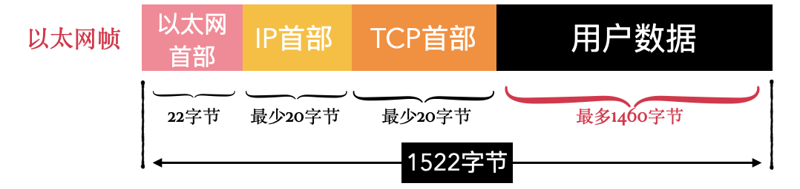
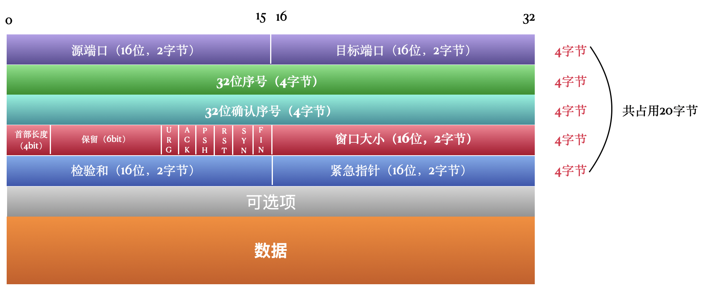

# 0x00. 导读

[TCP协议](https://www.cnblogs.com/fengzheng/p/17250389.html)
[Linux下的抓包工具Tcpdump](https://www.escapelife.site/posts/365ce3c5.html)

TCP，全称是 Transmission Control Protocol，传输控制协议。 是一种面向连接的、可靠的字节流服务协议，正因为它要保证可靠性，所以比起 UDP 协议要复杂的多，正是由于这种复杂性，导致它的性能比 UDP 差。

它向下使用网络层的 IP 协议，向上为 FTP、SMTP、POP3、SSH、Telnet、HTTP 等应用层协议提供支持。

# 0x01. 简介

# 0x02. 协议详解

TCP首部 + 用户数据被称为TCP段，其中 TCP 首部就是这里要主要研究的 TCP 协议的核心所在，用户数据部分是 TCP 段的负载。

TCP 段的大小也是有限制的，最大是 1460 字节，这是怎么算出的呢？

最终由网卡发出去的数据包叫做以太网帧，以太网帧由以太网首部和负载构成。

以太网帧的负载就是一个 IP 数据报，IP数据报由IP首部和负载构成。

IP数据报的负载就是一个 TCP段。所以，TCP段所能搭载的最大数据量可以这样计算出来：

$TCP段搭载的数据大小 = 以太网帧大小-以太网首部-IP首部-TCP首部$

以太网帧的大小是固定的 1522字节，而IP首部和TCP首部的大小是不固定的，但是最少会各占20字节，所以最后算下来 TCP段搭载的数据大小最多为 1460字节。

$TCP段搭载的数据大小（最多1460） = 以太网帧大小（1522字节）-以太网首部（22字节）-IP首部（最少20字节）-TCP首部（最少20字节）$

## 2.1 协议

- 源端口和目标端口

    源端口和目标端口分别占用 2个字节，共占用 4 字节，分别记录数据发送端的端口号和数据接收端的端口号，这两个标记和 IP 协议中记录的发送端 IP 和接收端 IP组合起来，便可确定一个唯一的 TCP 连接。

- 序号

    由于TCP段的大小有限制，当要传输的数据量大于这个限制的时候，就要对数据进行分段，一段一段的发送，既然发送方要分段，那接收方就要对分段进行重组，才能还原回原始数据。在重组的过程中，要保证各段间的先后顺序，序号正是起到保证重组顺序的作用。

    序号占用 4 字节，32 位，它的范围是 [0,$2^{32}$]​。TCP是字节流服务，会对每一个发送的字节进行编号。在建立连接的时候，系统会给定一个 ISN(初始序号)，然后这个设备在当前连接中发送的第一个字节的序号就是 ISN+1，假设 ISN 初始为0，那第一个字节的序号就是 1。

    举个例子，假设ISN为0，发送端第一次发送 100 字节的数据包，那这第一个 TCP段的序号就是1，下次再发送 100字节的数据包，那这第二个 TCP段的序号就是 101。

    这样一来，最大可以一直标记 $2^{32}$个字节，也就是 4个G的数据。当达到最大值后，又会从 0 开始标记。

    序号只有在下面两种情况下才有用：

    - 数据字段至少包含一个字节。
    - 是一个 SYN 段，或者是 FIN 段，或者是 RST 段。

- 确认序号

    当数据发送出去，接收方收到之后，会回复一个确认序号回复给发送方，这个确认序号表示接收方希望下次接收的序号。例如发送了序号为501的，长度为100的TCP段，那接收方收到后要回复 601的确认序号，表示【0-600】的字节已经接收，下次希望收到第 601个字节以后的数据。

    为了提高效率，并不是每次接收到TCP段都会马上回复给发送方，而是采用累积确认的方式，即每传送多个连续 TCP 段，可以只对最后一个 TCP 段进行确认。

    确认序号只有在 ACK 标志位被设置的时候才有效。

- 首部长度

    之所以需要首部长度，是因为可选项的大小是不固定的，如果没有可选项的话，那首部长度就是 20字节。这个标示部分占 4 bit，单位是4字节，4bit 可表示的最大值是 15，一个单位表示的长度是4字节，所以首部长度最大可以是 15 x 4字节，也就是 60 字节。

- 保留
    顾名思义，是保留位，占用6个比特位，目前的值为 0。

- 6个标志位
    协议中有 6 个比特标记位，可以理解为 TCP 段的类型。

    - URG

        1个比特位，当被设置为1时，表明紧急指针字段有效，该报文段有紧急数据，应尽快发送。

    - ACK

        当 ACK 设置为1时，确认号才有效，连接建立后，所有的报文段ACK都为 1。

    - PSH

        当 PSH 设置为1时，接收方应该尽快将这个报文段交给应用层，而不再等待整个缓存填满再交付。

    - RST

        当 RST 为1时，表示连接出现严重错误，必须重新建立连接。

    - SYN

        在建立连接时用到。

        当SYN=1,ACK=0时，表明这是一个连接请求报文段。

        当SYN=1,ACK=1时，表明对方同意连接。

    - FIN

    用来释放一个连接窗口。当FIN=1时，表明此报文段的发送方不再发送数据，请求释放单向连接。TCP断开连接用到。

- 窗口大小

    大小为2个字节，表示发送方自己的接收窗口，用来告诉对方允许发送的数据量，最大为65535字节。

- 检验和

    校验和是必需的，是一个端到端的校验和，由发送端计算，然后由接收端验证。其目的是为了发现TCP首部和数据在发送端到接收端之间发生的任何改动。如果接收方检测到校验和有差错，则TCP段会被直接丢弃。

- 紧急指针

    占2字节，当URG=1时，紧急指针表示本报文段中的紧急数据的字节数，表示从这个 TCP段的序号开始的后的若干个字节是紧急数据，之后的就是普通数据。

    假设此TCP段的序号为101，紧急指针为30，那就表示从 101开始，直到 131，【101，131】这个区间内为紧急数据。