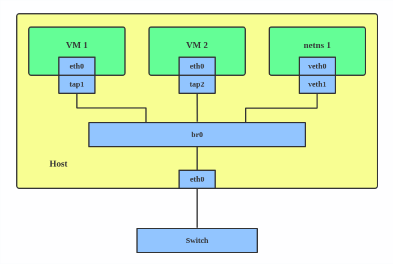

# 0x01. 名词解释

## 1.1 网卡（Network Interface Card，NIC）

又称网络适配器(Network Adapter)，是一块用于计算机网络通讯的基础硬件，属于OSI模型的第一层(Physical)和第二层(Data Link)。一般来说，其通过唯一的MAC地址来标识自己。

常见的网卡可达到10/100/1000Mbits/sMbps），这就是我们常说的百兆、千兆网卡。常用的标准有Ethernet（有线网卡）和Wi-Fi（无线网卡）。

## 1.2  中继器（Repeater）

一种将输入信号增强放大的硬件设备。它工作于 OSI 模型的物理层(Physical)。它通过对数据信号的重新发送或者转发，来扩大数据的传输距离。

## 1.3 网桥（Network Bridge）

又称桥接器，是一种用于网络桥接的硬件设备。它工作于 OSI 模型的第二层(Data Link)。

网桥将网络的多个网段在数据链路层连接起来。相对于中继器只是简单地转发信号，网桥在对帧进行转发时，根据其存储的MAC table进行过滤，只转发MAC地址在table内的帧。

由于交换机的普及，网桥已经很少见了。

## 1.4 路由器（Router）

又称网关（Gateway），是一种用于网络路由硬件设备。它工作于OSI模型的第三层(Network)。

提供路由与转发两种功能，即可以决定数据包从来源端到目的端所经过的路由路径（host到host之间的传输路径），也可以在内部把输入端的数据包移送至适当的输出端。

路由器中维护着一张路由表，记录着有去往不同网络地址应送往的端口号。当一台路由器收到一个IP数据包时，它将根据数据包中的目的IP地址项查找路由表，根据查找的结果将此IP数据包送往对应端口。

## 1.5 交换机（Switch）

交换机能为子网中提供更多的连接端口，以便连接更多的电脑。

这个种类就多了，目前有二层交换机(Data link)，相当于强化版网桥；三层交换机(Network)，有一定的路由功能，还有四层交换机(transport)和七层交换器。

# 0x02. 技术名词

## 2.1 Bridge 桥接

网桥的行为类似于网络交换机。它在连接到它的接口之间转发数据包。它通常用于在路由器、网关或主机上的虚拟机和网络命名空间之间转发数据包。它还支持 STP、VLAN 过滤和组播监听。



```bash
$ ip link add br0 type bridge
$ ip link set eth0 master br0
$ ip link set tap1 master br0
$ ip link set tap2 master br0
$ ip link set veth1 master br0

# 这将创建一个名为 br0 的桥接设备，并设置两个 TAP 设备（ tap1 、 tap2 ）、一个 VETH 设备（ veth1 ）和物理设备（ eth0 ）作为其从属设备，如上图所示。
```

## 2.2 网卡工作模式

- 广播模式（Broad Cast Model）:它的物理地址地址是 0Xffffff 的帧为广播帧，工作在广播模式的网卡接收广播帧。它将会接收所有目的地址为广播地址的数据包，一般所有的网卡都会设置为这个模式
- 多播传送（MultiCast Model）：多播传送地址作为目的物理地址的帧可以被组内的其它主机同时接收，而组外主机却接收不到。但是，如果将网卡设置为多播传送模式，它可以接收所有的多播传送帧，而不论它是不是组内成员。当数据包的目的地址为多播地址，而且网卡地址是属于那个多播地址所代表的多播组时，网卡将接纳此数据包，即使一个网卡并不是一个多播组的成员，程序也可以将网卡设置为多播模式而接收那些多播的数据包。
- 直接模式（Direct Model）:工作在直接模式下的网卡只接收目地址是自己 Mac 地址的帧。只有当数据包的目的地址为网卡自己的地址时，网卡才接收它。
- 混杂模式（Promiscuous Model）:工作在混杂模式下的网卡接收所有的流过网卡的帧，抓包程序就是在这种模式下运行的。网卡的缺省工作模式包含广播模式和直接模式，即它只接收广播帧和发给自己的帧。如果采用混杂模式，网卡将接受同一网络内所有所发送的数据包，这样就可以到达对于网络信息监视捕获的目的。它将接收所有经过的数据包，这个特性是编写网络监听程序的关键。

```bash
$ ifconfig ens192
ens192: flags=4163<UP,BROADCAST,RUNNING,MULTICAST>  mtu 1500
        inet 192.168.17.88  netmask 255.255.240.0  broadcast 192.168.31.255
        inet6 fe80::20c:29ff:fe99:4eb2  prefixlen 64  scopeid 0x20<link>
        ether 00:0c:29:99:4e:b2  txqueuelen 1000  (Ethernet)
        RX packets 163692  bytes 10031607 (9.5 MiB)
        RX errors 0  dropped 110  overruns 0  frame 0
        TX packets 1751  bytes 175974 (171.8 KiB)
        TX errors 0  dropped 0 overruns 0  carrier 0  collisions 0

$ ifconfig ens192 promisc
$ ifconfig ens192
ens192: flags=4419<UP,BROADCAST,RUNNING,PROMISC,MULTICAST>  mtu 1500
        inet 192.168.17.88  netmask 255.255.240.0  broadcast 192.168.31.255
        inet6 fe80::20c:29ff:fe99:4eb2  prefixlen 64  scopeid 0x20<link>
        ether 00:0c:29:99:4e:b2  txqueuelen 1000  (Ethernet)
        RX packets 171193  bytes 10482754 (9.9 MiB)
        RX errors 0  dropped 110  overruns 0  frame 0
        TX packets 1776  bytes 179091 (174.8 KiB)
        TX errors 0  dropped 0 overruns 0  carrier 0  collisions 0
```