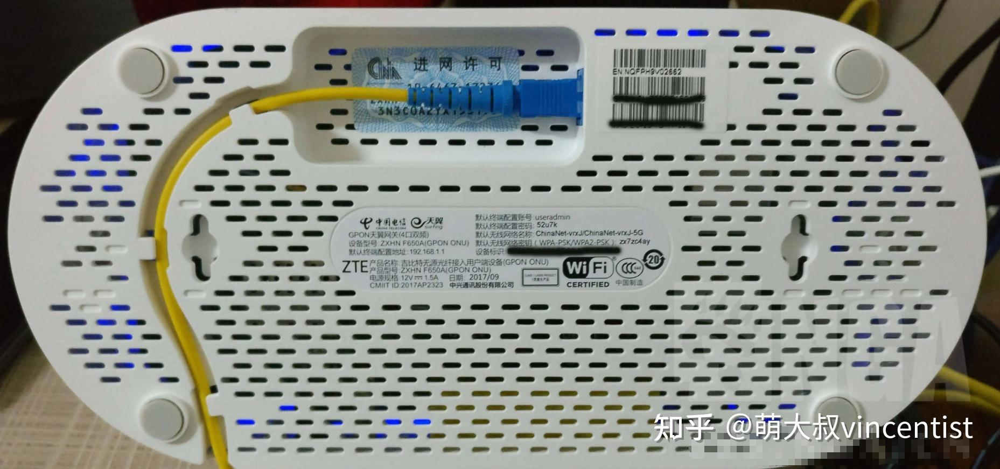
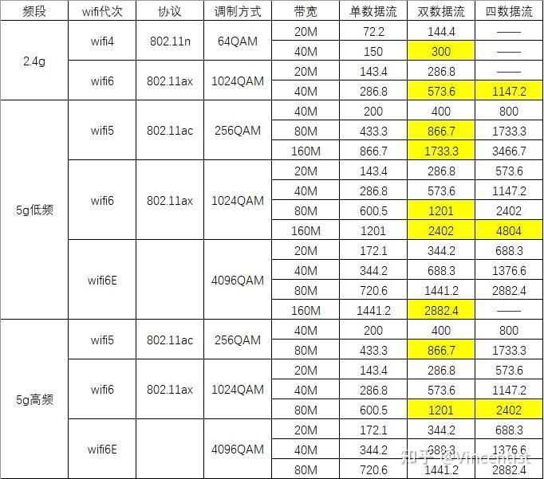
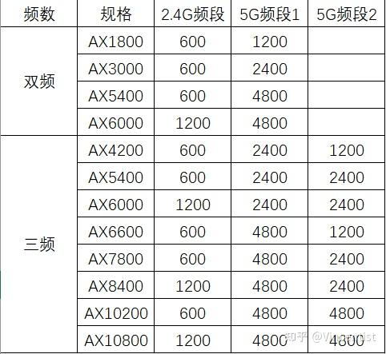
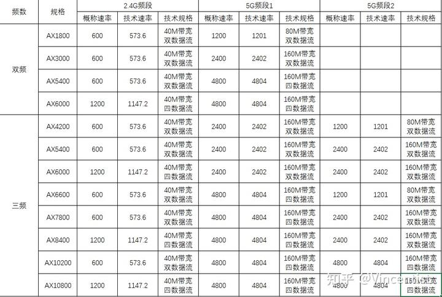

# 0x00. 导读

# 0x01. 简介

# 0x02. 光猫

何为光猫，简单来说，光猫是一种设备，让你可以上网的设备。即，如果你申请了宽带业务，就必须用这样一台设备，为你提供给上网的能力。

为什么需要这样一台设备？因为目前主流都是采用光纤方式进行上网的数据传输，而目前开发商一般会把光纤铺设到楼层或者你家里，但也就是一条光纤。而光猫核心就是实现光电转换，利用那条光纤传输上网的数据，因此，它是上网最核心的设备。

光猫最主要的功能，就是“光电转换”。就是把光纤里走的“光信号”，转换成网线里走的“电信号”（以及电话线里走的“电信号”）。

## 2.1 FTTH

FTTH 就是 fiber to the house，光纤到户；也就是运营商把光纤铺到用户家中。现在绝大多数上网用户都是这种网络结构。能看到的特征是，运营商把光纤（经过皮光纤和尾纤）接到用户家里，接上 “光猫”。

典型的样子就是上图的样子，黄色的那根 “细线”，是光纤，也称尾纤；它的特点是比较软，不那么怕折，但不够坚固，不适用于室外或楼内穿线，适用于用户家中光猫前的 “最后一小段”。

并非所有用户都是 FTTH（光纤到户）的，以 “光网络覆盖” 的区域来说，也还有两种网络结构，一种是 FTTB，一种是 FTTR。

FTTB，fiber to the building，光纤到楼，意思是光纤铺到了（且只铺到了）这栋楼（或这个单元），楼栋或单元到用户家中，还是要跑网线的。FTTB 的用户，家中入户就是一根网线，没有光纤铺到家里。上网的时候，会使用 PPPoE 协议进行身份认证，家中没有光猫，只有自己买的路由器。相当于，整栋楼或单元，有一个 “大光猫”。

FTTH，是一个光猫带一户，FTTB，是一个“大光猫” 带一栋楼或一个单元，接入的人多了；而且楼内的线基本规格不太高，可能就是五类线，又要跑很长的距离；所以，FTTB 的网速都不太快，一般是 20M 以下。FTTB 也是从传统的电话线拨号向全光网络覆盖转换过程中的一个中间产品。

FTTR，fiber to the room，光纤到房间，意思是光纤到户以后，还要在家里再跑光纤，跑到具体的房间里，家里有不只一个光猫，有主光猫、从光猫。

就 “光网络” 而言，有三种形式:

- FTTB，光纤到楼，现在已不多，但还有。用户家中只有网线和路由器，没有光纤和光猫。

- FTTH，光纤到户；主流，绝大多数是这种。用户家中有光纤，有一个光猫。

- FTTR，光纤到房间，新产品，用户量还不大，基本是 1000M 以上宽带的；用户家中有光纤，而且，有不只一个光猫。

# 0x03. WIFI

wifi6，是 802.11ax 标准；wfi5 是 802.11ac 标准；wifi4 是 802.11n 标准，再往前的 wifi1/2/3 就是 802.11 a/b/g 标准；各代的标准不同，支持的技术也不同，支持的网速也不同。

重点看标黄底的部分就可以。我们常说的 2.4g 频段的 600Mbps 其实是 573.6Mbps，5g 的 1200M 其实是 1201M、2400M 其实是 2402M.

## 2.1 QAM

QAM = Quadrature Amplitude Modulation, 也就是“正交振幅调制”，是一种调制方式，可以理解为将数据信号转换为电磁波信号一种技术。  
只有 1 和 0 两种波形，一种是突出、一种是不突出（可以理解为有电磁波和没有电磁波）。
- 1QAM 总共就 2 种波形，要么代表 0，要么代表是 1，那么每个波形包含的信息就是 1bit. 
- 4QAM 总共 4 种波形，每个波形可以代表 00，01，11，10 中的一种，那么每个波形包含的信息就是 2 比特。

举个例子，十进制的数字 10，转化为二进制是 1010，如果使用 1QAM 进行调制，则需要发射四次电磁波，分别是 1，0，1，0。如果 4QAM 进行调制则只需要发送两次电，分别是 10，10。效率提升一倍。以此类推 4QAM、16QAM、64QAM、256QAM、1024QAM 以及 4096QAM 等，一个调制符号分别可以传送 2、4、6、8、10、12 个比特的信息。

注意，由于二进制的数据都是由 1 和 0 组成，每次 QAM 的提升，都比上代多发送 2 个 bit 的信息，多发送的数据量都以 2 的 2 次方倍提升；也就是我们看到 1QAM、4QAM、16QAM、64QAM、256QAM、 1024QAM 和 4096QAM ，而每一代提升，都是单次发送的信息增加 2 个bit，也就是发送 2、4、6、8、10、12 个 bit ，这个数据发送量，就分别与上述QAM是一一对应的。  
这样，我们就可以回答 4096QAM 到底比 1024QAM 网速提升多少呢？我们看一看， 4096QAM 单次发送 12 个 bit ，而 1024QAM 单次发送 10 个 bit，所以， 4096QAM 比 1024QAM 提升了 20%。（上表中，4096QAM 的协商速率是用 1024QAM 数字乘以 1.2 计算的。）

## 3.2 频段

市面的路由器有双频和三频之分:
- 双频，就是一个 2.4Ghz 频段加上一个 5Ghz 频段，两个频段，后面的数字，也是这两个频段的无线速率之和；
- 三频，就是一个 2.4Ghz 频段加上两个 5Ghz 频段（5.2Ghz和5.8Ghz），后面的数字，也是这两个频段的无线速率之和。

市面上常见的双频路由器和三频路由器的频率组合：

我们再把这个表，和上面的技术规格做一个对应，就可以更加清楚的看明白，各种规格的路由器在各频段支持的具体规格。

上表中的数据，指的都是在wfi6（AX）技术下的数据。

这个速率，是需要路由器和终端（手机、电脑等）同时支持相应的规格，才能实现的，否则，设备将按兼容的更低规格去确定协商速率。例如，苹果 2022 年的最新版 ipad pro 12.9 的无线规格为“最高支持1.2g连接速度”，也就是说，它支持的是Wifi6、80M带宽、双数据流，有一个AX1800的路由器，就能和它完美合作了，你就是给它一个AX10800规格的路由器，它也不会跑得更快。

双频、三频路由器，也要看它的单一频段的最高规格是多少，AX10800的路由器，无论用什么终端也跑不到 10000Mbps，因为它是三个频段最高速率加在一起的和，单一频段最高只到 4804M。

# 0x04. 家庭组网

家用宽带组网的形式主要有:
- 有线mesh
- 无线mesh
- AC+AP

先说说mesh，不管有线mesh、无线mesh，都是利用多台路由器共同组网，也就是，光猫后面只有路由器（及交换机），不再存在其它设备，利用多个路由器协同工作，共同组建一个无缝衔接和漫游的网络。
