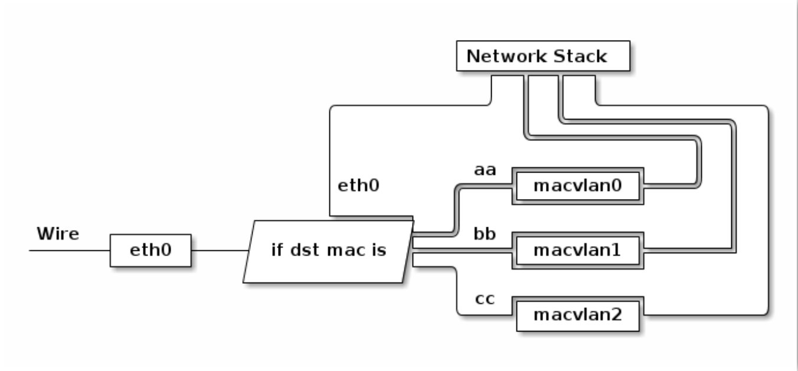

# 0x00. 导读

Linux 强大的虚拟网络背后其实是由一个个的虚拟设备所构成的。

[Introduction to Linux interfaces for virtual networking](https://developers.redhat.com/blog/2018/10/22/introduction-to-linux-interfaces-for-virtual-networking#)

在 `man ip link` 中可以得知有以下类型的 device:
```
bridge - Ethernet Bridge device

bond - Bonding device can - Controller Area Network interface

dummy - Dummy network interface

hsr - High-availability Seamless Redundancy device

ifb - Intermediate Functional Block device

ipoib - IP over Infiniband device

macvlan - Virtual interface base on link layer address (MAC)

macvtap - Virtual interface based on link layer address (MAC) and TAP.

vcan - Virtual Controller Area Network interface

veth - Virtual ethernet interface

vlan - 802.1q tagged virtual LAN interface

vxlan - Virtual eXtended LAN

ip6tnl - Virtual tunnel interface IPv4|IPv6 over IPv6

ipip - Virtual tunnel interface IPv4 over IPv4

sit - Virtual tunnel interface IPv6 over IPv4

gre - Virtual tunnel interface GRE over IPv4

gretap - Virtual L2 tunnel interface GRE over IPv4

ip6gre - Virtual tunnel interface GRE over IPv6

ip6gretap - Virtual L2 tunnel interface GRE over IPv6

vti - Virtual tunnel interface

nlmon - Netlink monitoring device

ipvlan - Interface for L3 (IPv6/IPv4) based VLANs

lowpan - Interface for 6LoWPAN (IPv6) over IEEE 802.15.4 / Bluetooth

geneve - GEneric NEtwork Virtualization Encapsulation

macsec - Interface for IEEE 802.1AE MAC Security (MACsec)

vrf - Interface for L3 VRF domains

```

# 0x01. 简介

物理网卡需要通过网卡驱动在内核中注册后才能工作，它在内核网络协议栈和外界网络之间传递数据，用户可以为物理网卡配置网卡接口属性，比如IP地址，这些属性都配置在内核的网络协议栈中。

内核也可以直接创建虚拟的网卡，只要为虚拟网卡提供网卡驱动程序，使其在内核中可以注册成为网卡设备，它就可以工作。

物理网卡负责内核网络协议栈和外界网络之间的数据传输，虚拟网卡的两端则是内核网络协议栈和用户空间，它负责在内核网络协议栈和用户空间的程序之间传递数据：

- 发送到虚拟网卡的数据来自于用户空间，然后被内核读取到网络协议栈中
- 内核写入虚拟网卡准备通过该网卡发送的数据，目的地是用户空间

内核会公平对待物理网卡和虚拟网卡，物理网卡能做的配置，虚拟网卡也能做。比如可以为虚拟网卡接口配置IP地址、设置子网掩码，可以将虚拟网卡接入网桥等等。

只有在数据流经物理网卡和虚拟网卡的那一刻，才会体现出它们的不同，即传输数据的方式不同：物理网卡以比特流的方式传输数据，虚拟网卡则直接在内存中拷贝数据(即，在内核之间和读写虚拟网卡的程序之间传输)。

正因为虚拟网卡不具备物理网卡以比特流方式传输数据的硬件功能，所以，绝不可能通过虚拟网卡向外界发送数据，外界数据也不可能直接发送到虚拟网卡上。能够直接收发外界数据的，只能是物理设备。

虽然虚拟网卡无法将数据传输到外界网络，但却：

- 可以将数据传输到本机的另一个网卡(虚拟网卡或物理网卡)或其它虚拟设备(如虚拟交换机)上
- 可以在用户空间运行一个可读写虚拟网卡的程序，该程序可将流经虚拟网卡的数据包进行处理，这个用户程序就像是物理网卡的硬件功能一样，可以收发数据(可将物理网卡的硬件功能看作是嵌入在网卡上的程序)，比如 OpenVPN 就是这样的工具。

 Linux 常用的虚拟网络接口类型：TUN/TAP、bridge、veth、ipvlan/macvlan、vlan 以及 vxlan/geneve.

# 0x02. TUN/TAP

tun、tap 是Linux提供的两种可收发数据的虚拟网卡设备。

tun、tap 作为虚拟网卡，除了不具备物理网卡的硬件功能外，它们和物理网卡的功能是一样的，此外 tun、tap 负责在内核网络协议栈和用户空间之间传输数据。

tun和tap都是虚拟网卡设备，但是：

- tun是三层设备，其封装的外层是IP头
- tap是二层设备，其封装的外层是以太网帧(frame)头
- tun是PPP点对点设备，没有MAC地址
- tap是以太网设备，有MAC地址
- tap比tun更接近于物理网卡，可以认为，tap设备等价于去掉了硬件功能的物理网卡

这意味着，如果提供了用户空间的程序去收发tun/tap虚拟网卡的数据，所收发的内容是不同的：

- 收发tun设备的用户程序，只能间接提供封装和解封数据包的IP头的功能
- 收发tap设备的用户程序，只能间接提供封装和解封数据包的帧头的功能

注意，此处用词是【收发数据】而非【处理数据】，是【间接提供】而非【直接提供】，因为在不绕过内核网络协议栈的情况下，读写虚拟网卡的用户程序是不能封装和解封数据的，只有内核的网络协议栈才能封装和解封数据。

一个 TUN 设备的示例图如下:
```
             
+----------------------------------------------------------------------+
|                                                                      |
|  +--------------------+      +--------------------+                  |
|  | User Application A |      | User Application B +<-----+           |
|  +------------+-------+      +-------+------------+      |           |
|               | 1                    | 5                 |           |
|...............+......................+...................|...........|
|               ↓                      ↓                   |           |
|         +----------+           +----------+              |           |
|         | socket A |           | socket B |              |           |
|         +-------+--+           +--+-------+              |           |
|                 | 2               | 6                    |           |
|.................+.................+......................|...........|
|                 ↓                 ↓                      |           |
|             +------------------------+          +--------+-------+   |
|             | Network Protocol Stack |          |  /dev/net/tun  |   |
|             +--+-------------------+-+          +--------+-------+   |
|                | 7                 | 3                   ^           |
|................+...................+.....................|...........|
|                ↓                   ↓                     |           |
|        +----------------+    +----------------+        4 |           |
|        |      eth0      |    |      tun0      |          |           |
|        +-------+--------+    +-----+----------+          |           |
|    10.32.0.11  |                   |   192.168.3.11      |           |
|                | 8                 +---------------------+           |
|                |                                                     |
+----------------+-----------------------------------------------------+
                 ↓
         Physical Network

```

比如常见的 VPN 程序就是把原来的数据包封装/加密一遍，再发送给 VPN 服务器。

# 0x03. veth

veth 接口总是成对出现，一对 veth 接口就类似一根网线，从一端进来的数据会从另一端出去。

其主要作用就是连接不同的网络，比如在容器网络中，用于将容器的 namespace 与 root namespace 的网桥 br0 相连。 容器网络中，容器侧的 veth 自身设置了 ip/mac 地址并被重命名为 eth0，作为容器的网络接口使用，而主机侧的 veth 则直接连接在 docker0/br0 上面。

# 0x04. bridge

Linux Bridge 是工作在链路层的网络交换机，由 Linux 内核模块 brige 提供，它负责在所有连接到它的接口之间转发链路层数据包。

添加到 Bridge 上的设备被设置为只接受二层数据帧并且转发所有收到的数据包到 Bridge 中。 在 Bridge 中会进行一个类似物理交换机的查MAC端口映射表、转发、更新MAC端口映射表这样的处理逻辑，从而数据包可以被转发到另一个接口/丢弃/广播/发往上层协议栈，由此 Bridge 实现了数据转发的功能。

```
+------------------------------------------------+-----------------------------------+-----------------------------------+
|                       Host                     |           VirtualMachine1         |           VirtualMachine2         |
|                                                |                                   |                                   |
|    +--------------------------------------+    |    +-------------------------+    |    +-------------------------+    |
|    |         Network Protocol Stack       |    |    |  Network Protocol Stack |    |    |  Network Protocol Stack |    |
|    +--------------------------------------+    |    +-------------------------+    |    +-------------------------+    |
|                       ↑                        |                ↑                  |                 ↑                 |
|.......................|........................|................|..................|.................|.................|
|                       ↓                        |                ↓                  |                 ↓                 |
|                  +--------+                    |            +-------+              |             +-------+             |
|                  | .3.101 |                    |            | .3.102|              |             | .3.103|             |
|     +------+     +--------+     +-------+      |            +-------+              |             +-------+             |
|     | eth0 |<--->|   br0  |<--->|tun/tap|      |            | eth0  |              |             | eth0  |             |
|     +------+     +--------+     +-------+      |            +-------+              |             +-------+             |
|         ↑             ↑             ↑      +--------+           ↑                  |                 ↑                 |
|         |             |             +------|qemu-kvm|-----------+                  |                 |                 |
|         |             ↓                    +--------+                              |                 |                 |
|         |         +-------+                    |                                   |                 |                 |
|         |         |tun/tap|                    |                                   |                 |                 |
|         |         +-------+                    |                                   |                 |                 |
|         |             ↑                        |            +--------+             |                 |                 |
|         |             +-------------------------------------|qemu-kvm|-------------|-----------------+                 |
|         |                                      |            +--------+             |                                   |
|         |                                      |                                   |                                   |
+---------|--------------------------------------+-----------------------------------+-----------------------------------+
          ↓
    Physical Network  (192.168.3.0/24)

```

# 0x05. macvlan

macvlan 本身是 linxu kernel 模块，其功能是允许在同一个物理网卡上配置多个 MAC 地址，即多个 interface，每个 interface 可以配置自己的 IP。

在macvlan中，实体网卡称为父接口(parent interface), 创建出来的虚拟网卡称为子接口(sub interface)，其中子接口无法与父接口通讯 (带有子接口 的 VM 或容器无法与 host 直接通讯, 这是因为在macvlan模式设计的时候为了安全而禁止了宿主机和容器直接通信)，如果vm或者容器需要与host通讯，就必须额外建立一个 sub interface给 host 用。

macvlan支持三种模式，bridge、vepa、private，在创建的时候设置mode XXX。



# 0x06. ipvlan

IPVlan 和 macvlan 类似，都是从一个主机接口虚拟出多个虚拟网络接口。一个重要的区别就是所有的虚拟接口都有相同的 mac 地址，而拥有不同的 ip 地址。

因为 mac 地址共享，所以如果使用 DHCP，就要注意不能使用 mac 地址做 DHCP，需要额外配置唯一的 clientID.

# 0x07. vlan

vlan 即虚拟局域网，是一个链路层的广播域隔离技术，可以用于切分局域网，解决广播泛滥和安全性问题。被隔离的广播域之间需要上升到第三层才能完成通讯。

# 0x08. vxlan/geneve

- underlay 网络：即物理网络
- overlay 网络：指在现有的物理网络之上构建的虚拟网络。其实就是一种隧道技术，将原生态的二层数据帧报文进行封装后通过隧道进行传输。

vxlan 与 geneve 都是 overlay 网络协议，它俩都是使用 UDP 包来封装链路层的以太网帧。


# 配置网卡信息
```
$ vim /etc/sysconfig/network-scripts/ifcfg-ens33
TYPE=Ethernet                   #网卡类型为以太网
HWADDR=00:0C:29:FE:1A:09        #网卡MAC地址 
UUID=99-6217--a******           #UUID号，没事不要动它，否则你会后悔的
NAME=em1                        #网卡名称
DEVICE=eth0						#物理设备名
IPADDR=192.168.1.10 			#IP地址
NETMASK=255.255.255.0 			#掩码值
NETWORK=192.168.1.0				#网络地址(可不要)
BROADCAST=192.168.1.255			#广播地址（可不要）
GATEWAY=192.168.1.1				#网关地址
DEFROUTE=yes                    #default route
ONBOOT=yes 						#[yes|no]（启动时是否激活设备）
USERCTL=no						#[yes|no]（非root用户是否可以控制该设备）
BOOTPROTO=static				#[none|static|bootp|dhcp]（启动时不使用协议|静态分配|BOOTP协议|DHCP协议）
```