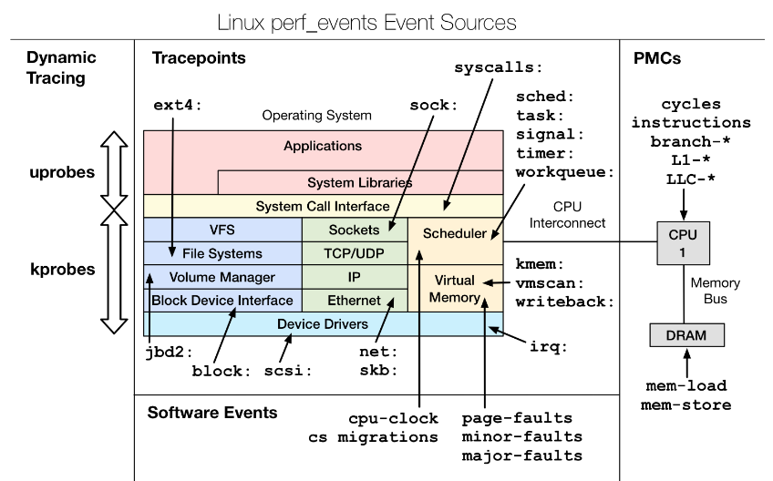

# 0x00. 导读

非常好的一篇文章，本文大部分来源于此：[深入探索 perf CPU Profiling 实现原理](https://mazhen.tech/p/%E6%B7%B1%E5%85%A5%E6%8E%A2%E7%B4%A2-perf-cpu-profiling-%E5%AE%9E%E7%8E%B0%E5%8E%9F%E7%90%86/)

多看看 [神文](https://www.brendangregg.com/perf.html)

# 0x01. 简介

系统级性能优化通常包括两个阶段：性能剖析和代码优化：

1. 性能剖析的目标是寻找性能瓶颈，查找引发性能问题的原因及热点代码;
2. 代码优化的目标是针对具体性能问题而优化代码或调整编译选项，以改善软件性能。

在步骤一性能剖析阶段，最常用的工具就是 perf。

# 0x02. perf 是什么

perf 是由 Linux 官方提供的系统性能分析工具，最开始叫 Performance Counters for Linux, PCL 。我们通常说的 perf 实际上包含两部分：

- perf 命令，用户空间的应用程序
- perf_events ，Linux 内核中的一个子系统
  
内核子系统 perf_events 提供了对性能计数器（[hardware performance counters](https://en.wikipedia.org/wiki/Hardware_performance_counter)）和性能事件的支持，它以事件驱动型的方式工作，通过收集特定事件（如 CPU 时钟周期，缓存未命中等）来跟踪和分析系统性能。perf_events 是在 [2009 年合并到 Linux](https://lwn.net/Articles/339361/) 内核源代码中，成为内核一个新的子系统。

> 在计算机中，硬件性能计数器( HPC ) 或硬件计数器是一组内置于现代微处理器中的专用寄存器，用于存储计算机系统内与硬件相关的活动的计数。高级用户通常依靠这些计数器来进行低级性能分析或调整。

perf 命令是一个用户空间工具，具备 profiling、tracing 和脚本编写等多种功能，是内核子系统 perf_events 的前端工具。通过 perf 命令可以设置和操作内核子系统 perf_events，完成系统性能数据的收集和分析。

**可以这么理解：PMU(Performance Monitoring Unit) 在硬件层面提供数据，perf 在用户层面提供操作，perf_events 子系统衔接了两者。**

虽然 perf 命令是一个用户空间的应用程序，但它却位于 Linux 内核源代码树中，在 [tools/perf](https://github.com/torvalds/linux/tree/master/tools/perf) 目录下，它可能是唯一一个被包含在 Linux 内核源码中的复杂用户软件。

下图显示了 perf 命令和 perf_events 的关系，以及 perf_events 支持的事件源。


# 0x03. 事件

perf 支持来自硬件和软件方面的各种事件。硬件事件来自芯片组中的硬件性能计数器（hardware performance counters），而软件事件则由tracepoints、kprobe 和 uprobe 等调试设施提供。可以使用 perf 的子命令 list 列出当前可用的所有事件。

[事件](https://www.brendangregg.com/perf.html#Events)类型如下：

- Hardware Events: CPU 性能监视计数器 PMCs，可以使用 `sudo perf list hardware` 查询
- Software Events: 这些是基于内核计数器的低级事件。例如，CPU迁移、主次缺页异常等等，可以使用 `sudo perf list sw` 查询。
- Kernel Tracepoint Events: 硬编码在内核中的静态内核级的检测点，即静态探针
- User Statically-Defined Tracing (USDT): 这些是用户级程序和应用程序的静态跟踪点。
- Dynamic Tracing: 可以被放置在任何地方的动态探针。对于内核软件，它使用kprobes框架。对于用户级软件，uprobes。
- Timed Profiling: 使用 `perf -FHz` 选项以指定频率收集的快照。这通常用于CPU使用情况分析，其工作原理是周期性的产生时钟中断事件。



指定性能事件的时候可以通过冒号添加修饰符
```
-e <event>:u          //userspace
-e <event>:k          //kernel
-e <event>:h          //hypervisor
-e <event>:G          //guest counting(in KVM guests)
-e <event>:H          //host counting(not in KVM guests)
```

# 0x04. 背景知识

```bash
$ sudo perf record -F 99 -a -g -- sleep 30
```

这里并未明确指定事件（没有 -e 参数），perf 将默认使用以下预定义事件中第一个可用的：
- cycles:ppp
- cycles:pp
- cycles:p
- cycles
- cpu-clock
  
前四个事件都是 PMC 提供的 CPU cycles 事件，区别在于精确度不同，从最精确（ppp）到无精确设置（没有 p），最精确的事件优先被选择。cpu-clock 是基于软件的 CPU 频率采样，在没有硬件 cycles 事件可用时，会选择使用 cpu-clock 软件事件。

那么什么是 CPU cycles 事件，为什么对 cycles 事件进行采样可以分析 CPU 的性能？

## 4.1 cycles 事件

首先介绍一个关于 CPU 性能的重要概念，Clock Rate（时钟频率）。Clock（时钟）是驱动 CPU 的数字信号，CPU 以特定的时钟频率执行，例如 4 GHz的 CPU 每秒可执行 40 亿个 cycles（周期）。

CPU cycles （周期）是 CPU 执行指令的时间单位，而时钟频率表示 CPU 每秒执行的 CPU 周期数。每个 CPU 指令执行可能需要一个或多个 CPU 周期。 通常情况下，更高的时钟频率意味着更快的CPU，因为它允许 CPU 在单位时间内执行更多的指令。

**每经过一个 CPU 周期都会触发一个 cycles 事件。可以认为，cycles 事件是均匀的分布在程序的执行期间。这样，以固定频率去采样的 cycles 事件，也是均匀的分布在程序的执行期间。我们在采样 cycles 事件时，记录 CPU 正在干什么，持续一段时间收集到多个采样后，我们就能基于这些信息分析程序的行为，多次出现的同样动作，可以认为是程序的热点，成为下一步分析重点关注的方面。**

因为 cycles 事件的均匀分布，通过以固定频率采样 cycles 事件获得的信息，我们就能进行 CPU 性能分析。那么如何指定采样频率呢？

在使用 perf record 记录 PMC 事件时，会使用一个默认的采样频率，不是每个事件都会被记录。例如记录 cycles 事件：
```bash
$ perf record -vve cycles -a -g -- sleep 10
Using CPUID GenuineIntel-6-45-1
DEBUGINFOD_URLS=
nr_cblocks: 0
affinity: SYS
mmap flush: 1
comp level: 0
------------------------------------------------------------
perf_event_attr:
  size                             128
  { sample_period, sample_freq }   4000
  sample_type                      IP|TID|TIME|ID|CPU|PERIOD
  read_format                      ID|LOST
  disabled                         1
  inherit                          1
  freq                             1
  sample_id_all                    1
  exclude_guest                    1
...
[ perf record: Captured and wrote 0.422 MB perf.data (297 samples) ]

```

加了 -vv 选项可以输出更详细的信息。从输出中可以看出，即使我们没有明确设置采样频率，采样频率已经启用（`freq 1`），并且采样频率为 4000 （`{ sample_period, sample_freq } 4000`），即每 CPU 每秒采集约 4000个事件。cycles 事件每秒中有几十亿次，默认采样频率的设置很合理，否则记录事件的开销过高。

可以使用 -F 选项明确设置事件采样频率，例如：
```bash
$ perf record -F 99 -e cycles -a sleep 1
```

-F 99 设置采样频率为 99 Hertz，即每秒进行 99 次采样。Brendan Gregg 在大量的例子中都使用了 99 Hertz 这个采样频率，至于为什么这样设置，他在文章 [perf Examples](https://www.brendangregg.com/perf.html) 中给出了解释，大意是：选择 99 Hertz 而不是100 Hertz，是为了避免意外地与一些周期性活动同步，这会产生偏差的结果。也就是说，如果程序中有周期性的定时任务，例如每秒钟执行的任务，以 100 Hertz 频率进行采样，那么每次周期性任务运行时都会被采样，这样产生的结果“放大”了周期性任务的影响，偏离了程序正常的行为模式。

perf record 命令还可以使用 -c 选项来设置采样事件的周期，这个周期代表了采样事件之间的间隔。例如：
```bash
# -c 选项设置采样周期为 1000，即每隔 1000 次事件进行一次采样
$ sudo perf record -c 1000 -e cycles -a sleep 1
```

## 4.2 CPU 在干什么？

CPU 内部有多种不同功能的寄存器，涉及到指令执行的，有三个重要的寄存器：

- PC 寄存器（PC，Program Counter），存放下一条指令的内存地址
- 指令寄存器（IR，Instruction Register），存放当前正在执行的指令
- 状态寄存器（SR，Status Register），用于存储 CPU 当前的状态，如条件标志位、中断禁止位、处理器模式标志等

CPU 还有其他用于存储数据和内存地址的寄存器，根据存放内容命名，如整数寄存器、浮点数寄存器、向量寄存器和地址寄存器等。有些寄存器既可以存放数据，又可以存放地址，被称为通用寄存器（GR，General register）。

程序执行时，CPU 根据 PC 寄存器中的地址从内存中读取指令到 IR 寄存器中执行，并根据指令长度自增，加载下一条指令。

只要我们在采样时获取CPU 的 PC 寄存器和 IR 寄存器的内容，就能推断出 CPU 当时正在干什么。

在编译程序时，可以让编译器生成一个映射，将源代码行与生成的机器指令关联起来，这个映射通常存储在 [DWARF 格式（Debugging With Attributed Record Formats）](https://dwarfstd.org/) 的调试信息中。同时编译时会生成符号表（Symbol Table），其中包含了程序中各种符号（如函数名、变量名）及其地址的映射。perf 借助调试信息和符号表（symbol table），可以将采样时寄存器中的指令地址转换为对应的函数名、源代码行号等信息。

知道了 CPU 当时的动作（例如我知道当前 CPU 在对 A 地址进行递增，没啥用啊，我们需要知道这个动作背后的逻辑，例如，喔，原来是在给 X 变量递增）还不够，我们还需要知道 CPU 是怎么做这个“动作”的，也就是代码的执行路径。

### 4.2.1 函数调用栈

x86-64 平台上的程序使用堆栈（Stack）来实现函数调用。堆栈（Stack）的特性是后进先出（LIFO），函数调用正是利用了这一特性。调用某个函数就是在堆栈上为这个函数分配所需的内存空间，这部分空间被称为栈帧（stack frame），从函数返回，就是将这个函数的**栈帧（stack frame）从堆栈中弹出，释放空间。多个栈帧（stack frame）**组成 Call stack，体现出了函数的调用关系。

每个函数的活动记录对应一个栈帧（stack frame），多个栈帧（stack frame）叠加在一起构成调用栈（ Call stack）。Frame Pointer（通常是 rbp 寄存器）指向当前激活的函数的栈帧（stack frame）的起始处，这个起始处保存了调用它的函数的栈帧（stack frame）的起始地址。通过这种链接，我们就能以 Frame Pointer 为起点，追溯整个调用链，即从当前函数开始，逐级访问到每个调用者的栈帧（stack frame），从而重构出程序执行的路径。

perf 正是利用 Frame Pointer，还原采样时的代码执行路径。

在开启编译器优化的情况下，程序会将 rbp 寄存器作为通用寄存器重新使用，这时就不能再使用 Frame Pointer 还原函数调用栈。perf 还可以使用其他方法进行 stack walking：

- –call-graph dwarf ：使用调试信息
- –call-graph lbr： 使用 Intel 的 last branch record (LBR)
- –call-graph fp：使用 Frame Pointer ，缺省方法

函数调用栈和符号解析是使用 perf 的两大阻力，前者影响观测准确性，后者影响观测可读性。[symbol_record](./symbol_record.md)

# 0x05. 总结

```bash
$ sudo perf record -F 99 -a -g -- sleep 30
```

perf 是事件驱动的方式工作，这个命令没有指定 -e 参数，会收集什么事件呢？perf 会默认收集 cycles 相关事件，从最精确的 cycles:ppp 到无精确设置的 cycles，优先选择可用且精度高的事件。如果没有硬件 cycles 事件可用，退而选择 cpu-clock 软件事件。

为什么采样 cycles 事件就能分析程序的 CPU 性能？因为每个 CPU 周期都会触发一个 cycles 事件，cycles 事件均匀的分布在程序的执行期间，以固定频率采样的 cycles 事件同样均匀分布，如果我们在采样 cycles 事件时，记录 CPU 正在干什么，持续一段时间收集到多个采样后，就能基于这些信息分析程序的行为，多次出现的同样动作，就可以认为是程序的热点。

如何指定采样频率？-F 99 设置采样频率为 99 Hertz，即每秒进行 99 次采样。也可以使用 -c 1000 设置采样周期，即每隔 1000 次事件进行一次采样。

如何知道采样时 CPU 正在做什么？通过 CPU 的 PC（Program Counter）寄存器（x86-64 平台上对应的是 rip 寄存器）、指令寄存器等状态信息，能推断出 CPU 的瞬时动作。

知道了 CPU 采样时的“动作”还不够，还需要知道 CPU 是怎么做这个“动作”的，也就是代码的执行路径。系统利用了堆栈（Stack）的后进先出（LIFO）实现了函数调用，每个函数在堆栈上分配的空间称为栈帧（stack frame），多个栈帧（stack frame）组成 Call stack，体现出了函数的调用关系。通过栈帧指针Frame Pointer（rbp 寄存器），可以追溯整个调用链，逐级访问到每个调用者的栈帧（stack frame），重构出程序执行的路径。这就是 -g 参数的作用：使用 Frame Pointer 还原调用栈。

操作系统为了安全会限制用户进程对关键资源的访问，将系统分为了用户态和内核态，用户态的代码必须通过**系统调用（system call ）**访问核心资源。所以在执行系统调用时，进程具有两个栈：用户栈（User Stack）和内核栈（Kernel Stack）。为了还原包含了用户栈和内核栈在内完整的调用栈，我们探索了进程虚拟地址空间的布局，以及系统调用的实现：原来在系统调用时，会将进程用户态的执行状态（rsp、rip等寄存器）保存在内核数据结构 [struct pt_regs](https://elixir.bootlin.com/linux/v6.6.1/source/arch/x86/include/asm/ptrace.h#L59) 内，这样就能通过 Frame Pointer 和 pt_regs 分别还原内核栈和用户栈。

怎么获取采样发生时刻 CPU 寄存器的内容呢？在特定的时间间隔到达时，也就是该采样的时刻，APIC 会触发 PMI 中断，CPU 在将控制权转给中断处理程序之前，将当前的寄存器状态保存到 pt_regs，然后作为参数传递给 perf_event_nmi_handler。这样 perf 就拿到了采样发生时刻，CPU 寄存器的内容。

# 0x06. 其它

在 perf 的某些命令中，用户可以使用 -- 来指示后面跟随的选项将被直接传递给 perf xxx 命令，而不再是当前命令的选项。例如
```bash
$ sudo perf c2c record -- -g -a

# 1. perf c2c record 是 perf c2c 模式下的记录命令。
# 2. -- 后面的选项 -g -a 是直接传递给 perf record 的。
```
在这个例子中，-- 分隔了 perf c2c record 的自身选项和传递给 perf record 的选项。这允许用户灵活地传递与 perf record 相关的任何参数，而无需在不同的命令模式下进行冗余设置。

-- 分隔符：在很多命令行工具中，-- 表示命令的选项结束，后面的内容直接传递给底层工具（如 perf record），而不会被解释为当前命令的选项。