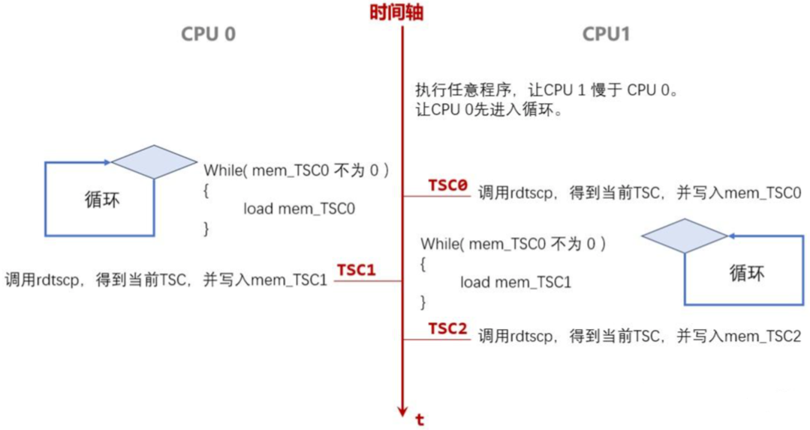

# 0x00. 导读

# 0x01. 简介

系统启动后， Linux 从 RTC（Real Time Clock）获取当前时间时。RTC 是一个由主板纽扣电池供电的硬件时钟，因此即使机器断电，它也能继续运行。在大多数情况下，RTC 不是特别准确，因为它是由廉价的晶体振荡器驱动的，其频率会根据温度和其他环境因素变化。 Linux 系统从RTC 查询得到的启动时间，并存储在内核内存中，稍后将启动时间用作偏移量，合并TSC 保留的滴答计数推导出（当前的）挂钟时间（Wall-clock time）。

系统启动的同时， TSC（Time-Stamp Counter 时间戳计数器）开始运行。TSC 是一个寄存器计数器，它由生成CPU 的时钟脉冲的晶体振荡器驱动，所以它和 CPU 的频率相同，例如 2GHz （CPU的 TSC）时钟每纳秒会滴答两次。

## 1.1 频率稳定

让我们的 CPU 频率稳定：
```bash
echo 100 > /sys/devices/system/cpu/intel_pstate/min_perf_pct
```

## 1.2 TSC 同步

## 1.3 

TSC 是核内一小块独立集成电路构成的计时器，它是独立的。它以基础频率为单位，它跟随频率高、低电平的变化而变化，每次高、低电平的转换，TSC 加 1。通过 rdtsc 指令，可以将 TSC 的数值存放在 EDX:EAX 中，示例代码如下：
```c
// 推荐这种方法
#include "x86intrin.h"

static uint64_t get_rdtsc() 
{ 
  unsigned int dummy;
  uint64_t t = __rdtscp(&dummy);
  return t;
}

// 这个也推荐
#include <iostream>

uint64_t now() {
   return __builtin_ia32_rdtsc();
}

// release 模式可能被优化出问题
static uint64_t get_tscp()
{
    uint64_t a, d;
    __asm__ volatile("rdtscp" : "=a"(a), "=d"(d));
    return (d << 32) | a;
}

// 假如差值是 10 (这个 10 是指 CPU 10 个嘀嗒)，CPU 2.5GHz ，则时间是 10 / 2.5 = 4ns
```

## 1.4 条件

1. Linux 内核 2.6.18 或更高版本
```bash
cat /proc/version 
```

2. 有 tsc 时钟源（第一步已经能达到了）
```bash
# 查看系统上可用的时钟源
cat /sys/devices/system/clocksource/clocksource0/available_clocksource
# 查看正在使用哪个：
$ cat /sys/devices/system/clocksource/clocksource0/current_clocksource
# 更改时钟源
$ echo tsc > /sys/devices/system/clocksource/clocksource0/current_clocksource
```

3. 有 rdtscp
```bash
cat /proc/cpuinfo | grep rdtscp
```

## 1.5 优缺点

# 优点

极高精度，极低开销的取时间的方法。

# 缺点

## 1. CPU 频率变化
    Q: 
        有的CPU会根据机器负载情况动态调节工作频率， 那么单位时间CPU的指令周期数就会发生变化，也就很难将其转换成时间。另外，CPU进入休眠再次重启后，TSC 会清零。

    A: 
        1. 恒定的TSC （constant TSC）使系统中所有 CPU 核心上 TSC 保持同步
        2. 不变（或不间断）的TSC （nonstop_tsc）使 TSC 保持在固定速率下运行。
        $ cat /proc/cpuinfo | grep -E "constant_tsc|nonstop_tsc"
        flags：... tsc rdtscp constant_tsc nonstop_tsc ...

## 2. 多核 TSC 不同步
    Q: 
        在同一处理器的多个核心之间，以及不同处理器的不同核心之间，rdtsc 的结果是否是同步的呢？例如核心 A 是 t1 开始计时，B 是 t2 开始计时，两个值就没有比较的意义。

    A: 
        参考上面的回答。
        注意，程序最好是绑核，不是百分百确定多个 CPU 之间能同步。

## 3. 指令乱序
    Q:
        乱序执行，导致程序读取的TSC结果可能不准。例如测试的代码被优化到 tsc 的范围外了。
    A:
        使用 RDTSCP 命令来代替 RDTSC ，开销略大一丁点。

[ClockTimeAnalysis](https://gitlab.com/chriscox/CppPerformanceBenchmarks/-/wikis/ClockTimeAnalysis)

# 0x02. 程序



程序思路如上图，两个进程，绑在两个核上，假设如图的 CPU 0 和 CPU 1 吧：

1. CPU 0 的程序，一上来就是一个循环。直到读到 mem_TSC0 不为 0，才退出循环。mem_TSC0，从变量名上能看出来，它是一个内存变量（不能被编译器转为寄存器），它的内存就来自于共享内存。它什么时候会不为0呢。要看 CPU 1 上的程序。

2. CPU 1 上的程序一上来要先执行一个没什么意义的循环。目的，就是让 CPU 0 这边，先进入循环。其实就是让CPU 1暂停一下，让CPU 0先走到循环里。
    暂停，不能用 sleep(), 因为 sleep() 会导致后续少量指令频率下降。如果两个 CPU 工作频率不一样，测量数据会不准确。  
    这里的暂停程序如下：
    ```c
    if (cur_cpu == fg[2])
        for (i=0; i<=fg[3]; i++)
            k+=i;
    ```

3. 在 CPU 0 进入循环之后，CPU 1 使用 rdtscp 指令，得到当前 TSC 计数值。然后，写入共享内存变量 mem_TSC0。

4. 在写入之后，CPU 0还会在很长一段时间内，不断循环load mem_TSC0，并比较它的值是否不为0。若干周期后，CPU 0读到的mem_TSC0终于不为0了，CPU 0上的循环退出。CPU 0循环退出后马上再次调用rdtscp，得到TSC计数，写入mem_TSC1。

5. mem_TSC1 – mem_TSC0 = CPU 1 写共享内存 mem_TSC0 后，CPU 0 多久时间才看到新值。
mem_TSC2 – mem_TSC1 = CPU 0 写入新值，CPU 1 多久后才能看到新值。

```c
// 绑核程序
void setcpu(int cpu)
{
    int i, nrcpus, cur_cpu;
    cpu_set_t mask;
    unsigned long bitmask = 0;
    
    CPU_ZERO(&mask);
    CPU_SET(cpu, &mask);
    
    if (sched_setaffinity(0, sizeof(cpu_set_t), &mask) == -1) 
    { 
        perror("sched_setaffinity fail!");
        exit(EXIT_FAILURE);
    }
} 

// 分配内存
void *smem()
{ 
    void *ptr;
    ptr = mmap(0, (arr_size_X * arr_size_Y + 4 ) * sizeof(TYPE)
        , PROT_READ | PROT_WRITE
        , MAP_SHARED|MAP_ANONYMOUS|0x40000, -1, 0); // 大页
    if (ptr == MAP_FAILED)
        printf("Failed to allocate shared memory\n");
    return ptr;
}


// 将 TSC0, TSC1, TSC2 加载到两个Core的L1，最终Line状态为S
__asm__ __volatile__
(
    "lea    %0,     %%r8\n\t"
    "mov    (%%r8), %%rax\n\t" // TSC0
    "mov 128(%%r8), %%rax\n\t" // TSC1
    "mov 256(%%r8), %%rax\n\t" // TSC2
    :
    :"m"( *mem )
    :"rax","r8"
);

// 暂停：第二个CPU上的进程暂停一下
if (cur_cpu == fg[2])
    for (i=0; i<=fg[3]; i++)
        k+=i;

// 开始测量
if ( cur_cpu == fg[1] )
{   // 第一个CPU中运行的测量程序
    __asm__ __volatile__
    (
        "lea    %0,     %%r8\n\t"             // &mem
        "SYNC_TSC0:\n\t"
            "mov    (%%r8), %%r9\n\t"         // while load
            "cmp    $0,     %%r9\n\t"
            "je SYNC_ TSC0\n\t"
        "rdtscp \n\t"                          // TSC 2
        "movq   %%rax,      128(%%r8)\n\t"
        "movq   %%rdx,      136(%%r8)\n\t"
        :
        :"m"( *mem )
        :"rax","rdx","r8","r9"
    );
}
else
{   // 第二个CPU中运行的测量程序
    __asm__ __volatile__
    (
          "lea    %0,     %%r8\n\t"       // &mem
          "rdtscp \n\t"                    // TSC 0
          "mov    %%rax,  (%%r8)\n\t"
          "mov    %%rdx,  8(%%r8)\n\t"
              "SYNC_TSC1:\n\t"
              "mov    128(%%r8), %%r9\n\t"     // while load
              "cmp    $0,        %%r9\n\t"
              "je SYNC_TSC1\n\t"
          "rdtscp \n\t"                  // TSC 3
          "movq   %%rax,      256(%%r8)\n\t"
          "movq   %%rdx,      264(%%r8)\n\t"
          :
          :"m"( *mem )
          :"rax","rdx","r8","r9"
    );
}
```

如果程序将来执行时，大页内存分配失败，可能是没有配置大页，可以如下配置：
```bash
cat /proc/sys/vm/nr_hugepages
# 分配 10 个大页
echo 10 > /proc/sys/vm/nr_hugepages
```

```bash
$ gcc -g mesi2.c -o mesi2
# 0 号 CPU 上做初始化，分配共享内存、清0等等操作。
# 1 3，两个进程分别在1号、3号两个CPU上运行。
# 最后的 10000000，是 CPU 3 上的程序，先执行 10000000 次循环，暂停一段时间。让 CPU 1 先进入循环。
$ ./mesi2 0 1 3 10000000
```