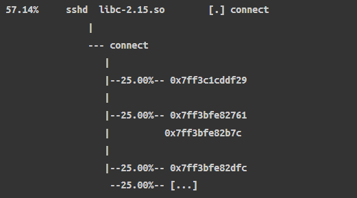
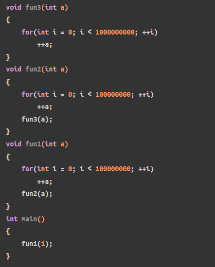
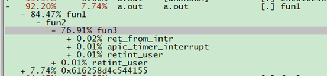
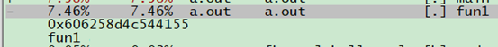

# 0x00. 导读

# 0x01. 简介 

# 0x02. 符号表

应用程序的符号表，用来将逻辑地址翻译成对应的函数和变量名，这样才能被程序员阅读和分析，没有符号表，profile 的结果都是一些16进制的逻辑地址：  
如下是perf report分析sshd进程的堆栈调用情况



符号可以位于目标文件中，也可以存放在单独的文件。**Symbols 与 gcc -g 产生的 debug info 并不是一个东西。function tracing 只需要 symbols，不需要 debug symbols（gcc -g）。** 

Symbols 有两种，都可以在 readelf -s 输出中的 FUNC 类型中看到，

- .dynsym：动态符号，保存了引用来自外部文件符号的全局符号，如 printf 库函数。其保存的符号只能在运行时被解析。
- .symtab：局部符号，保存的内容是 .dynsym 的超集，保存了可执行文件的本地符号，如全局变量，代码中定义的本地函数等。其保存的符号只是用来进行调试和链接的。

通常情况下，生成可执行文件时，“局部”符号会被去掉，（以减小 binary size）， 然后通过单独的 xx-dbg/xx-dbgsym 包来提供这些符号 （也就是放到独立的文件，按需下载和使用）。

```bash
$ readelf -s LTTBif | grep "Symbol table" 
Symbol table '.dynsym' contains 23366 entries:
Symbol table '.symtab' contains 24430 entries:

$ readelf -s `which top` | grep 'Symbol table'
Symbol table '.dynsym' contains 136 entries:
```

可以用命令 strip 来手动去掉局部符号表：
```bash
$ strip -s ./hello-world # 原地 strip，直接修改可执行文件
```

既然对于跟踪来说 symbols 就够用了，那 debug symbols 有什么用呢？  
Debug symbol 是 dwarf 格式信息 。[ How debuggers work: Part 3 - Debugging information](https://eli.thegreenplace.net/2011/02/07/how-debuggers-work-part-3-debugging-information/)

Debug symbols 的用途或功能
- 将内存地址映射到具体某行源代码
- 调用栈展开（stack unwinding）。例如设置 perf 跟踪函数的执行

DWARF 格式存在的一些问题：
- 占用空间通常很大；
- 基于 BPF 的工具（例如 bpftrace）与它兼容性不好，无法展开 DWARF 类型的调用栈；  
BPF 工具一般使用另一种 stack unwinding 技术：frame pointer（帧指针）。 这是 perf 使用的默认 stack walking 方式，也是 bcc/bpftrace 目前支持的唯一方式。

## 1.2 栈回溯

我们经常在编译的时候会开启 `frame pointers` 优化选项，即优化掉函数栈帧 rbp，省略掉 frame pointer 是编译器一个很烂的优化，它会破坏 debug , 更烂的是省略 frame pointer 一般是编译器默认的优化选项。
没有 frame pointer 会使 perf 无法获取完整的调用栈，如下示例：



不开启优化的编译，进行profile是可以看到call graph的，如下：



如果编译时开启 `-fomit-frame-pointer` (这里因为测试代码简单，直接开优化的话就优化没了)，就无法获取到call graph



有三种方法可以修复这个问题，这里不做展开，这些称为 stack walking techniques ：

- using dwarf data to unwind the stack。需要在编译时添加-g参数。
- using last branch record (LBR) if available (a processor feature)。Intel的最后分支记录（LBR）调用图深度不如前两种方法。
- returning the frame pointers 。帧指针（fp）需要消耗一个寄存器，成本较高，但可实现开销较低的栈展开，适用于性能剖析。


frame pointer 原理
- 每个 stack trace (或称 activation records 或 call stacks) 包含很多 frames，这 些 frames 以 LIFO（后进先出）方式存储。这与栈的工作原理一样，stack frames 由此得名；
- 每个 frame 包含了一个函数执行时的状态信息（参数所在的内存区域、局部变量、返回值等等）；
- Frame pointer 是指向 frame 内存地址的指针。fp 就是 x86 中的 EBP 寄存器，fp 指向当前栈帧栈底地址，此地址保存着上一栈帧的 EBP 值，具体可参考[此文章](https://people.cs.rutgers.edu/~pxk/419/notes/frames.html)的介绍，根据 fp 就可以逐级回溯调用栈。然而这一特性是会被优化掉的，而且这还是 GCC 的默认行为，在不手动指定 -fno-omit-frame-pointer 时默认都会进行此优化，此时 EBP 被当作一般的通用寄存器使用，以此为依据进行栈回溯显然是错误的。不过尝试指定 -fno-omit-frame-pointer 后依然没法获取到正确的调用栈，根据 GCC 手册的说明，指定了此选项后也并不保证所有函数调用都会使用 fp…… 看来只有放弃使用 fp 进行回溯了。

dwarf 是一种调试文件格式，GCC 编译时附加的 -g 参数生成的就是 dwarf 格式的调试信息，其中包括了栈回溯所需的全部信息，使用 libunwind 即可展开这些信息。dwarf 的进一步介绍可参考 [“关于DWARF”](https://cwndmiao.github.io/programming%20tools/2013/11/26/Dwarf/)，值得一提的是，GDB 进行栈回溯时使用的正是 dwarf 调试信息。实际测试表明使用 dwarf 可以很好的获取到准确的调用栈。

编译的时候，有没有 -g 参数都行， frame pointer 不会使用 dwarf 信息。
perf 的时候 指定 --call-graph fp

存在的问题：默认编译参数 -fomit-frame-pointer

[参考](http://arthurchiao.art/blog/linux-tracing-basis-zh/)

# 0x03. call graph

Call Graph 是帮助 Perf Events 使用者判断性能瓶颈成因的重要工具。Call Graph 优雅地结合「花去最多执行时间的热区」与「为什么要执行热区内的代码」进而让使用者能快速判断程式有没有改进空间。

perf report 输出的 Call Graph 是以各个样本的 Stack Trace（堆叠回溯）为基础，绘制而成的树状图。因此本节会依序介绍 Stack Trace 与两种不同的 Call Graph。

## 3.1 Stack Trace

Stack Trace（堆叠回溯）有时又称 Call Chain（呼叫链）是特定时间下 Call Stack（呼叫堆叠）的记录。举例来说，如果在下面代码执行到函数 c 的时候记录 Call Stack，记录到的 Stack Trace 会是 main -> a -> b -> c：
```c
int main() {
    a();
    return 0;
}

void a() {
    b();
}

void b() {
    c();
}

void c() {
    // Dump Stack Trace
}
```

Stack Trace 包含「呼叫者（Caller）」与「被呼叫者（Callee）」之间的关系。在程序化程式设计（Procedural Programming）之中，呼叫者与被呼叫者之间通常有一定的因果关系，**所以 Stack Trace 是寻找效能问题发生原因的重要工具。如果说最常被取样的指令（Instruction）是程序执行的热区，最常出现的 Stack Trace 就是程序进入热区的原因。**

perf record 会以特定频率取样开发者想要测量的事件。我们能让 perf record 在每次取样时一併记录 Stack Trace，进而搜集大量 Stack Trace。以下方示意图为例，横轴为时间顺序，纵轴为堆叠的变化过程，圆圈为事件的取样点：
```
  o  o  o  o  o  o  o  o  o  o  o  o  o  o  o  o  o
+--------------------------------------------------+
|main                                              |
+--+-----------------------+-----------------------+
   |a                      |a                      |
   +--+--------+--+--------+--+--------+--+--------+
      |b       |c |b       |  |b       |c |b       |
      +--+--+--+--+--+--+--+  +--+--+--+--+--+--+--+
         |c |c |     |c |c |     |c |c |     |c |c |
         +--+--+     +--+--+     +--+--+     +--+--+
```
因为 Stack Trace 数量庞大，所以下一步是统计各种 Stack Trace 的样本个数。如下表所示：

|Stack Trace  |  樣本數  |  百分比
|  ----  | ----  |----  |
|main	|1|	5.9
|main -> a|	2|	11.8
|main -> a -> b|	4|	23.5
|main -> a -> b -> c|	8|	47.1
|main -> a -> c	|2|	11.8

这个统计图表有两种不同的解读方式：

- 由上而下的解读是从「第一个呼叫者（First Caller）」往「最后一个被呼叫者（Last Callee）」处理 Stack Trace 并绘制 Call Graph。
- 由下而上的解读是从「最后一个被呼叫者（Last Callee）」往「第一个呼叫者（First Caller）」处理 Stack Trace 并绘制 Call Graph。

## 3.2 Caller-based Call Graph

第一种解读方式是由上而下（Top Down）解读统计数据。此方法会合併有共同呼叫者的 Stack Trace。换句话说，就是将 x -> y -> z 的个数加到 x -> y 的累计数量：

|Stack Trace|	樣本數|	百分比（Self）|	累計|	累計百分比（Total）
|  ----  | ----  |----  |----  |----  |
main|	1|	5.9|	17|	100.0
main -> a|	2|	11.8|	16|	94.1
main -> a -> b|	4|	23.5|	12|	70.6
main -> a -> b -> c	|8|	47.1|	8|	47.1
main -> a -> c	|2	|11.8	|2	|11.8

或者可以畫出以下 Caller-based Call Graph（以「呼叫者」為基礎的呼叫圖）：
```
           Total   Self
+@ main    100.0     5.9
 +@ a       94.1    11.8
  +@ b      70.6    23.5
  |+@ c     47.1    47.1
  +@ c      11.8    11.8
```

每个 Caller-based Call Graph 的节点通常会有一组数字：

- `Self` 是结束于该节点的 Stack Trace 占总体数量的百分比。
- `Total` 是所有有共同前缀的 Stack Trace 占总体数量的百分比。通常程式的执行起点（例如：main 或 _start）应该要很接近 100%。

Caller-based Call Graph 能让我们知道每个函式呼叫执行的过程中会触发多少事件。如果记录的事件种类是 cycles，Caller-based Call Graph 就会呈现每个函式呼叫的执行时间百分比。改进程式效能的时候，我们可以从比例最高的函式开始分析与最佳化。

小结：Caller-based Call Graph 适合用来判断能被分割为若干模组、各个模组独立性高、且各模组都有自己的领域知识的程式。它让我们可以从改进上限较高的模组开始分析与最佳化。

## 3.3 Callee-based Call Graph

第二种解读方式是由下而上（Bottom Up）解读统计数据。首先先反转 Stack Trace，然后以最后一个被呼叫者分组排序，将 Stack Trace 个数较高者排在上面：

|組別|	Stack Trace|	樣本數|	百分比|	組別樣本數|	組別百分比
|  ----  | ----  |----  |----  |----  |----  |
|c1|	c <- b <- a <- main|	8|	47.1|	10(c1+c2)|	58.8
|c2|c <- a <- main|	2|	11.8|
|b|	b <- a <- main|	4|	23.5|	4|	23.5
|a|	a <- main|	2|	11.8|	2|	11.8
|main|	main|	1|	5.9|	1|	5.9

接著，再将每组 Stack Trace 合併为 Callee-based Call Graph（以「被呼叫者」为基础的呼叫图）：
```
           total   self / parent = fractal
~~~~~~~~~~~~~~~~~~~~~~~~~~~~~~~~~~~~~~~~~~
@ c         58.8   58.8 /  100.0 =    58.8
+@ b        47.1   47.1 /   58.8 =    80.0
|+@ a       47.1   47.1 /   47.1 =   100.0
| +@ main   47.1   47.1 /   47.1 =   100.0
+@ a        11.8   11.8 /   58.8 =    20.0
 +@ main    11.8   11.8 /   11.8 =   100.0
~~~~~~~~~~~~~~~~~~~~~~~~~~~~~~~~~~~~~~~~~~
@ b         23.5   23.5 /  100.0 =    23.5
+@ a        23.5   23.5 /   23.5 =   100.0
 +@ main    23.5   23.5 /   23.5 =   100.0
~~~~~~~~~~~~~~~~~~~~~~~~~~~~~~~~~~~~~~~~~~
@ a         11.8   11.8 /  100.0 =    11.8
+@ main     11.8   11.8 /   11.8 =   100.0
~~~~~~~~~~~~~~~~~~~~~~~~~~~~~~~~~~~~~~~~~~
@main        5.9    5.9 /  100.0 =     5.9
```

Callee-based Call Graph 呈现的重点有二个：

- 每个函式各自触发多少事件
- 每个函式各自被谁呼叫、每种呼叫方式占有多少比例

以上面的例子来说，我们可以知道有 58.8% 的样本落在函式 c。在 58.8% 之中，80.0% 是来自函式 b，20.0% 是来自函式 a。所以我们可以先思考函式 b 是否一定要呼叫函式 c，分析完 c <- b <- a <- main 之后，再分析下一种 Stack Trace。

小结：Callee-based Call Graph 的强项是分析为什么特定函式（热区或效能瓶颈）会被呼叫。该函式呼叫的前后文为何。

## 3.3 Perf Events 与 Call Graph

获取函数调用栈过程又称栈回溯（unwind），栈回溯的方法被称为 unwinder，常见的 unwinder 有：
1. fp：perf 默认选项，ARM 和 X86 都支持，消耗低；
2. dwarf：通过 --call-graph=dwarf 指定，ARM 和 X86 都支持，对CPU和磁盘消耗高；
3. lbr：通过 --call-graph=lbr 指定，仅 Intel 新型号支持，消耗低，但可回溯的栈深度有限；
4. orc：内核 unwinder，无需指定。 在 perf record 中，若不通过 --call-graph 指定 unwinder，默认使用 fp 作为用户态栈的 unwinder；至于内核态的 unwinder，不由 perf 参数指定，由内核编译选项控制，低版本内核使用 fp，高版本内核使用 orc。


perf record, 选项 -g 会让 perf record 在记录各个样本的时候，同时记录取样点的 Stack Trace。  
其次，使用者可以透过 --call-graph 选项指定走访 Stack Trace 的方法  
```
--call-graph [fp,dwarf,lbr]
```

- fp（预设值）

    此方法是利用 Frame Pointer 走访每一个 Frame 并记录呼叫堆叠上的函式。通常 CPU 会有一个寄存器记录呼叫堆叠最后一个 Frame 的地址，每个 Frame 会记录前一个 Frame 的地址，所以只要依序走访每一个 Frame 就能得到 Stack Trace。

    优点：这个方法能得到准确的 Stack Trace 且额外负担亦可接受。

    缺点：这个方法假设所有函式都遵循特定呼叫约定（Calling Convention）。如果有函式没有遵循呼叫约定，perf record 就可能得到不完整的 Stack Trace。

    此外，部分计算机结构（包含 x86 与 x86-64）的编译器在最佳化模式下会省略 Frame Pointer。如果要让 perf record 正确地记录 Stack Trace，编译待测程式时必须加上 `-fno-omit-frame-pointer` 选项。

- dwarf

    这个方法是利用 Dwarf debug info 走访每一个 Frame. 

    优点：这个方法产生的 Stack Trace 最详尽。Inline 函式也能被正确地列在 Stack Trace 里面（以 (inlined) 标记）。

    缺点：这个方法在记录 Stack Trace 时，需要花时间解读 debug info ，因此这个方法的额外负担最高、需要最久的记录时间。此外，这个方法产生的记录档案也是最大的。

    其次，这个方法需要额外的 debug info ，编译待测程式时必须加上 `-g` 选项。这个方法不适合用于测量大型程式，因为 debug info 的大小通常比程式本身大若干倍。考量观察者效应，过大的 debug info 可能增加测量结果的不准确度。

- lbr

    LBR 是 Last Branch Record（最后分支记录）的缩写。这个方法是让处理器记录 Branch Instruction（分支指令）跳跃的「来源位址」与「目标位址」。每当处理器执行一个 call 指令之后，就将该 call 指令的来源位址与目标位址记录于 LBR 暂存器。同样地，每当处理器执行一个 ret 指令之后，就会从 LBR 暂存器移除最后一组记录。最后 perf record 会将 LBR 暂存器每一组记录的来源位址与最后一组的目标位址整理成 Stack Trace。

    优点：这个方法的额外负担很低，而且不需调整编译器选项。

    缺点：因为硬体能保留的分支记录结果是有限的，所以当堆叠深度过深时，会得到不完整的 Stack Trace。这可能会引入一些不确定性。其次，就我目前所知，只有 Haswell 微架构之后的 Intel 处理器才支援以 Last Branch Record 记录 Call Stack。

编译器选项也会影响 Stack Trace 记录。以下列出 3 个会影响 Stack Trace 的编译器选项：

- -fno-omit-frame-pointer 会阻止编译器省略「设定 Frame Pointer」的指令。如前所述，如果要以 fp 模式记录 Stack Trace，就必须在编译待测程式时加上此选项。

- -fno-optimize-sibling-calls 会阻止编译器施行 Sibling Call Optimization。

    当一个函数的最后一条语句是返回另一个函数的返回值时，我们称该述句为 `Tail Call`。若该函数的参数型别（Argument Type）、参数个数、返回型别（Return Type）与被呼叫者一致，则将该类 Tail Call 细分为 `Sibling Call`。因为 Sibling Call 已经是这个函数的最后步骤，所以这个函数的 Frame 其实是可以被重复利用的。Sibling Call Optimization 就是让被呼叫者直接覆盖呼叫者的 Frame。

    这个最佳化会让 perf record 记录到不存在于代码的 Stack Trace。a -> b -> c, 可能记录中会出现 a -> c.

    当 Sibling Call 让 Call Graph 看起来不太正确时，可以在编译待测程式时加上 -fno-optimize-sibling-calls。

- -fno-inline 会阻止编译器将「函式呼叫」代换「为被呼叫者的代码」。

    在最佳化模式下，编译器会尝试将函式呼叫改写为 Inline Function（内嵌函式）的代码。然而，如果使用 fp 或 lbr 记录 Stack Trace，这些 Inline Function 就无法被记录于 Stack Trace 上。

    虽然测量效能时不建议关闭 Function Inlining（函式内嵌），但是如果你需要详细的 Stack Trace，你可以加上 -fno-inline。如果不想要全面关闭 Function Inlining，也可以将想要测试的函式标上 __attribute__((noinline)) 属性，编译器就不会内嵌该函式。

`set(CMAKE_CXX_FLAGS "${CMAKE_CXX_FLAGS} -fno-omit-frame-pointer -fno-optimize-sibling-calls")`

# 0x04. 实践

```c
#include <stdio.h>
#include <stdlib.h>

#define SIZE ((4 * 1024 * 1024))
#define NUM_ROUNDS 256

static char data[SIZE];


#define COMPUTE(N, CH) \
  do { \
    unsigned i, j; \
    for (j = 0; j < (N); ++j) { \
      for (i = 0; i < SIZE; ++i) { \
        data[i] = CH + i + j; \
      } \
      escape(data); \
    } \
  } while (0)


__attribute__((always_inline))
static inline void escape(void *p) {
  __asm__ volatile ("" : : "r"(p) : "memory");
}


__attribute__((noinline))
void D() {
  COMPUTE(1, 'D');
}


__attribute__((noinline))
void C() {
  D();
  COMPUTE(NUM_ROUNDS, 'C');
}


__attribute__((noinline))
void B() {
  COMPUTE(NUM_ROUNDS, 'B');
  C();
  C();
}


__attribute__((noinline))
void A() {
  COMPUTE(NUM_ROUNDS, 'A');
  B();
  C();
  B();
}


int main() {
  COMPUTE(NUM_ROUNDS, 'M');
  A();
  A();
  return 0;
}
```

```bash
$ gcc -g -O2 -fno-omit-frame-pointer callgraph.c -o callgraph

# 可以加上 --user-callchains 指定了 perf 采样时只采集用户栈，排除掉内核栈
$ sudo perf record -g --call-graph fp -o callgraph.fp.perf.data ./callgraph
$ sudo perf record -g --call-graph dwarf -o callgraph.dwarf.perf.data ./callgraph
$ sudo perf record -g --call-graph lbr -o callgraph.lbr.perf.data ./callgraph

# $ sudo perf report \
#       [--tui|--stdio] \
#       [--children|--no-children] \
#       [-g [fractal|graph],0.5,[caller|callee]] \
#       -i perf.data
$ sudo perf report --stdio -i [filename]
$ sudo perf report -i perf.data --stdio --children -g graph,0.5,caller
```