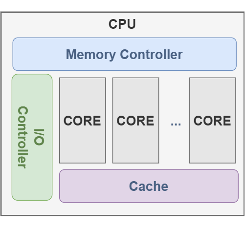

# 术语解释

## 性能相关

- IOPS: 每秒发生的输入/输出操作的次数，是数据传输的一个度量方法。例如对于磁盘读写， IOPS 指的是每秒的读写次数。

- 吞吐量: 用来评价工作效率，具体含义依赖于上下文。例如可以描述数据的传输速度( 字节/秒 或 比特/秒 )， 或者操作的速度( 每秒操作次数 或 每秒业务数 )。

- 响应时间: 一次操作完成的时间，包括等待、处理、返回结果的时间。

- 延时: 描述操作中用来等待服务的时间，有时候也等同于 响应时间 。

- 饱和度: 指某一资源无法满足服务的排队工作量。随着工作量的增加对资源的请求超过资源能处理的程度叫饱和度，饱和度发生在使用率（基于容量） 100% 的时候，这时多出的工作无法处理，开始排队。

- 使用率: 基于时间或者容量。有些组件，使用率达到 100% 的时候性能也不会下降多少，并且能接受更多的工作。拿电梯举例子，当它移动时，它是被使用的，当它停止不动时，它是闲置不用的，在 100% 忙碌(不停的在楼上楼下移动)的时候，还是能够接受乘客的。

## 硬件相关

- core: CPU 的基本计算单元，用来运行程序，维护程序的状态、寄存器、指令，通过 ALUs(算数逻辑单元) 来执行相应的操作。如果支持硬件线程(hardware thread)的话(例如 Intel 的超线程(hyperthreading))，就可以同时运行多个程序。

- CPU: 包含一个或者多个 core 用来执行任务。最多可以同时运行 X 个任务，X = number cores * number of hardware threads per core. 如果超过了 X ，其余的就需要等 OS 调度。当存在多个 core 的时候，就需要内存控制器、IO 控制器等，以前这些东西都是在 CPU 的外面，现在大多数都会集成在 CPU 里面了。（很多文章中用到的名词 CPU 其实是一个模糊的概念，可以指 processor, core, 超线程）

- Processor: 处理器，也有称为 socket ，就是我们经常看到的那个很值钱的小玩意，上面包含一个或者多个 core. **注意，这并不与 CPU 冲突，CPU 其实是一个软件层面的概念，而 Processor 是硬件层面的。**

- 超线程: 相当于一个逻辑核心，在硬件角度上来说，实际上是添加了计算单元和逻辑单元，但是没有分配缓存和控制器的逻辑核心。这个逻辑核心可以进行独立的计算，但是缓存【无论是指令缓存还是数据缓存】是和 core 是共享的，也就是说 core 分出了一部分 L1 和 L2 给超线程的逻辑核心。

    > The following resources are shared between two threads running in the same core:
    - Cache
    - Branch prediction resources
    - Instruction fetch and decoding
    - Execution units

软件的角度：

socket 的样子，固定 CPU 的插座，如下图。一般个人电脑主板上只有一个 socket，服务器主板可能有多个 socket。

processor 的样子

硬件的角度：

