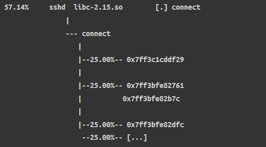
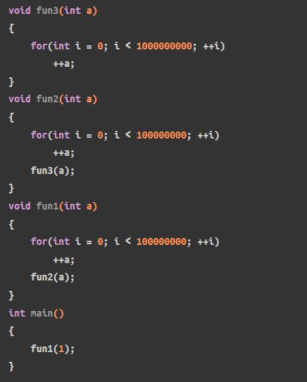
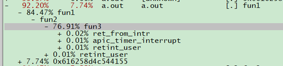
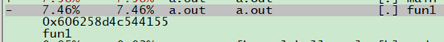

# 0x00. 导读

perf 是 Linux 官方提供的一个功能强大的性能分析工具，集成了剖析、跟踪和脚本功能。它特别适用于 CPU 分析，可以剖析 CPU 栈踪迹、跟踪 CPU 调度器行为，并通过检查性能监控计数器 （PMC） 来了解微观架构级别的 CPU 性能。

perf 的原理是这样的：每隔一个固定的时间，就在 CPU 上（每个核上都有）产生一个中断，在中断上看看，当前是哪个 pid ，哪个函数，然后给对应的 pid 和函数加一个统计值，这样，我们就知道 CPU 有百分几的时间在某个 pid ，或者某个函数上了。

同时，也引入了一些负荷。

perf stat 看看整体情况，心里有个大概。
perf top
更细就是 perf record和perf report
Perf script ，火焰图

每个长方块代表了函数调用栈中的一个函数，即为一层堆栈的内容；
Y轴显示堆栈深度，顶层方块表示CPU上正在运行的函数，下面的函数即为主调；
X轴的宽度代表被采集的sample数量，越宽表示采集到的越多；

Off-CPU和Wakeup火焰图
Chain火焰图
# 0x01. 简介

Perf工具支持一系列的可测量事件。利用 PMU(Performance Monitor Unit) 、 tracepoint 和内核中的计数器来进行性能统计。可以用 perf list 查看完整的。

DSO(Dynamic Shared Object)

## 1.1 符号表

应用程序的符号表，用来将逻辑地址翻译成对应的函数和变量名，这样才能被程序员阅读和分析，没有符号表，profile的结果都是一些16进制的逻辑地址：  
如下是perf report分析sshd进程的堆栈调用情况



符号可以位于目标文件中，也可以存放在单独的文件。Symbols 与 gcc -g 产生的 debug info 并不是一个东西。function tracing 只需要 symbols，不需要 debug symbols（gcc -g）。 

Symbols 有两种，都是 readelf -s 输出中的 FUNC 类型，

- .dynsym：动态符号，保存了引用来自外部文件符号的全局符号，如 printf 库函数。其保存的符号只能在运行时被解析。
- .symtab：局部符号，保存的内容是 .dynsym 的超集，保存了可执行文件的本地符号，如全局变量，代码中定义的本地函数等。其保存的符号只是用来进行调试和链接的。

通常情况下，生成可执行文件时，“局部”符号会被去掉，（以减小 binary size）， 然后通过单独的 xx-dbg/xx-dbgsym 包来提供这些符号 （也就是放到独立的文件，按需下载和使用）。

```
$ readelf -s LTTBif | grep "Symbol table" 
Symbol table '.dynsym' contains 23366 entries:
Symbol table '.symtab' contains 24430 entries:

$ readelf -s `which top` | grep 'Symbol table'
Symbol table '.dynsym' contains 136 entries:
```

可以用命令 strip 来手动去掉局部符号表：
```bash
$ strip -s ./hello-world # 原地 strip，直接修改可执行文件
```

既然对于跟踪来说 symbols 就够用了，那 debug symbols 有什么用呢？  
Debug symbol 是 dwarf 格式信息 。[ How debuggers work: Part 3 - Debugging information](https://eli.thegreenplace.net/2011/02/07/how-debuggers-work-part-3-debugging-information/)

Debug symbols 的用途或功能
- 将内存地址映射到具体某行源代码
- 调用栈展开（stack unwinding）。例如设置 perf 跟踪函数的执行

DWARF 格式存在的一些问题：
- 占用空间通常很大；
- 基于 BPF 的工具（例如 bpftrace）与它兼容性不好，无法展开 DWARF 类型的调用栈；  
BPF 工具一般使用另一种 stack unwinding 技术：frame pointer（帧指针）。 这是 perf 使用的默认 stack walking 方式，也是 bcc/bpftrace 目前支持的唯一方式。

## 1.2 栈回溯

我们经常在编译的时候会开启 `frame pointers` 优化选项，即优化掉函数栈帧 rbp，省略掉 frame pointer 是编译器一个很烂的优化，它会破坏 debug , 更烂的是省略 frame pointer 一般是编译器默认的优化选项。
没有 frame pointer 会使 perf 无法获取完整的调用栈，如下示例：



不开启优化的编译，进行profile是可以看到call graph的，如下：



如果编译时开启 `-fomit-frame-pointer` (这里因为测试代码简单，直接开优化的话就优化没了)，就无法获取到call graph



有三种方法可以修复这个问题，这里不做展开，这些称为 stack walking techniques ：

- using dwarf data to unwind the stack。需要在编译时添加-g参数。
- using last branch record (LBR) if available (a processor feature)。Intel的最后分支记录（LBR）调用图深度不如前两种方法。
- returning the frame pointers 。帧指针（fp）需要消耗一个寄存器，成本较高，但可实现开销较低的栈展开，适用于性能剖析。


frame pointer 原理
- 每个 stack trace (或称 activation records 或 call stacks) 包含很多 frames，这 些 frames 以 LIFO（后进先出）方式存储。这与栈的工作原理一样，stack frames 由此得名；
- 每个 frame 包含了一个函数执行时的状态信息（参数所在的内存区域、局部变量、返回值等等）；
- Frame pointer 是指向 frame 内存地址的指针，

编译的时候，有没有 -g 参数都行， frame pointer 不会使用 dwarf 信息。
perf 的时候 指定 --call-graph fp

存在的问题：默认编译参数 -fomit-frame-pointer

[参考](http://arthurchiao.art/blog/linux-tracing-basis-zh/)
## 1.3 使用方式

perf的使用大体可以有三种方式：

- Counting：统计的方式，统计事件发生的次数，这种方式不生成perf.data文件，例如perf stat, perf top
- Sampling:采样的方式，采样事件，并写入到内核buffer中，并异步写入perf.data文件中，perf.data文件可以被perf report或者perf script 命令读取。
- bpf programs on events(https://www.ibm.com/developerworks/cn/linux/l-lo-eBPF-history/index.html)

--list-cmds
List the most commonly used perf commands.
 
--list-opts
List available perf options.

# 0x02. 事件

事件可以分为如下三种：
- `Hardware Event`  
    由 PMU 部件产生，在特定的条件下探测性能事件是否发生以及发生的次数。比如 cache 命中

- `Software Event`  
    由内核产生的事件，分布在各个功能模块中，统计与操作系统相关的性能事件。比如进程切换、tick数等

- `Tracepoint Event`  
    由内核中静态 tracepoint 所触发的事件，这些 tracepoint 用来判断程序运行期间内核的行为细节，比如slab分配器的分配次数等。  
    tracepoints 是散落在内核源代码中的一些 hook ，它们可以在特定的代码被执行到时触发。  
    `sudo ls /sys/kernel/debug/tracing/events`


一个事件可以有子事件(或掩码)。 在某些处理器上的某些事件，可以组合掩码，并在其中一个子事件发生时进行测量。最后，一个事件还可以有修饰符，也就是说，通过过滤器可以改变事件被计数的时间或方式。

事件可以通过冒号添加一个或多个修饰符。 修饰符允许用户对事件计数进行限制。   
`perf stat -e cycles:u dd if=/dev/zero of=/dev/null count=100000`

# 0x03. 命令

介绍常用的为主。

- `list`: 查看可用事件  
- `stat`: 查看性能统计信息   
- `record`: 记录性能数据  
- `report`: 生成性能报告  
- `annotate`: 源码级别的性能分析
- `top`: 实时查看热点函数
- `bench`: 内置基准测试
- `trace`: 系统调用跟踪与分析

`perf 上面的命令 -h` 就能查看帮助文档。

## 3.1 list

[perf_list](./perf_list.md)
## 3.2 stat

[perf_stat](./perf_stat.md)

## 3.3 record

[perf_record](./perf_record.md)


## 3.4 report

[perf_report](./perf_report.md)

## 3.5 annotate

perf annotate 命令可以实现源码级别的性能分析。它展示了各个函数中指令的性能数据，帮助用户发现程序中的瓶颈。

$ perf annotate [options] [symbol]

以下是 perf annotate 的一些常用参数：  
-i 或 --input：指定要读取的输入文件，默认为 perf.data。
-s 或 --symbol：指定要注解的符号（函数）名称。
-d 或 --dsos：指定要注解的动态共享对象（DSO）名称。
-P 或 --pretty：指定输出格式，如raw、normal等。
--stdio：以文本模式显示注解（而非 TUI 模式）。
--tui：以 TUI 模式显示注解（默认方式）。
--gtk：以 GTK 模式显示注解。
--no-source：仅显示汇编代码，不显示源代码。
--group：将指定事件作为事件组进行注解。
-f 或 --force：强制解析文件，即使它看起来无效或损坏。
--show-total-period：显示每个符号的总周期数。
-k 或 --vmlinux：指定内核符号表文件（vmlinux）的路径。
--buildid-dir：指定包含构建 ID 数据的目录。
--buildid-cache-dir：指定用于缓存构建 ID 数据的目录。
--no-cache：禁用构建 ID 缓存。
--percent-type：指定百分比类型，如：local, global等。
--percent-limit：仅显示超过指定百分比的项。

## 3.6 top

[perf_top](./perf_top.md)

## 3.7 bench

perf bench 命令提供了一组内置的基准测试，用于评估系统的性能。这些测试涵盖了内存、调度、文件系统等多个方面。

$ perf bench [options] [subcommand]

以下是 perf bench 的一些常用参数：  
--list：列出所有可用的基准测试。
--help：显示帮助信息，包括可用参数和简要说明。
-p 或 --process：使用进程实现多任务测试，而非线程（适用于某些基准测试，如 sched ）。
perf bench 命令下有几个子命令，可以用于运行不同类型的基准测试：
futex：针对 futex（快速用户空间互斥锁）操作的基准测试。
sched：针对调度器（进程/线程切换）的基准测试。
mem：针对内存操作的基准测试。
kallsyms：针对内核符号查找的基准测试。
cgroup：针对 cgroup 的基准测试。

## 3.8 trace

perf trace 命令用于跟踪和分析系统调用，帮助用户了解程序在运行时如何与内核进行交互。这对于排查性能问题和理解系统行为非常有用。

$ perf trace [options] [command]

以下是 perf trace 的一些常用参数：  
-a 或 --all-cpus：在所有CPU上监视事件，而不仅仅是在当前CPU上。
-C 或 --cpu：指定要监视的CPU列表。
-p 或 --pid：指定要监视的进程ID。
-t 或 --tid：指定要监视的线程ID。
-e 或 --event：指定要监视的事件类型。如：sched, raw_syscalls 等。
-i 或 --input：从指定文件读取数据，默认为 perf.data。
-o 或 --output：将数据写入指定文件。
--duration：设置监视事件的最长持续时间（以秒为单位）。
-g 或 --call-graph：记录调用图信息，例如：dwarf, fp（帧指针）等。
-D 或 --delay：设置统计输出之间的延迟时间（以毫秒为单位）。
--syscall-events：仅监视系统调用事件。
--tool_stats：显示工具统计信息。
--summary：显示汇总统计信息。
--summary-only：仅显示汇总统计信息。
-s 或 --show-syscall-stats：显示系统调用统计信息。
--sched：显示调度事件。
-v 或 --verbose：详细输出。
--wide：宽输出。
--no-sys-names：不显示系统调用名称。
--raw-trace：输出原始跟踪数据，而不是格式化输出。
--skip-clear：在监视之前不清除屏幕。
--stats：显示统计数据。
--runtime：设置最长运行时间（以秒为单位）。
--timestamp：显示时间戳。