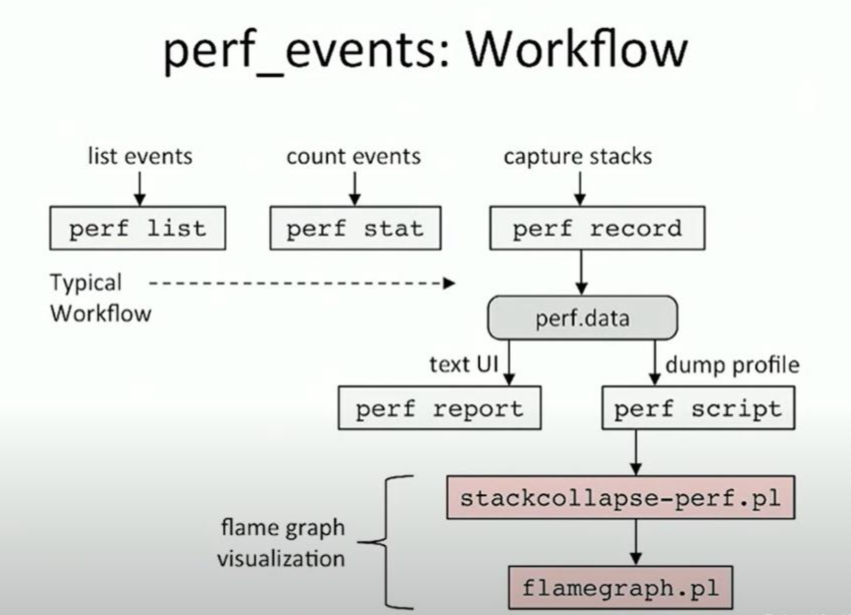

# 0x00. 导读

系统级性能优化通常包括两个阶段：性能剖析和代码优化：

1. 性能剖析的目标是寻找性能瓶颈，查找引发性能问题的原因及热点代码;
2. 代码优化的目标是针对具体性能问题而优化代码或调整编译选项，以改善软件性能。

在步骤一性能剖析阶段，最常用的工具就是 perf。

perf_events 是 Linux 核心內建的系統效能分析工具。perf_events 一開始的主要功能是存取硬件性能计数器，所以最早的名字是 Performance Counters for Linux (PCL)。隨著功能不斷擴充，perf_events 能處理的事件來源已經不限於硬件性能计数器，所以改名為 perf_events。

有時候 perf_events 也被簡稱為 Perf。然而因為 Perf 作為一個單字是難以搜尋的常見字𢑥，所以 Vince Weaver 與 Brendan Gregg 前輩通常使用 perf_events 稱呼這套工具。

perf_events 這套工具分為三個部分：

- 在 User Space 的 perf 指令
- 在 Kernel Space 負責處理和儲存事件記錄的機制
- 在 Kernel Space 的事件來源：硬件性能计数器、中斷、Page Fault、系統呼叫、KProbe、UProbe、FTrace、Trace Point 等等。

如果負載大多數時間都在執行狀態（CPU-bound 負載），最常使用的事件來源是硬件性能计数器。如果負載要花不少時間從硬盘或网络读写数据（IO-bound 負載）或者是要和其他負載共用特定資源（例如：Mutex、Semaphore 等），則建議改用 FTrace、Trace Point、KProbe 與 UProbe 等事件來源。

------

perf 的原理是取样测量：每隔一个固定的时间，就在 CPU 上（每个核上都有）产生一个中断，在中断上看看，当前是哪个 pid ，哪个函数，然后给对应的 pid 和函数加一个统计值，这样，我们就知道 CPU 有百分几的时间在某个 pid ，或者某个函数上了。

取样测量的基本概念就是通过记录下来的样本回推程序的执行状况，其最大的有点就是测量过程的额外负担可以通过取样频率调整。常用的頻率是 97、997、9973 等质数。perf_events 的取樣頻率的上限大約是 10,000 Hz。這個數值可以透過 `/proc/sys/kernel/perf_event_max_sample_rate` 修改。

取样测量也有它的缺点。其中一个是取样测量通常以执行时间作为母体。所以比较不容易观察到输入输出或同步造成的效能问题。其二是取样测量的基本理论是以统计样本次数回推真实的行为，我们难以从样本回推真实各种事件的顺序。如果效能问题和事件发生的顺序有关，取样测量比较没有办法告诉我们问题的来源。虽然有上述问题，取样测量还是很好的效能测量方法。它的低额外负担和可以指定取样频率还是让它成为效能测量的首选。

许多 CPU 会内建效能监控单元（Performance Monitoring Unit）有时候简记为 PMU 。它能提供 Cycles、Instructions Retired、Cache Misses、L1 I-Cache Load Misses、L1 D-Cache Load Misses、Last Level Cache Misses 等重要资讯。

-----------

perf_events 中的 周期和频率 与物理中的含义不一样，物理中，周期是指需要多少秒，频率是指每秒多少次。   
perf_events 中，周期指的是一段时间内，事件发生的次数；目标频率指的是 perf_events 一段时间内需要取得的样本数。


灰色为所有发生过的事件。黑色为记录到的事件样本（共 4 个）。因为目标周期为 4 Hz，所以 perf_events 每 0.25 秒可以设定不同的周期。下图的周期依序为 4 个、3 个、1 个、2 个事件。

另外，效能计数器的统计次数有时候会落在「触发事件的指令」的后方。这个现象在 Intel 技术文件中被称为 `Skid`（滑行）。以开车类比，就像是踩下煞车后，车子还会滑行一小段距离。这是因为高速 CPU 通常都有比较多层的 Pipeline、一个指令通常会再拆分为多个 Micro-Ops（微指令）、再加上 Out-of-Order Execution （乱序执行）会先执行准备就绪的 Micro-Ops，CPU 要准确地追蹤「触发事件的指令」要花费不少成本，因此部分事件会被记录在稍后的指令。使用者在解读事件数量的时候，务必要考虑 Skid 现象。

-----

以下列出幾個重點檔案與資料夾：

- [tools/perf](https://git.kernel.org/pub/scm/linux/kernel/git/torvalds/linux.git/tree/tools/perf) 包含 perf 代码和说明。
- [tools/perf/design.txt](https://git.kernel.org/pub/scm/linux/kernel/git/torvalds/linux.git/tree/tools/perf/design.txt) 包含 perf 与 Linux 核心之間的介绍。
- [kernel/events](https://git.kernel.org/pub/scm/linux/kernel/git/torvalds/linux.git/tree/kernel/events) 包含 perf_events 的框架。可以在這裡找到 Linux 核心怎麼取樣事件、怎麼處理記錄。
- [kernel/trace](https://git.kernel.org/pub/scm/linux/kernel/git/torvalds/linux.git/tree/kernel/trace) 包含 Linux 追蹤框架的實作。
- [include/trace](https://git.kernel.org/pub/scm/linux/kernel/git/torvalds/linux.git/tree/include/trace) 包含 Linux 追蹤框架的標頭檔案。
- [include/uapi/linux/perf_event.h](https://git.kernel.org/pub/scm/linux/kernel/git/torvalds/linux.git/tree/include/uapi/linux/perf_event.h) 包含許多 perf_events 常數。
- [arch/x86/events/intel](https://git.kernel.org/pub/scm/linux/kernel/git/torvalds/linux.git/tree/arch/x86/events/intel) 包含 Intel CPU 的效能計數器實作。另外，也能在這個目錄找到「事件名稱」和「硬體事件編號」的對應表，以便查尋 Intel 的處埋器架構手冊。

效能計數器大多和 CPU 的設計緊密結合，每個產品線或微架構常會有細微的差異。因此手邊有一份處理器架構手冊便是很重要的事。以下僅列出一些常見 CPU 的處理器架構手冊：

- Intel x86
    - [Intel 64 and IA-32 Architectures Software Developer Manuals](https://www.intel.com/content/www/us/en/developer/articles/technical/intel-sdm.html) 第三部第 18 章 Performance Monitoring 與第 19 章 Performance Monitoring Events
    - [Intel Processor Event Reference](https://github.com/intel/perfmon)

# 0x01. 简介

重点 list stat record report.

DSO(Dynamic Shared Object)

栈回溯和符号解析是使用 perf 的两大阻力，[stack trace and call graph](../basics/symbol_record.md)，前者影响观测准确性，后者影响观测可读性。



## 1.3 使用方式

perf的使用大体可以有三种方式：

- Counting：统计的方式，统计事件发生的次数，这种方式不生成perf.data文件，例如perf stat, perf top
- Sampling: 采样的方式，采样事件，并写入到内核buffer中，并异步写入perf.data文件中，perf.data文件可以被perf report或者perf script 命令读取。
- bpf programs on events (https://www.ibm.com/developerworks/cn/linux/l-lo-eBPF-history/index.html), Kernel 4.4+新增功能 别管。

```
--list-cmds
List the most commonly used perf commands.
 
--list-opts
List available perf options.
```

# 0x02. 事件

事件可以分为如下三种：
- `Hardware Event`  
    由 PMU 部件产生，在特定的条件下探测性能事件是否发生以及发生的次数。比如 cache 命中。`sudo perf list hardware`

- `Software Event`  
    由内核产生的事件，分布在各个功能模块中，统计与操作系统相关的性能事件。比如进程切换、tick数等。`sudo perf list sw`

- `Tracepoint Event`  
    由内核中静态 tracepoint 所触发的事件，这些 tracepoint 用来判断程序运行期间内核的行为细节，比如slab分配器的分配次数等。  
    tracepoints 是散落在内核源代码中的一些 hook ，它们可以在特定的代码被执行到时触发。  
    `sudo ls /sys/kernel/debug/tracing/events`


一个事件可以有子事件(或掩码)。 在某些处理器上的某些事件，可以组合掩码，并在其中一个子事件发生时进行测量。最后，一个事件还可以有修饰符，也就是说，通过过滤器可以改变事件被计数的时间或方式。

指定性能事件
```
-e <event>:u          //userspace
-e <event>:k          //kernel
-e <event>:h          //hypervisor
-e <event>:G          //guest counting(in KVM guests)
-e <event>:H          //host counting(not in KVM guests)
```

事件可以通过冒号添加一个或多个修饰符。 修饰符允许用户对事件计数进行限制。   
`perf stat -e cycles:u dd if=/dev/zero of=/dev/null count=100000`

# 0x03. 命令

介绍常用的为主。

- `list`: 查看可用事件  
- `stat`: 查看性能统计信息   
- `record`: 记录性能数据  
- `report`: 生成性能报告  
- `annotate`: 源码级别的性能分析
- `top`: 实时查看热点函数
- `bench`: 内置基准测试
- `trace`: 系统调用跟踪与分析

`perf 上面的命令 -h` 就能查看帮助文档。

## 3.1 list

[perf_list](./perf_list.md)
## 3.2 stat

[perf_stat](./perf_stat.md)

## 3.3 record

[perf_record](./perf_record.md)


## 3.4 report

[perf_report](./perf_report.md)

## 3.5 annotate

perf annotate 命令可以实现源码级别的性能分析。它展示了各个函数中指令的性能数据，帮助用户发现程序中的瓶颈。

$ perf annotate [options] [symbol]

以下是 perf annotate 的一些常用参数：  
-i 或 --input：指定要读取的输入文件，默认为 perf.data。
-s 或 --symbol：指定要注解的符号（函数）名称。
-d 或 --dsos：指定要注解的动态共享对象（DSO）名称。
-P 或 --pretty：指定输出格式，如raw、normal等。
--stdio：以文本模式显示注解（而非 TUI 模式）。
--tui：以 TUI 模式显示注解（默认方式）。
--gtk：以 GTK 模式显示注解。
--no-source：仅显示汇编代码，不显示源代码。
--group：将指定事件作为事件组进行注解。
-f 或 --force：强制解析文件，即使它看起来无效或损坏。
--show-total-period：显示每个符号的总周期数。
-k 或 --vmlinux：指定内核符号表文件（vmlinux）的路径。
--buildid-dir：指定包含构建 ID 数据的目录。
--buildid-cache-dir：指定用于缓存构建 ID 数据的目录。
--no-cache：禁用构建 ID 缓存。
--percent-type：指定百分比类型，如：local, global等。
--percent-limit：仅显示超过指定百分比的项。

## 3.6 top

[perf_top](./perf_top.md)

## 3.7 bench

perf bench 命令提供了一组内置的基准测试，用于评估系统的性能。这些测试涵盖了内存、调度、文件系统等多个方面。

$ perf bench [options] [subcommand]

以下是 perf bench 的一些常用参数：  
--list：列出所有可用的基准测试。
--help：显示帮助信息，包括可用参数和简要说明。
-p 或 --process：使用进程实现多任务测试，而非线程（适用于某些基准测试，如 sched ）。
perf bench 命令下有几个子命令，可以用于运行不同类型的基准测试：
futex：针对 futex（快速用户空间互斥锁）操作的基准测试。
sched：针对调度器（进程/线程切换）的基准测试。
mem：针对内存操作的基准测试。
kallsyms：针对内核符号查找的基准测试。
cgroup：针对 cgroup 的基准测试。

## 3.8 trace

perf trace 命令用于跟踪和分析系统调用，帮助用户了解程序在运行时如何与内核进行交互。这对于排查性能问题和理解系统行为非常有用。

$ perf trace [options] [command]

```
以下是 perf trace 的一些常用参数：  
-a 或 --all-cpus：在所有CPU上监视事件，而不仅仅是在当前CPU上。
-C 或 --cpu：指定要监视的CPU列表。
-p 或 --pid：指定要监视的进程ID。
-t 或 --tid：指定要监视的线程ID。
-e 或 --event：指定要监视的事件类型。如：sched, raw_syscalls 等。
-i 或 --input：从指定文件读取数据，默认为 perf.data。
-o 或 --output：将数据写入指定文件。
--duration：设置监视事件的最长持续时间（以秒为单位）。
-g 或 --call-graph：记录调用图信息，例如：dwarf, fp（帧指针）等。
-D 或 --delay：设置统计输出之间的延迟时间（以毫秒为单位）。
--syscall-events：仅监视系统调用事件。
--tool_stats：显示工具统计信息。
--summary：显示汇总统计信息。
--summary-only：仅显示汇总统计信息。
-s 或 --show-syscall-stats：显示系统调用统计信息。
--sched：显示调度事件。
-v 或 --verbose：详细输出。
--wide：宽输出。
--no-sys-names：不显示系统调用名称。
--raw-trace：输出原始跟踪数据，而不是格式化输出。
--skip-clear：在监视之前不清除屏幕。
--stats：显示统计数据。
--runtime：设置最长运行时间（以秒为单位）。
--timestamp：显示时间戳。
```