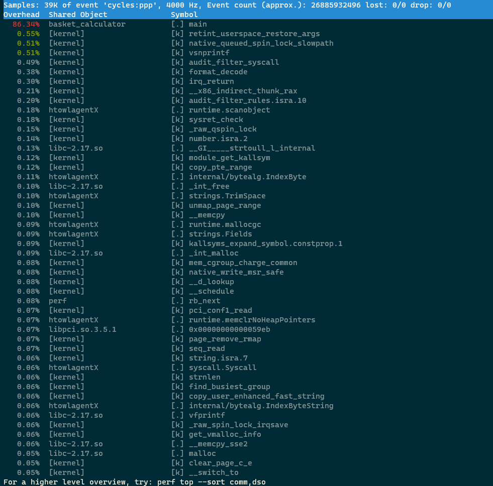

# 0x00. 导读

# 0x01. 简介

# 0x02. 命令

perf top 命令实时显示系统中最耗费CPU资源的函数。这有助于用户快速定位导致性能问题的代码部分。默认的性能事件为cpu cycles。

$ perf top [options]

以下是 perf top 的一些常用参数：  
-e 或 --event：指定要收集的事件类型，例如：cache-misses, instructions 等。  
-p 或 --pid：指定要监视的进程ID。  
-t 或 --tid：指定要监视的线程ID。  
-a 或 --all-cpus：监视所有CPU，而不仅仅是当前CPU。  
-C 或 --cpu：指定要监视的CPU列表。  
--call-graph：设置调用图记录方法，例如：dwarf 或 fp（帧指针）。  

```
$ perf top // 默认配置
$ perf top -G // 得到调用关系图
$ perf top -e cycles // 指定性能事件
$ perf top -p 23015,32476 // 查看这两个进程的cpu cycles使用情况
$ perf top -s comm,pid,symbol // 显示调用symbol的进程名和进程号
$ perf top --comms nginx,top // 仅显示属于指定进程的符号
$ perf top --symbols kfree // 仅显示指定的符号
```

## 2.1 --call-graph

```
sudo perf top -p 69598 --call-graph dwarf -g
```

## 2.2 解释




第一列：符号引发的性能事件的比例，默认指占用的 cpu 周期比例。  
第二列：符号所在的 DSO(Dynamic Shared Object)，可以是应用程序、内核、动态链接库、模块。  
第三列：DSO 的类型。[.]表示此符号属于用户态的ELF文件，包括可执行文件与动态链接库。[k]表述此符号属于内核或模块。  
第四列：符号名。有些符号不能解析为函数名，只能用地址表示。  