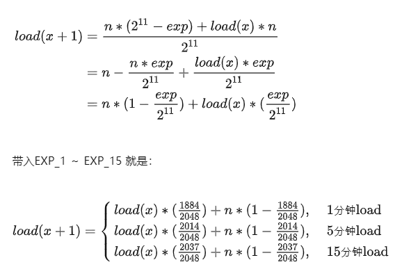

```bash
$ top
top - 13:43:40 up 3 days, 21:23,  6 users,  load average: 60.34, 60.62, 58.03
Tasks: 522 total,   4 running, 515 sleeping,   0 stopped,   3 zombie
%Cpu(s): 85.0 us,  5.7 sy,  0.0 ni,  0.0 id,  9.3 wa,  0.0 hi,  0.0 si,  0.0 st
KiB Mem : 13150206+total,   375732 free, 16477400 used, 11464893+buff/cache
KiB Swap: 33554428 total, 32846588 free,   707840 used. 82336672 avail Mem 

  PID USER      PR  NI    VIRT    RES    SHR S  %CPU %MEM     TIME+ COMMAND                                                                                               
54442 root      20   0  501.3g 172.1g 171.1g S  3743  137   1604:07 AegisTrade
```

# 0x01. 输出解释

## 1. 13:43:40 up 3 days, 21:23,  6 users

当前系统时间  
系统已经运行了 3 天  
6 个用户当前登录

## 2. **load average: 60.34, 60.62, 58.03**

系统负载，即任务队列的平均长度，三个数值分别为 1分钟、5分钟、15分钟前到现在的平均值。

计算公式：  



例子：


## 3. Tasks: 522 total,   4 running, 515 sleeping,   0 stopped,   3 zombie
总进程数  
正在运行的进程数  
睡眠的进程数  
停止的进程数  
冻结进程数 

## 4. %Cpu(s): 85.0 us,  5.7 sy,  0.0 ni,  0.0 id,  9.3 wa,  0.0 hi,  0.0 si,  0.0 st
us: 用户空间占用CPU百分比  
sy: 内核空间占用CPU百分比  
id: 空闲CPU百分比  
wa: cpu运行时在等待io的时间  
hi：硬件中断占用CPU百分比
si：软中断占用百分比

## 5. KiB Mem : 13150206+total,   375732 free, 16477400 used, 11464893+buff/cache
物理内存总量  
空闲内存总量  
使用的物理内存总量  
用作内核缓存的内存量  

## 6. KiB Swap: 33554428 total, 32846588 free,   707840 used. 82336672 avail Mem
交换区总量  
空闲交换区总量  
使用的交换区总量  
缓冲的交换区总量  

# 列解释

|  列名  | 含义  |
|  ----  | ----  |
|PR|      进程的调度优先级，范围是 0 到 39，映射到内核的值是 100 到 139；也可以是 rt ，表示实时任务。PR 的默认值是 20，对应到内核是 120，和 NI 的关系是: PR = 20 + NI。  |
|NI|      nice值，进程的优先级。范围是 -20 到 +19，默认值是 0，值越低优先级越高。  |
|%CPU|    上次更新到现在的CPU时间占用百分比  |
|TIME|    进程使用的CPU时间总计，单位秒  |
|TIME+|   进程使用的CPU时间总计（动后到现在所使用的全部CPU时间），单位1/100秒  |
|%MEM|    进程使用的物理内存百分比  |
|VIRT|    表示一个任务使用的虚拟内存总和，包括所有的代码段、数据段、链接的共享库、已经被 swap 的页和已经被映射但是没有使用的页，单位kb。  |
|SWAP|    进程使用的虚拟内存中，被换出的大小，单位kb。  |
|RES|     进程使用的、未被换出的物理内存大小，单位kb。RES=CODE+DATA  |
|CODE|    可执行代码占用的物理内存大小，单位kb  |
|DATA|    可执行代码以外的部分(数据段+栈)占用的物理内存大小，单位kb  |
|SHR|     表示一个任务可能和其他任务共享的内存，单位kb  |
|nFLT|    页面错误次数  |
|nDRT|    最后一次写入到现在，被修改过的页面数。  |
|S|       进程状态(D=不可中断的睡眠状态,R=运行,S=睡眠,T=跟踪/停止,Z=僵尸进程)  |
|COMMAND| 命令名/命令行  |
|WCHAN|   若该进程在睡眠，则显示睡眠中的系统函数名  |
|Flags|   任务标志，解释如下  |


|  Flags  | 含义  |
|  ----  | ----  |
|D   | Uninterruptible sleep。不可中断休眠，就是等待 I/O 完成时的状态，会导致 CPU 统计的 wa 上升。  |
|R   | Running  |
|S   | Sleeping  |
|T   | Stopped by job control signal  |
|t   | Stopped by debugger during trace  |
|Z   | zombie  |

# 使用

-d <秒数>：指定 top 命令的刷新时间间隔，单位为秒。  
-n <次数>：指定 top 命令运行的次数后自动退出。  
-p <进程ID>：仅显示指定进程ID的信息。  
-u <用户名>：仅显示指定用户名的进程信息。  
-H：在进程信息中显示线程详细信息。  
-i：不显示闲置（idle）或无用的进程。  
-c：显示完整的命令行而不截断。  

# 交互

|  字母  | 含义  |
|  ----  | ----  |
|M| 以 内存占用率 大小的顺序排序进程列表  |
|C| 以 CPU 占用率大小的顺序排序进程列表  |
|N| 以 PID 大小的顺序排序进程列表  |
|T| 以 使用时间 大小的顺序排序进程列表  |
|n| 指定显示的行数，默认为满屏|
|b| 高亮显示，一般为 运行状态 的进程被高亮  |
|1| 显示 CPU 详细信息，每核显示一行  |
|2| 显示 NUMA Node 统计  |
|3| 显示 NUMA Node 单个 CPU 汇总|
|l| 显示/隐藏第一行负载信息  |
|t| 显示/隐藏第2~3行CPU信息  |
|m| 显示/隐藏第4~5行内存信息  |
|i| 忽略闲置和僵死进程  |
|L| 用于输入要搜索的关键字，& 表示跳转到下一个匹配项。|
|c| 切换显示完整命令行  |
|H| 按照线程显示  |
|u| 用户过滤  |
|E| 切换总览部分的内存单位  |
|e| 切换列部分的内存单位  |
|I| 切换 %CPU 的模式，Irix/Solaris 两个模式。Irix mode 的计算方式是跑满一个 CPU 为 100%，%CPU 可能会超过 100%。Solaris mode 则是会把总体利用率除以 CPU 核数，保证不会超过 100%。|
|F| 字段管理。按空格或者 d 切换是否展示，按 s 设置用该字段进行排序，按 q 或者 ESC 退出这个界面。前面的星号表示选中。要调整字段的排列顺序，先选中一个字段，按右键表示开始移动，然后上下移动，然后按左键表示移动结束。|

# 多窗口

要进入多窗口模式，在全屏模式下，按 A 即可（这个可以在两个模式间来回切换）。  
多窗口模式有一个 summary area 和 4 个 window，4 个窗口从上到下编号，对应 1 到 4。summary area 默认为 window 1 的 summary area，可以切换为不同 window 的 summary area，这个可以从 summary area 左上角的提示看出来。这个提示区会展示 summary area 当前对应的 window 的编号和名字，比如 1:Def。要切换 summary area 对应不同的 window，可以按 a （从上到下） 或者 w （从下到上）。可以输入 'A' 将该 active 视图放大为单视图铺满窗口。在多视图展示的情况下，还可以输入'-'来隐藏/展 示某种视图。

Def：以 CPU 占用高低对task进行排序，默认就是这个。  
Job：里面展示的task多是些系统服务或内核线程。  
Mem：以Mem占用高低对task进行排序。  
Usr：按用户名 展示task。  

top 其实有两个概念是混合使用的，就是 window 和 Field Group，你可以认为他们就是等价的。
top 默认定义了 4 个 window，每个 window 配置要显示的列，就称为这个 window 的 Field Group。  
在全屏模式下，可以通过快捷键 g 切换当前要显示的 Field Group 是哪个，使用序号 1 到 4 到进行选择。修改当前展示的 Field Group 不仅是改变要显示的内容，也会使用对应的 window 的样式，包括过滤器和颜色配置等。