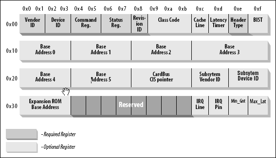

# 0x00、/proc/iomem

查看物理地址空间的映射情况。

```bash
$ cat /proc/iomem
00000000-00000fff : reserved
00001000-0009fbff : System RAM
0009fc00-0009ffff : reserved
000a0000-000bffff : PCI Bus 0000:00     <- PCI设备内存
000c0000-000c95ff : Video ROM           <- 显存
000c9800-000cbbff : Adapter ROM
000f0000-000fffff : reserved
  000f0000-000fffff : System ROM        <- BIOS
00100000-bffdffff : System RAM
  2a000000-340fffff : Crash kernel
bffe0000-bfffffff : reserved
c0000000-febfffff : PCI Bus 0000:00
  f4000000-f7ffffff : 0000:00:02.0
  f8000000-fbffffff : 0000:00:02.0
  fc000000-fc3fffff : 0000:00:05.0
  fc400000-fc40ffff : 0000:00:02.0
  fc410000-fc413fff : 0000:00:03.0
    fc410000-fc413fff : ICH HD audio
  fc414000-fc415fff : 0000:00:02.0
  fc416000-fc416fff : 0000:00:04.0
  fc417000-fc417fff : 0000:00:05.0
  fc418000-fc418fff : 0000:00:06.0
  fc419000-fc419fff : 0000:00:07.0
  fc41a000-fc41afff : 0000:00:0a.0
  fc41b000-fc41bfff : 0000:00:0b.0
  fc41c000-fc41cfff : 0000:00:12.0
  fc41d000-fc41dfff : 0000:00:19.7
    fc41d000-fc41dfff : ehci_hcd
  fc41e000-fc41efff : 0000:00:1a.7
    fc41e000-fc41efff : ehci_hcd
fec00000-fec003ff : IOAPIC 0
fee00000-fee00fff : Local APIC
feffc000-feffffff : reserved
fffc0000-ffffffff : reserved
100000000-43fffffff : System RAM
  14e800000-14ef9d279 : Kernel code
  14ef9d27a-14f56bfbf : Kernel data
  14f764000-14fa71fff : Kernel bss
```

# 0x0x、扩展阅读

从输出可以发现：物理地址空间对应的真实存储器不仅仅内存条上的存储单元，还有很多其它设备上的存储器（例如BIOS、显存等）。

```c
void __iomem * ioremap (unsigned long offset, unsigned long size)
```

`ioremap` 是将物理地址映射到了虚拟地址空间，但虚拟地址空间又分为进程虚拟地址空间和内核虚拟地址空间， `ioremap` 映射到的正是内核虚拟地址空间。

为了访存设备 memory 或 register ，即 I/O memory ，我们需要建立两级映射：

    设备局部内存地址空间 -- 通过 kernel/BIOS --> 物理地址空间 —- 通过 ioremap --> 内核虚拟地址空间
如果想要用户空间程序直接具备访存I/O memory的能力，我们需要完成如下映射：

    设备局部内存地址空间 -— 通过 kernel/BIOS --> 物理地址空间 —- 通过 mmap --> 进程虚拟地址空间

Linux 为了实现进程虚拟地址空间，在启用 MMU 后，在内核中操作的都是虚拟地址，内核访问不到物理地址。

如果在驱动里直接访问物理地址，等于访问了一个非法地址，会导致内核崩溃，下面会有一个相关的小实验。

通过 ioremap 将物理地址映射为虚拟地址后，内核就能通过 ioremap() 返回的虚拟地址，以 虚拟地址->mmu页表映射-> 物理地址 的形式正确地访问到物理地址了。

## PCI

    Peripheral ComponentInterconnect (外围设备互联)。可以使用 lspci 命令查看当前系统的 pci 。

系统中的PCI设备信息可以从 `/proc/bus/pci/device` , `/sys/bus/pci/device` 文件系统中查看；

其中设备信息的表示格式为：` 总线域（16位）：总线编号（8位）：设备编号（5位）.功能编号（3位），表示为AAAA:BB:CC:D`。

每个 PCI 外设由 bus:device.function 一共 16 位地址标识。
其中 bus(8位) 、 device(5位) 、 function(3位) 。

```bash
$ lspci
00:00.0 Host bridge: Intel Corporation 440FX - 82441FX PMC [Natoma] (rev 02)
00:01.0 ISA bridge: Intel Corporation 82371SB PIIX3 ISA [Natoma/Triton II]
00:01.1 IDE interface: Intel Corporation 82371SB PIIX3 IDE [Natoma/Triton II]
00:01.2 USB controller: Intel Corporation 82371SB PIIX3 USB [Natoma/Triton II] (rev 01)
...
```

所有的 PCI 设备至少包含 256 字节的配置地址空间。其中前 64 字节是标准的。



```bash
$ lspci | grep VGA
00:02.0 VGA compatible controller: Red Hat, Inc. Device 0102 (rev 06)

$ xxd /sys/bus/pci/devices/0000\:00\:02.0/config
0000000: 361b 0201 0301 0000 0600 0003 0000 0000  6...............
0000010: 0000 00f4 0000 00f8 0040 41fc a1c0 0000  .........@A.....
0000020: 0000 0000 0000 0000 0000 0000 f41a 0011  ................
0000030: 0000 40fc 0000 0000 0000 0000 0a01 0000  ..@.............

# 0x10 位置，并且是小端字节序，所以是 f400
$ cat /proc/iomem | grep f400
  f4000000-f7ffffff : 0000:00:02.0      # 正式 VGA
```
