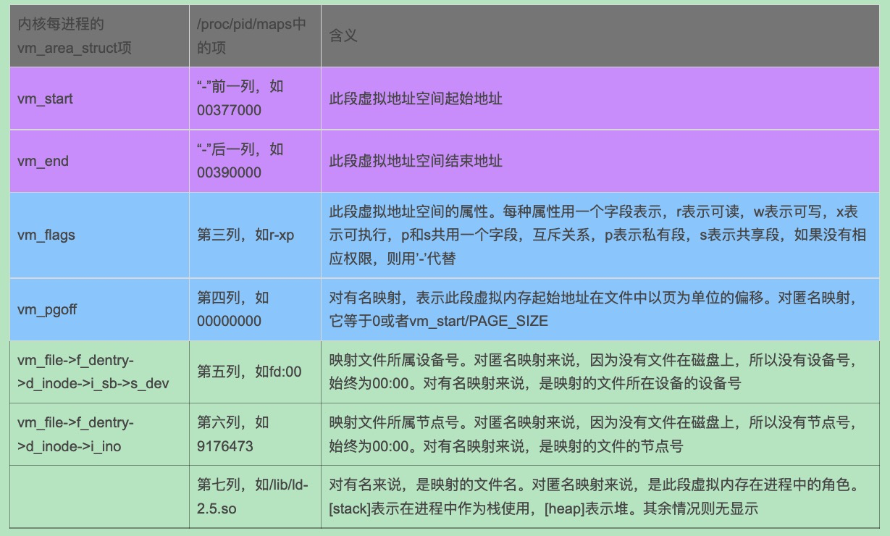

# 0x00. 导读

显示进程的虚拟地址空间分布。

```bash
/proc/PID/maps 或者 pmap -x PID
pmap -X `pidof hello`
```

# 0x01. 简介

参考： [/proc/pid/maps 简要分析](https://www.cnblogs.com/arnoldlu/p/10272466.html)

# 0x02. 命令


```bash
$ cat /proc/12098/maps
00400000-00401000 r-xp 00000000 fd:01 139198                             /root/elf_write/ftrace/main
00600000-00601000 r--p 00000000 fd:01 139198                             /root/elf_write/ftrace/main
00601000-00602000 rw-p 00001000 fd:01 139198                             /root/elf_write/ftrace/main
020c2000-020e3000 rw-p 00000000 00:00 0                                  [heap]
7f787763b000-7f78777f3000 r-xp 00000000 fd:01 1049989                    /usr/lib64/libc-2.17.so
7f78777f3000-7f78779f3000 ---p 001b8000 fd:01 1049989                    /usr/lib64/libc-2.17.so
7f78779f3000-7f78779f7000 r--p 001b8000 fd:01 1049989                    /usr/lib64/libc-2.17.so
7f78779f7000-7f78779f9000 rw-p 001bc000 fd:01 1049989                    /usr/lib64/libc-2.17.so
7f78779f9000-7f78779fe000 rw-p 00000000 00:00 0 
7f78779fe000-7f7877a1f000 r-xp 00000000 fd:01 1049982                    /usr/lib64/ld-2.17.so
7f7877c14000-7f7877c17000 rw-p 00000000 00:00 0 
7f7877c1d000-7f7877c1f000 rw-p 00000000 00:00 0 
7f7877c1f000-7f7877c20000 r--p 00021000 fd:01 1049982                    /usr/lib64/ld-2.17.so
7f7877c20000-7f7877c21000 rw-p 00022000 fd:01 1049982                    /usr/lib64/ld-2.17.so
7f7877c21000-7f7877c22000 rw-p 00000000 00:00 0 
7ffdd73c8000-7ffdd73e9000 rw-p 00000000 00:00 0                          [stack]
7ffdd73f4000-7ffdd73f6000 r-xp 00000000 00:00 0                          [vdso]
ffffffffff600000-ffffffffff601000 r-xp 00000000 00:00 0                  [vsyscall]
```

## 2.1 解释

`man 5 proc` + search 也可以查看帮助手册的解释。

一共 6 列：

    76093000-76096000 r-xp 00000000 b3:19 941 /system/lib/libmemalloc.so

1. 所处虚拟内存地址(VMA)范围：`76093000-76096000`
    - 对应虚拟地址空间的 起始-结束 地址
    - 在Linux中将进程虚拟空间中的一个段叫做虚拟内存区域 VMA (Virtual Memory Area) 。
    - VMA 对应 ELF 文件中的 segment 。
    - ELF 文件有 section 和 segment 的概念。从链接的角度看， ELF 是按照 section 存储的，事实也的确如此；从装载的角度看，ELF 文件又按照 segment 进行划分，这是为了防止按照 section 装载时造成的内部碎片。 segment 相当与是将多个属性（读写执行）相同的 section 合并在一起进行。 program headers 存放 segment 的信息; section table 存放 section 的信息.

2. VMA权限：r-xp

    r=读，w=写,x=可执行,s=共享,p=私有

3. 偏移量：00000000

    表示 VMA 对应的 segment 在映射文件中的偏移。对于 匿名映射 则是 0 。

4. b3:19

    映射文件所属设备号。

5. 941

    映射文件的节点号 inode 

6. /system/lib/libmemalloc.so

    映射文件的路径。[stack] 表示在进程中作为栈使用，[heap] 表示堆。




