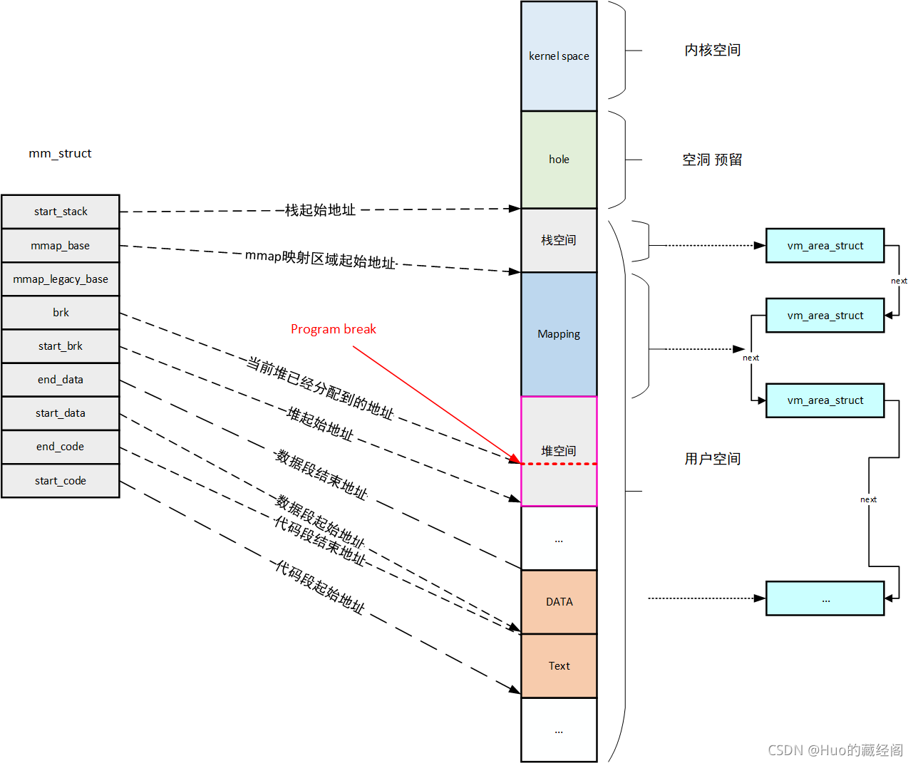

# 0x00、/proc/PID/maps 或者 pmap -x PID

显示进程的虚拟地址空间分布。


[/proc/pid/maps 简要分析](https://www.cnblogs.com/arnoldlu/p/10272466.html)

```bash
$ cat /proc/12098/maps
00400000-00401000 r-xp 00000000 fd:01 139198                             /root/elf_write/ftrace/main
00600000-00601000 r--p 00000000 fd:01 139198                             /root/elf_write/ftrace/main
00601000-00602000 rw-p 00001000 fd:01 139198                             /root/elf_write/ftrace/main
020c2000-020e3000 rw-p 00000000 00:00 0                                  [heap]
7f787763b000-7f78777f3000 r-xp 00000000 fd:01 1049989                    /usr/lib64/libc-2.17.so
7f78777f3000-7f78779f3000 ---p 001b8000 fd:01 1049989                    /usr/lib64/libc-2.17.so
7f78779f3000-7f78779f7000 r--p 001b8000 fd:01 1049989                    /usr/lib64/libc-2.17.so
7f78779f7000-7f78779f9000 rw-p 001bc000 fd:01 1049989                    /usr/lib64/libc-2.17.so
7f78779f9000-7f78779fe000 rw-p 00000000 00:00 0 
7f78779fe000-7f7877a1f000 r-xp 00000000 fd:01 1049982                    /usr/lib64/ld-2.17.so
7f7877c14000-7f7877c17000 rw-p 00000000 00:00 0 
7f7877c1d000-7f7877c1f000 rw-p 00000000 00:00 0 
7f7877c1f000-7f7877c20000 r--p 00021000 fd:01 1049982                    /usr/lib64/ld-2.17.so
7f7877c20000-7f7877c21000 rw-p 00022000 fd:01 1049982                    /usr/lib64/ld-2.17.so
7f7877c21000-7f7877c22000 rw-p 00000000 00:00 0 
7ffdd73c8000-7ffdd73e9000 rw-p 00000000 00:00 0                          [stack]
7ffdd73f4000-7ffdd73f6000 r-xp 00000000 00:00 0                          [vdso]
ffffffffff600000-ffffffffff601000 r-xp 00000000 00:00 0                  [vsyscall]
```

| 内核每进程的vm_area_struct项      | /proc/pid/maps中的项 | 含义     |
| :----:        |    :----:   |          :----: |
|vm_start|	“-”前一列，如00377000|	此段虚拟地址空间起始地址|
|vm_end|	“-”后一列，如00390000|	此段虚拟地址空间结束地址|
|vm_flags|	第三列，如r-xp|	此段虚拟地址空间的属性。每种属性用一个字段表示。 <br>r 可读，w 可写，x 可执行，p 和 s 共用一个字段，互斥关系，p 表示私有段，s 表示共享段，如果没有相应权限，则用’-’代替
|vm_pgoff|	第四列，如00000000|	对有名映射，表示此段虚拟内存起始地址在文件中以页为单位的偏移。<br>对匿名映射，它等于0或者vm_start/PAGE_SIZE
|vm_file->f_dentry->d_inode->i_sb->s_dev|	第五列，如fd:00|	映射文件所属设备号。<br>对匿名映射来说，因为没有文件在磁盘上，所以没有设备号，始终为00:00。<br>对有名映射来说，是映射的文件所在设备的设备号
|vm_file->f_dentry->d_inode->i_ino|	第六列，如9176473|	映射文件所属节点号。<br>对匿名映射来说，因为没有文件在磁盘上，所以没有节点号，始终为00:00。<br>对有名映射来说，是映射的文件的节点号
| 	|第七列，如/lib/ld-2.5.so|	对有名来说，是映射的文件名。<br>对匿名映射来说，是此段虚拟内存在进程中的角色。[stack]表示在进程中作为栈使用，[heap]表示堆。其余情况则无显示

