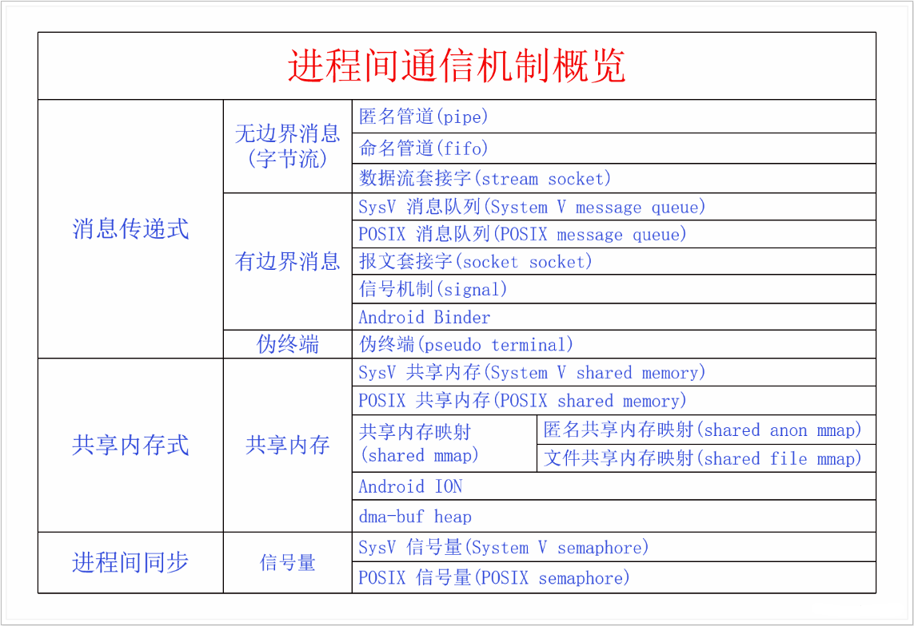

# 0x00. 导读

为什么要通信？因为有些任务是由多个进程一起协同来完成的，或者一个进程对另一个进程有服务请求，或者有消息要向另一方提供。其次是因为进程间有隔离，每个进程都有自己独立的用户空间，互相看不到对方，所以才需要通信。

为什么能通信？那是因为内核空间是共享的，虽然 N 个进程都有 N 个用户空间，但是内核空间只有一个，虽然用户空间之间是完全隔离的，但是用户空间与内核空间并不是完全隔离的，他们之间有系统调用这个通道可以沟通。所以两个用户空间就可以通过内核空间这个桥梁进行沟通了。

# 0x01. 简介

进程间通信机制都要有两部分组成，一是存在于内核空间的通信中枢，二是存在于用户空间的通信接口。

# 0x02. 

## 2.1 通信机制种类

进程间通信机制的类型有两种，一种是媒婆式，给你俩牵线搭桥，然后就不管了，你俩自己聊吧，另一种是保姆式，一直在中间传话。这两种模式用计算机的术语来说分别叫做**共享内存式**和**消息传递式**。

共享内存式进程间通信，由于通信信息的传递不需要通信中枢的协助，所以通信双方还需要进程间同步，来保证数据读写的一致性，以避免踩踏数据或者读到垃圾数据。  

消息传递式进程间通信，由于通信信息是通过通信中枢传递的，所以不需要进程间同步。消息传递式进程间通信又可以分为两类，有边界消息和无边界消息。无边界消息就是字节流，发过来是一个一个的字节，要靠进程自己设计如何区分消息的边界。有边界消息的进程间通信的发送和接收都是以消息为基本单位的。

## 2.2 通信机制接口设计

进程间通信机制一般要实现下面三类接口，但是有些机制不一定要这三类接口都实现。

1. 如何建立通信信道，谁去建立通信信道。
2. 对方如何找到并加入这个通信信道。
3. 如何使用通信信道。

**只是了解的话，到这里可以停止了。**

# 0x03. 共享内存式通信

共享内存式进程间通信的原理很简单，就是通过修改页表，使得两个虚拟进程空间的一部分虚拟内存对应到相同的物理内存上。

## 3.1 SysV 共享内存

SysV 共享内存是一种非常古老的共享内存方法，是在 UNIX 诞生早期就有的方法。SysV 共享内存创建共享内存的方法是使用接口 `shmget`，它有三个参数，分别是 key、size、flag。

- 其中 key 是一个整数，是表示通信信道的名称，两个进程要提前约定好 key。
- Size 代表共享内存的大小。
- Flag 用来表示创建的行为，flag IPC_CREAT 表示如果通信信道存在就直接获取它，如果还不存在就创建它，没有 IPC_CREAT 的话表示只获取不创建。如果再加上 IPC_EXCL 的话，表示只创建，如果已经被别人创建了则返回失败。

shmget 返回的是共享内存的 id，代表通信信道的句柄。然后拿着通信信道的句柄通过 `shmat` 接口就可以把底层的物理内存映射到本进程空间了。函数返回值就是映射到本进程虚拟内存空间的一个指针，然后就可以像访问普通内存一样读写这段内存了。任务完成之后就可以通过 `shmdt` 接口释放信道。注意这只是释放了本进程的通信信道，没有释放底层的物理内存，要释放底层物理内存的话，需要使用接口 `shmctl()` 并选择 IPC_RMID 操作。

## 3.2 POSIX 共享内存

POSIX 共享内存使用接口 `shm_open` 来创建共享内存通信信道句柄，它的参数和 open 是一样的，但是它不创建磁盘文件。这样以来，我们使用的是一个路径名作为通信信道的名称，这就比一个整数 key 好多了，容易起名字还不容易重复。并且它的参数是和 open 一样的，所以它的第三个参数 mode 可以指定权限，这样就更安全了。shm_open 的第二个参数和 open 的第二个参数是一样的，可以指定 flag O_CREAT O_EXCL，这两个 flag 和前面的 shmget 可以达到相同的效果，你可以选择是仅加入已经信道，还是非要自己亲自创建信道，或者已有就加入没有就创建。shm_open 返回的是一个 fd，这个 fd 就是通信信道的句柄。有了这个 fd，我们可以通过接口 `ftruncate` 来设置共享内存的大小。得到了信道句柄之后，我们加入信道的方式不是用的专用的方法，而是使用系统已有的接口，用的是 mmap，这点和 SysV 共享内存有很大的不同。mmap 之后我们就加入了信道，其返回值是本进程虚拟内存空间的指针，我们就可以像操作普通内存一样操作它了。

## 3.3 共享内存映射

系统调用 mmap 并不是专门用来做进程间通信的，它是用来做内存映射的。它的映射来源可以用文件也可以是匿名 (也就是没有来源，直接分配内存并初始化为 0)。它的映射方式可以是私有的，也可以是共享的。映射来源和映射方式两者一组合是四种方式。当我们使用共享映射方式的时候，正好可以用来做进程间通信。对于共享文件映射，两个进程映射相同的文件就可以达到共享内存的目的，文件名就是通信信道的名称，由名称直接加入信道，没有信道句柄。对于共享匿名映射，是通过 fork 之后在父子进程之间共享内存的。fork 之后父子进程之间的内存本来是 COW(写时复制) 的，也就是说父子进程之间不会共享内存，但是被共享匿名映射的部分不会 COW，而是在父子进程之间共享物理内存，这就达到了共享内存的效果。这种方法既没有信道名称也没有信道句柄，是通过继承方式直接就获得了信道。这两种共享内存的解除方法都是使用 munmap 函数。

## 3.4 Android ION

## 3.5 dma-buf heaps

# 0x04. 消息传递式通信

## 4.1 匿名管道

匿名管道是 UNIX 上最早的进程间通信机制了。它的出现来源于早期的操作系统都是命令行式的，我们经常需要多个命令来协同完成一个任务。

比如 `ls -ef | grep process-name` , 这个命令中前面命令的输出要作为后面命令的输入，中间的 | 竖线叫做管道符，代表像管道一样从前往后传递数据。那么这个管道符的逻辑在程序中是怎么实现的呢，就是通过匿名管道实现的。  
Shell 在执行命令时先 fork 出一个子进程 A，然后在子进程 A 中解析命令，发现命令需要执行两个程序，并通过管道连接。于是就使用匿名管道的创建接口 `int pipe(int fd[2])`，此接口接收一个双 int 元素的数组作为参数。接口执行完成后返回两个 fd， fd[0] 是读端 fd，fd[1] 是写端接口。然后 fork A，生成进程 B，这样进程 B 也继承了两个 fd。A 和 B 都有两个 fd 是没啥意义的，于是进程 A close(fd[0])，进程 B close(fd[1])。然后进程 A 执行 `exec(“ls -l”)`, 然后进程 B 执行 `exec(“grep process-name”)`，这样进程 A 就可以通过 fd[1] 输出数据，进程 B 通过 fd[0] 读取数据。这样就实现了进程间通信的目的。匿名管道通过通信双方的父进程创建通信句柄，然后通过 fork 传递给子进程。父子进程都通过 file IO 的方式来进行消息传递。由于是使用的 file IO，所以读写的都是字节流，并没有消息边界。如果进程想要确定消息边界，需要自己想办法确定每个消息的边界，比如每个换行符代表一个消息，或者每次遇到字符串 AAAAAA，代表一个新消息。

## 4.2 命名管道

我们可以看到匿名管道虽然很好用，但是却有一个很大的缺陷，就是只能父子进程或者亲属进程之间使用，因为要传递信道句柄 fd。有没有办法扩大匿名管道的使用范围呢，有，创建命名管道。管道有了名称之后，其它进程就可以通过名称找到信道句柄从而加入信道了。命名管道的用法是，首先要使用 mkfifo 命令在文件系统创建一个文件，这个文件是真实的文件，但不是常规文件，而是 fifo 类型的文件。有个这个文件之后，通信双方的写者就可以用正常的 open 接口以 O_WRONLY 模式打开文件，读者就可以用 open 接口以 O_RDONLY 方式打开文件。然后读写双方就可以通过各自的 fd 读写管道了。命名管道的创建方式和匿名管道不同，但是消息传递方式是相同的。匿名管道也是无边界消息，原理同匿名管道一样。

## 4.3 SysV 消息队列

SysV 消息队列是一个有边界的消息传递式进程间通信。它的信道创建逻辑和 SysV 共享内存差不多。创建接口是 msgget，有两个参数 key 和 flag。Key 是一个整数，是信道名称。Flag 有两个，flag IPC_CREAT 表示如果通信信道存在就直接获取它，如果还不存在就创建它，没有 IPC_CREAT 的话表示只获取不创建。如果再加上 flag IPC_EXCL 的话，表示只创建，如果已经被别人创建了则返回失败。msgget 返回的是消息队列的 id，也就是信道的句柄。然后可以通过接口 msgsnd 和 msgrcv 来发送和接收消息，一个只能发送或者接收一个消息。当通信完成之后，可以通过接口 msgctl 的 IPC_RMID 操作来销毁消息队列。

## 4.4 POSIX 消息队列

SysV 消息队列和 SysV 共享内存存在的问题是一样的，于是又设计了 POSIX 消息队列。POSIX 消息队列的创建接口是 mq_open，它的参数和 open 是类似的。用一个字符串类型的 name 作为信道名称。还有一个 flag 参数和前面讲的 flag 参数是一样的，可以指定是创建信道还是加入已经的信道。返回值叫做消息队列描述符，是信道句柄。然后可以通过接口 mq_send、 mq_receive 来发送接收消息。当通信完成后可以通过接口 mq_close 来关闭信道。如果所有的进程都关闭信道了，底层信道才会被删除。

## 4.5 套接字

套接字是分为网络套接字和 UNIX local 套接字。网络套接字不仅可以在本机进行进程间通信，还能在不同的机器间进行通信。UNIX local 套接字只能在本机的进程间进行通信。两者都分为流式套接字和数据报套接字，前者是无边界消息传递式进程间通信，后者是有边界消息传递式进程间通信。套接字是区分服务端和客户端的，服务端创建通信信道，客户端加入通信信道。

## 4.6 Android Binder

Android Binder 是谷歌为 Android 开发的 RPC，RPC 是远程过程调用的意思。

## 4.7 信号机制

信号机制是在 UNIX 里面很早就存在的机制，它是内核用来处理程序运行时发生错误的一种方法，也是给进程发送一些简单特定的消息的方法，所以也可以看做是一种进程间通信机制。但是它又比较特殊，它和一般的进程间通信机制的结构都不太相同。它是不需要建立通信信道的，因为它不是典型的进程间通信，或者说它的通信信道是天然建立好的，因为它用的是 pid 来指定消息传递给谁。它的发送是内核发送或者进程通过 kill 等接口发送，指定 pid 就能发送给对方。对方可以设置信号处理函数来接收处理信号，也可以不设置，内核会进行默认处理。

## 4.8 伪终端

最早的时候，一台电脑还是一台几间房子那么大的大型机，普通人根本买不起，有些大学或者科研单位或者政府机关也只能买得起一台。然后是大家每人买一个终端连接到这台电脑就可以使用了。终端就是一台显示器加一个键盘，只不过这个显示器并不是像素显示器，而是字符显示器，一屏只能显示 80x25 的字符。当时的程序也都是命令行程序，从终端接收输入，再把结果输出到终端。具体到程序内部来说，fd 0 对应的就是终端输入，fd 1 就是终端输出。终端并不是说键盘输入的是什么它就原封不动地传给程序，而是会做一定的预处理。

后来随着技术的不断发展，计算机就变成了我们今天使用的计算机。每个人都可以买一台独立的电脑了，而且显示器也变成了像素显示器了，可以显示丰富的画面。而且很多程序的模式也从命令行模式转变成了 GUI 模式。但是仍然有很多程序比较适合在命令行执行，仍然保留了命令行模式。为此系统开发了一个 GUI 程序，叫做 **终端模拟器**，也是我们平常说的命令行界面或者终端程序。它利用图形界面模拟了之前的终端界面，让我们看起来像是在使用终端，但是它本身是一个 GUI 程序。

终端模拟器是怎么运行命令行程序的呢？它会使用系统的接口创建一个**伪终端**，伪终端分为主端和从端两部分，模拟器自己拿主端，命令行程序拿从端，这样命令行程序仿佛就像运行在终端环境里一样。我们从键盘输入的字符其实是先按照 GUI 程序的逻辑传递给了终端模拟器，终端模拟器再把输入传递给伪终端的主端，然后伪终端在内核里按照终端本身的逻辑进行处理，再发给伪终端从端，这样我们的命令行程序才会收到输入。命令行程序的输出先发给伪终端从端，然后再进入内核里的伪终端，然后再发给伪终端主端，然后终端模拟器才收到我们的输出，然后它再按照 GUI 程序的方法把输出绘制到它的窗口上，我们就看到了程序的输出。所以说伪终端可以看做是终端模拟器和命令行程序之间的进程间通信机制。