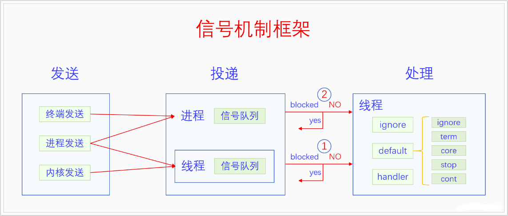

# 0x00. 导读

# 0x01. 简介

通过查看 `/proc/PID/status` 文件，可以知道一个进程当前等待的、阻塞的、忽略的、捕获的信号。

## 1.1 信号类型

刚开始的时候，UNIX 系统只有 1-31 总共 31 个信号，这些信号每个都有特殊的含义和特定的用法。这些信号的实现有一个特点，它们是用 bit flag 实现的。这就会导致当一个信号还在待决的时候，又来了一个同样的信号，再次设置 bit 位是没有意义的，所以就会丢失一次信号。为了解决这个问题，后来 POSIX 规定增加 32-64 这 33 个信号作为实时信号，并规定实时信号不能丢失，要用队列来实现。我们把之前的信号 1-31 叫做 **标准信号**，由于标准信号会丢失，所以标准信号也叫做 **不可靠信号**，由于标准信号是用 bit flag 实现的，所以标准信号也叫做 **标记信号 (flag signal)**。由于实时信号不会丢失，所以实时信号也叫作 **可靠信号**，由于实时信号是用队列实现的，所以实时信号也叫做 **排队信号 (queue signal)**。我们平常遇到的 SIGSEGV、SIGABRT 等信都是标准信号。

# 0x02. 详解

信号机制是 UNIX 系统最古老的机制之一，它不仅是内核处理程序在运行时发生错误的方式，还是终端管理进程的方式，并且还是一种进程间通信机制。

信号机制由三部分构成，首先是信号是怎么产生的，或者说是谁发送的，然后是信号是怎么投递到进程或者线程的，最后是信号是怎么处理的。



## 2.1 信号产生

信号的产生方式也就是发送方有三种：
- 首先是终端发送，比如我们在终端里输入 Ctrl+C 快捷键时，终端会给当前进程发送 SIGINT 信号。
- 其次是内核发送，这里的内核发送是指内核里的异常处理的信号发送，比如进程非法访问内存，在异常处理中就会给当前线程发送 SIGSEGV 信号。
- 最后是进程发送，也就是一个进程给另一个进程发送或者是进程自己给自己发送。

## 2.2 信号投递

每个进程都有一个信号队列，每个线程也有一个信号队列。
信号队列的数据结构如下所示：
```c
struct sigpending {
	struct list_head list;
	sigset_t signal;
};
```
可以看到信号队列非常简单，sigset 是个 bit flag，代表当前队列里有哪些信号，list 是信号列表的头指针。

信号投递总体上可以分为两类，普通发送和强制发送。异常处理发送信号都是用的强制发送，其它的基本上都是用的普通发送。

## 2.3 信号处理

信号处理方式有三种：
1. 默认处理

    如果程序什么也没设置的话，走默认处理 (default) 方式。  
    默认处理有五种情况，不同的信号，其默认处理方式不同。这五种情况分别是：
    - ignore(忽略)
    - term(终结进程也就是杀死进程)
    - core(coredump 内存转储并杀死进程)
    - stop(暂停进程)
    - cont(continue 恢复执行进程)。

2. signal

    进程提前通过接口函数 signal 或者 sigaction 设置了处理方式，设置 IGN 来忽略信号，或者设置一个信号处理函数 handler 来处理信号。
    大家注意，默认处理中的忽略和进程主动设置的忽略，两者的逻辑是不同的，一个是默认处理是忽略，一个是进程主动要求要忽略。你想要忽略一个默认处理不是忽略的信号，就必须要主动设置忽略。

3. sigaction  

    推荐用 sigaction ，其余同上。

## 2.4 信号的处理时机

信号是在什么时候被处理的呢？信号是在线程将要返回用户空间之前进行处理的。线程返回用户空间有两种情况，一是从系统调用返回，二是从中断返回。返回之前，线程会检查队列里有没有信号要处理，有的话就处理。