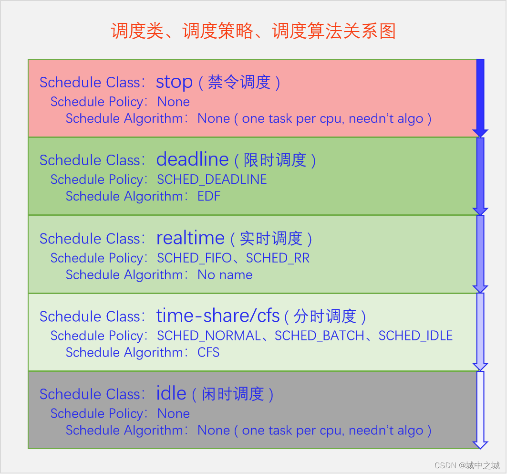

# 0x00. 导读

介绍 CFS 调度器。

[Linux CFS 调度器：原理、设计与内核实现（2023）](https://arthurchiao.art/blog/linux-cfs-design-and-implementation-zh/)

# 0x01. 简介

内核在 2.6.23 版中引入了 CFS(Completely Fair Scheduler) 以取代 O(1) 调度器， CFS 吸取了 RSDL 中关于公平调度的思想，着力于改善调度器在交互性与公平性两方面的性能。

CFS 的设计思路发生了很大的变化，完全切换了一个方向来思考“公平”这件事情。调度器抛弃了基于时间片来划分调度周期的做法，引入了 vruntime (虚拟时间) 的概念来度量公平，并使用红黑树来管理任务。


## 1.1 CFS 优先级与权重

O(1) 和 O(n) 都将 CPU 资源划分为时间片，采用了固定额度分配机制，在每个调度周期进程可使用的时间片是确定的，调度周期结束被重新分配。

CFS 摒弃了固定时间片分配，采用动态时间片分配，本次调度中进程可占用的时间与进程总数、总 CPU 时间、进程权重等均有关系，每个调度周期的值都可能会不一样。

CFS 调度器从进程优先级出发，它建立了优先级 prio 和权重 weight 之间的映射关系，把优先级转换为权重来参与后续的计算。

```c
const int sched_prio_to_weight[40] = {
/* -20 */     88761,     71755,     56483,     46273,     36291,
/* -15 */     29154,     23254,     18705,     14949,     11916,
/* -10 */      9548,      7620,      6100,      4904,      3906,
/*  -5 */      3121,      2501,      1991,      1586,      1277,
/*   0 */      1024,       820,       655,       526,       423,
/*   5 */       335,       272,       215,       172,       137,
/*  10 */       110,        87,        70,        56,        45,
/*  15 */        36,        29,        23,        18,        15,
};
```

普通进程的优先级范围是 [100,139] ， prio 整体减小 120 就和代码左边的注释对上了，也就是 nice 值的范围 [-20,19] ，因此 sched_prio=0 相当于 static_prio=120 。

比如现有进程 A sched_prio=0，进程 B sched_prio=-5，通过 sched_prio_to_weight 的映射：

- 进程 A weight=1024，进程 B weight = 3121
- 进程 A 的 CPU 占比 = 1024/(1024+3121)= 24.7%
- 进程 B 的 CPU 占比 = 3121/(1024+3121) = 75.3%
- 假如 CPU 总时间是 10ms，那么根据 A 占用 2.47ms，B 占用 7.53ms

在 CFS 中引入 sysctl_sched_latency (调度延迟)作为一个调度周期，这样根据权重计算后的各个进程的运行时间是不等的，也就违背了"完全公平"思想，于是 CFS 引入了虚拟运行时间 (virtual runtime) 。

每个进程的物理运行时间时肯定不能一样的，CFS 调度器只要保证的就是进程的虚拟运行时间相等即可。

那虚拟运行时间该如何计算呢?  
`virtual_time = wall_time * nice_0_weight/sched_prio_to_weigh`

比如现有进程 A sched_prio=0，进程 B sched_prio=-5：

- 调度延迟 =10ms，A 的运行时间 =2.47ms B 的运行时间 =7.53ms，也就是 wall_time
- nice_0_weight 表示 sched_prio=0 的权重为 1024
- 进程 A 的虚拟时间：2.47*1024/1024=2.47ms
- 进程 B 的虚拟时间：7.53*1024/3121=2.47ms

经过这样映射，A和B的虚拟时间就相等了。

上述公式涉及了除法和浮点数运算，因此需要转换成为乘法来保证数据准确性，再给出虚拟时间计算的变形等价公式：  
`virtual_time = (wall_time * nice_0_weight * 2^32/sched_prio_to_weigh)>>32`

令 `inv_weight = 2^32/sched_prio_to_weigh`

则 `virtual_time = (wall_time * 1024 * inv_weight)>>32`

由于 sched_prio_to_weigh 的值存储在数组中，inv_weight 同样可以：
```c
const u32 sched_prio_to_wmult[40] = {
/* -20 */     48388,     59856,     76040,     92818,    118348,
/* -15 */    147320,    184698,    229616,    287308,    360437,
/* -10 */    449829,    563644,    704093,    875809,   1099582,
/*  -5 */   1376151,   1717300,   2157191,   2708050,   3363326,
/*   0 */   4194304,   5237765,   6557202,   8165337,  10153587,
/*   5 */  12820798,  15790321,  19976592,  24970740,  31350126,
/*  10 */  39045157,  49367440,  61356676,  76695844,  95443717,
/*  15 */ 119304647, 148102320, 186737708, 238609294, 286331153,
};
```

经过一番计算，各个进程的虚拟运行时间一致了，似乎我们理解了"完全公平"的思想。

虚拟运行时间与优先级的衰减因子有关，也就是 inv_weight 随着 nice 值增大而增大，同时其作为分母也加速了低优先级进程的衰减。

- nice=0 虚拟运行时间 = 物理运行时间
- nice>0 虚拟运行时间 > 物理运行时间
- nice<0 虚拟运行时间 < 物理运行时间

简言之：CFS 将物理运行时间在不同优先级进程中发生了不同的通胀。

摒弃了固定时间片机制也是 CFS 的亮点，系统负载高时大家都少用一些 CPU，系统负载低时大家都多用一些 CPU，让调度器有了一定的自适应能力。

**CFS 是动态计算程序优先级的一种调度算法，其内部算法核心是选取 vruntime 最小的进程进行调度运行，而维护最小的进程，使用了红黑树，而计算 vruntime 使用了所有进程数以及 nice 值的加权。**

# 0x02. 前提

CFS 采用了红黑树算法来管理所有的调度实体 sched_entity ，算法效率为 O(log(n)) 。CFS 跟踪调度实体 sched_entity 的虚拟运行时间 vruntime ，平等对待运行队列中的调度实体 sched_entity ，将执行时间少的调度实体 sched_entity 排列到红黑树的左边。

## 2.1 调度实体 sched entity

代表一个可调度对象，可以是一个进程，也可以是一个进程组等。
```
sched_dl_entity
sched_dt_entity
sched_entity
```

## 2.2 调度类 

不同的进程对于调度器的调度紧迫性需求是不同的，有些是希望实时响应，有些是无所谓，所以出现了调度类，调度策略是调度类的细分，调度算法是调度类的实现。

- Stop 调度类， stop_sched_class：优先级最高的调度类，可以抢占其他所有进程，不能被其他进程抢占；
- Deadline 调度类， dl_sched_class：使用红黑树，把进程按照绝对截止期限进行排序，选择最小进程进行调度运行；
- RT 调度类， rt_sched_class：实时调度器，为每个优先级维护一个队列；
- CFS 调度类， cfs_sched_class：完全公平调度器，采用完全公平调度算法，引入虚拟运行时间概念；
- IDLE-Task 调度类， idle_sched_class：空闲调度器，每个CPU都会有一个idle线程，当没有其他进程可以调度时，调度运行idle线程

所属进程的优先级顺序为
```
stop_sched_calss > dl_sched_class > rt_sched_class > fair_sched_class > idle_sched_class
```

Stop 调度类和 IDLE-Task 调度类，仅由内核使用。

## 2.3 调度策略

- SCHED_DEADLINE：限期进程调度策略，使 task 选择 Deadline 调度器来调度运行；
- SCHED_RR：实时进程调度策略，时间片轮转，进程用完时间片后加入优先级对应运行队列的尾部，把CPU让给同优先级的其他进程；
- SCHED_FIFO：实时进程调度策略，先进先出调度没有时间片，没有更高优先级的情况下，只能等待主动让出CPU；
- SCHED_NORMAL：普通进程调度策略，使task选择CFS调度器来调度运行；
- SCHED_BATCH：普通进程调度策略，批量处理，使task选择CFS调度器来调度运行；
- SCHED_IDLE：普通进程调度策略，使task以最低优先级选择CFS调度器来调度运行；

## 2.4 调度算法

linux 实现了 6 种调度策略，而依据其调度策略的不同实现了 5 个调度器类,一个调度器类可以用一种或者多种调度策略调度某一类进程,也可以用于特殊情况或者调度特殊功能的进程。

当说到调度器，我们需要确认：调度器类、调度策略、调度算法、调度实体、调度对象。

可以使用 `chrt` 可查看或修改进程的调度属性。



## 2.5 vruntime

- vruntime 表示进程真正在 CPU 上执行的时间，不包括任何形式的等待时间；
- 注意机器一般都是多核的，因此 vruntime 是在多个 CPU 上执行时间的累加。

## 2.6 pick next

如何选择下一个任务。