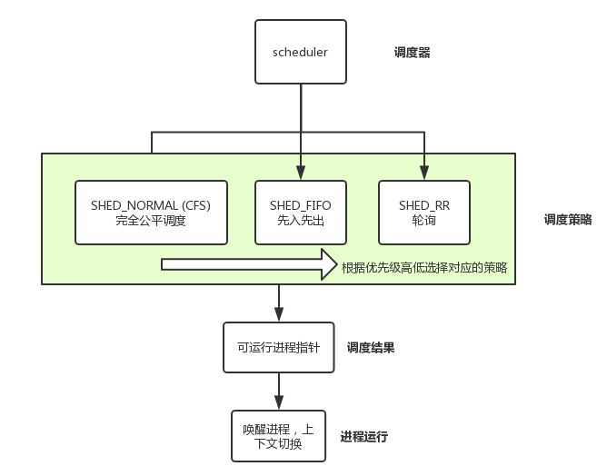

# 0x00. 导读

[linux-sched](https://s3.shizhz.me/linux-sched/task)

# 0x01. 简介

进程调度是对 TASK_RUNNING 状态的进程进行调度。调度程序的最大原则在于能够最大限度的利用计算资源。

# 0x02. 调度器

linux 操作系统需要解决几个互相冲突的目标

- 进程响应时间尽可能快
- 后台作业的吞吐量即可能高
- 尽可能避免进程的饥饿现象
- 低优先级和高优先级进程的需要尽可能调和

简答概况就是要有一个办法，**决定什么时候以一种怎么样的方式选择一个新进程占用CPU运行，并且大家都拍手较好，谁也没有二话**。

## 调度器种类

时间片、优先级、runqueue

- [O(n)调度算法](./O(n)调度算法.md) 2.4 内核
- [O(1)调度算法](./O(1)调度算法.md) 2.6 内核
- [CFS调度算法](./CFS调度算法.md) 2.6.23+ (当前默认调度器)
